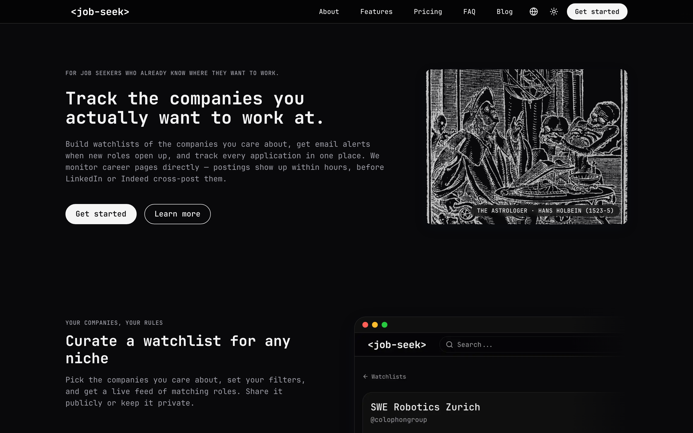
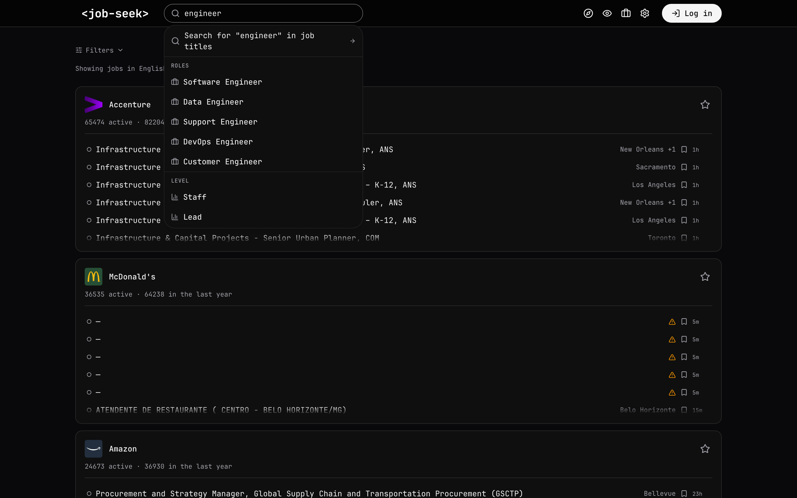
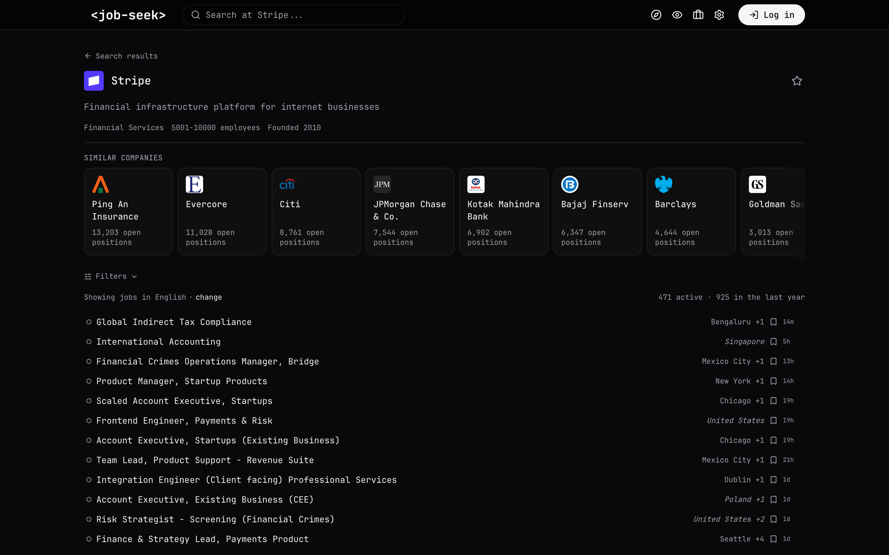

<div align="center">

# Job Seek

**An open-source job aggregator that monitors 4,400+ company career pages directly.**

Roles land here within hours of the company posting them — once, in canonical form, with no third-party reposts.

[**Try jseek.co →**](https://jseek.co) &nbsp;·&nbsp; [Self-host](#run-your-own) &nbsp;·&nbsp; [Add a company](#add-a-company)

[](LICENSE)
[](LICENSE-JOB-DATA)
[](https://pypi.org/project/jobseek-crawler-setup/)
[](https://github.com/colophon-group/jobseek)

[](https://jseek.co)

<sub>Tracking <strong>Stripe · Anthropic · OpenAI · Figma · Vercel · Datadog · Mistral · Hugging Face · Linear · Notion · Roche · Nestlé · UBS · Swisscom · ABB · SAP · Siemens · Klarna · N26 · Wise · Monzo</strong> — and ~4,380 others. Full list: [`apps/crawler/data/companies.csv`](apps/crawler/data/companies.csv).</sub>

</div>

---

## How it compares

|  | **Job Seek** | LinkedIn / Indeed | Roll-your-own (JobSpy, JobFunnel) |
|---|---|---|---|
| **Source** | Direct from employer career pages | Aggregated from job boards | Whatever you wire up |
| **Postings per role** | One canonical entry | 1–N copies | Depends |
| **Coverage** | 4,400+ vetted companies | Millions, mostly duplicates | Bring your own |
| **Latency from posting** | Typically hours | Days | Your schedule |
| **Search** | Typesense, faceted (seniority, stack, locale, salary) | Keyword + location | None bundled |
| **Self-host** | Yes — one repo, MIT | Not possible | DIY |
| **License** | MIT code, CC BY-NC 4.0 data | Closed | Per-project |

## What you get on jseek.co

|  |  |
|---|---|
|  | **Explore.** Filter every tracked company by seniority, tech stack, salary, location, and posting language. Free, no account. |
|  | **Company pages.** Live and historical posting counts, similar-company suggestions, every role linked back to the source. |

A built-in **application tracker** moves saved roles through `saved → applied → interviewing → offered/rejected`, with stats and an interview log. Free for everyone. **Pro** ($10/month) unlocks unlimited watchlists with email alerts.

> Built by [Colophon Group](https://colophon-group.org), a small team in Switzerland — so German, French, and Italian aren't an afterthought.

---

## Add a company

Open issues labelled [`company-request`](https://github.com/colophon-group/jobseek/issues?q=is%3Aopen+label%3Acompany-request) are companies waiting to be added — most resolve in five minutes with a coding agent.

> **`ws` is a tool for your coding agent, not for you directly.** Set up [Claude Code](https://claude.com/claude-code), Cursor, or another agent first; the agent installs and runs the CLI itself.

```bash
pip install jobseek-crawler-setup
```

Pick an issue, then hand your agent this prompt:

> Run `ws task --issue <NUMBER>` and follow the printed instructions.

`ws` walks the agent through fetching the issue, finding the career page, choosing the right monitor and scraper from the 40 available, validating the result, and opening a PR. Choosing the right combination by hand is tedious — getting it wrong silently misses postings, which is why the workflow is structured this way.

**No open issues for the company you want?** [Request it.](https://github.com/colophon-group/jobseek/issues/new?labels=company-request) Anyone can.

**Agent environment**: `git`, `gh` (authenticated), Python 3.12+, web access.

---

## Run your own

Clone, point at your Postgres + Redis + Typesense, run the crawler and the Next.js app:

```bash
git clone https://github.com/colophon-group/jobseek
cd jobseek

# Crawler (Python 3.12+, uv)
cd apps/crawler
uv sync
cp .env.example .env.local      # DATABASE_URL, REDIS_URL, TYPESENSE_*
uv run crawler sync             # CSV → Postgres + Redis + Typesense
uv run crawler run              # start a worker

# Web app (Node 20+, pnpm)
cd ../web
pnpm install
pnpm db:migrate
pnpm dev                        # http://localhost:3000
```

Architecture overview: [`AGENTS.md`](AGENTS.md). Search stack — collections, scoped API keys, deployment: [`docs/11-typesense.md`](docs/11-typesense.md). Production routines: [error review](docs/14-error-review-routine.md), [daily labelling](docs/15-data-sampling-routine.md).

---

## What's in the repo

```
apps/crawler/          Python pipeline (asyncio, Playwright fallback)
  src/core/monitors/   Monitor types — Greenhouse, Lever, Workday, …
  src/core/scrapers/   Scrapers — JSON-LD, DOM, sitemap, vendor-specific
  src/redis_queue.py   Claim queue with atomic reservation, requeue, reschedule
  src/exporter.py      CDC: Postgres → Supabase + Typesense
  src/labeller/        Daily labelling pipeline (HuggingFace upload)
  src/workspace/       `ws` — agent orchestrator for company onboarding
  data/companies.csv   Source of truth — every tracked company is one row
  data/boards.csv      One row per board (monitor + scraper config)

apps/web/              Next.js 16 + Drizzle + Lingui + Better Auth
  app/[lang]/...       Path-prefix i18n (en / de / fr / it)
  src/db/schema.ts     Drizzle schema — Postgres + Supabase mirror

docs/                  Architecture and operational routines
scripts/               Typesense setup, backfill, IndexNow notifications
```

---

## License

- **Code** — [MIT](LICENSE). Use, modify, redistribute, no warranty.
- **Job-posting data** — [CC BY-NC 4.0](LICENSE-JOB-DATA). Free for research and non-commercial reuse with attribution. Not "open data" by the strict OKD definition. For commercial licensing, get in touch via [business@colophon-group.org](mailto:business@colophon-group.org).

---

<div align="center">
<sub>Built in Switzerland by <a href="https://colophon-group.org">Colophon Group</a>. <a href="https://github.com/colophon-group/jobseek/issues">Issues</a> and PRs welcome.</sub>
</div>
