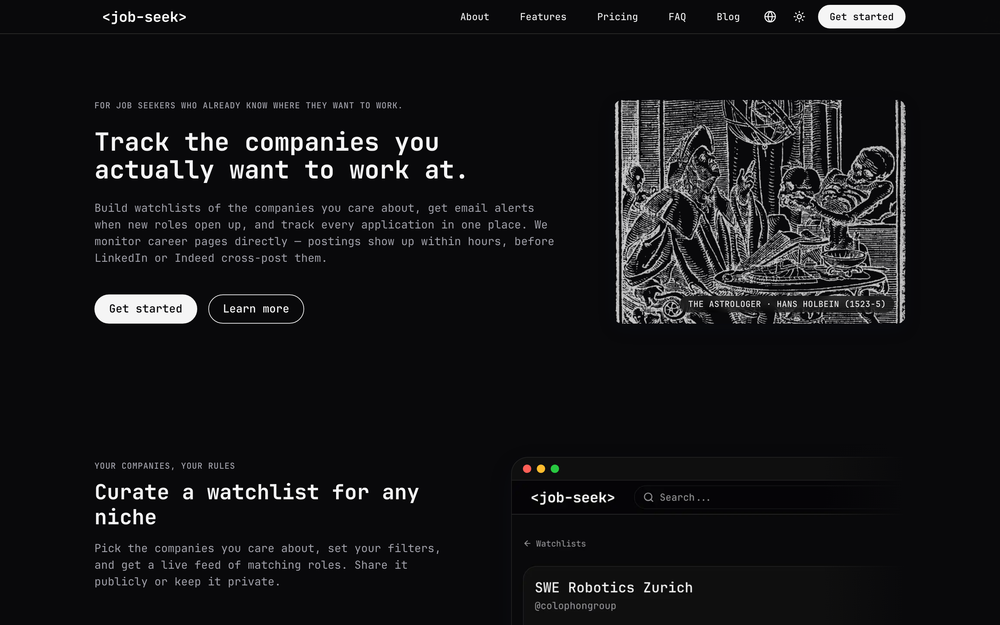
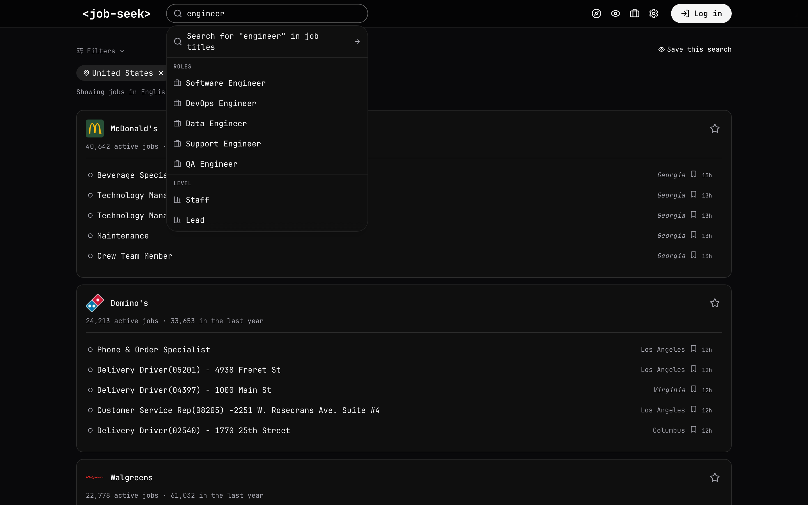
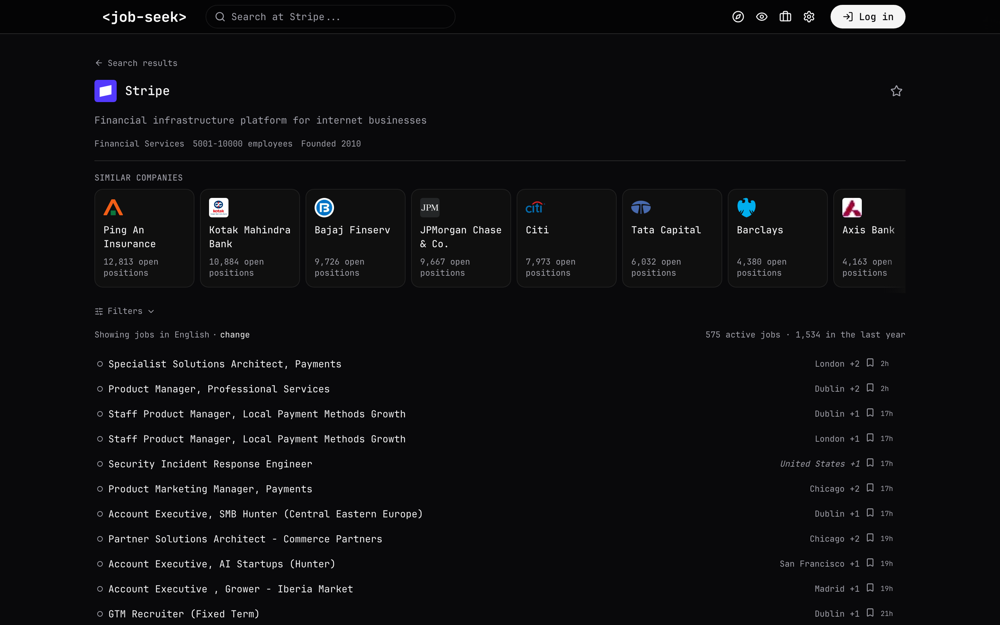
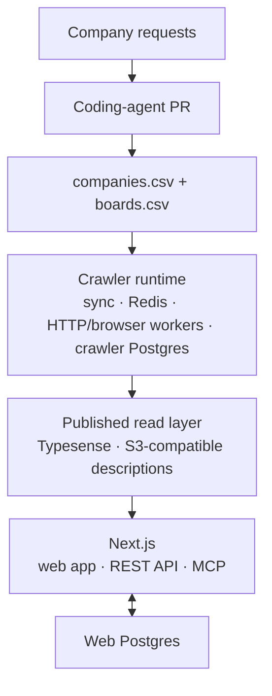

<div align="center">

# Job Seek

**Open-source job search built from 5,300+ company career sites and ATS feeds.**

Find roles soon after employers publish them, search them through one consistent schema, and track the applications that matter to you.

[**Try jseek.co →**](https://jseek.co) &nbsp;·&nbsp; [Use the MCP server](#use-job-seek-from-ai-tools-and-code) &nbsp;·&nbsp; [Add a company](#add-a-company) &nbsp;·&nbsp; [Run it yourself](#run-it-yourself)

[](LICENSE) [](LICENSE-JOB-DATA) [](https://github.com/colophon-group/jobseek/actions/workflows/ci.yml) [](https://github.com/colophon-group/jobseek/actions/workflows/codeql.yml) [](https://pypi.org/project/jobseek-crawler-setup/) [](https://github.com/colophon-group/jobseek)

[](https://jseek.co)

<sub>Tracking <strong>Stripe · Anthropic · OpenAI · Figma · Vercel · Datadog · Mistral · Hugging Face · Linear · Notion · Roche · Nestlé · UBS · Swisscom · ABB · SAP · Siemens · Klarna · N26 · Wise · Monzo</strong> — and thousands more. Browse the source-of-truth registry in [`companies.csv`](apps/crawler/data/companies.csv).</sub>

</div>

---

## Why Job Seek

Job Seek is for people who already have a sense of where they want to work. Instead of starting with reposted listings, it monitors employer career sites and their applicant-tracking systems, then normalizes each source into one searchable model.

| | |
|---|---|
| **Broad direct-source coverage** | 5,300+ companies across 6,200+ configured career boards, primarily employer-hosted sites and ATS feeds, plus a small number of platform-hosted sources. |
| **One search model** | Typesense-backed keyword search and facets for occupation, seniority, technology, location, work mode, employment type, salary, experience, and posting language. |
| **Source-URL identity** | Postings are canonicalized and deduplicated by source URL, while every result links back to the original listing. |
| **A complete job-search workspace** | Public watchlists, saved roles, application stages, interview notes, and pipeline statistics live alongside search. |
| **Open interfaces** | Use the web app, the public REST API, or the hosted read-only MCP server from any compatible AI client. |

## What you get on jseek.co

| | |
|---|---|
| [](https://jseek.co/en/explore) | **Explore.** Search postings across every tracked company and combine filters without creating an account. |
| [](https://jseek.co/en/company/stripe) | **Company pages.** See active and last-year posting counts, filter within one company, explore similar employers, and open every role at its source. |

With a free account, you can create up to 10 watchlists and use the built-in **application tracker** to move roles through `saved → applied → interviewing → offered/rejected`, record interview rounds, and review pipeline statistics.

**Pro is coming soon.** The planned launch price is $10/month; plan details will be announced before launch.

> Built by [Colophon Group](https://colophon-group.org), a small team in Switzerland — so German, French, and Italian are first-class product languages, not afterthoughts.

---

## Use Job Seek from AI tools and code

The hosted MCP endpoint exposes read-only tools for job search, posting details, companies, taxonomies, public watchlists, and prefilled watchlist links:

```text
https://jseek.co/mcp
```

It uses Streamable HTTP and does not require authentication. Add the URL as a custom MCP connector, or run the published package locally:

```bash
npx @jseek/mcp-server
```

See [`packages/mcp-server/README.md`](packages/mcp-server/README.md) for client-specific setup and tool examples. For direct HTTP integrations, the public REST contract is available at [`/api/openapi.json`](https://jseek.co/api/openapi.json).

---

## Add a company

Open issues labelled [`company-request`](https://github.com/colophon-group/jobseek/issues?q=is%3Aopen+label%3Acompany-request) are companies waiting to be added. The production backlog is processed by an isolated, Hetzner-hosted Codex runner; contributors can resolve an issue with any capable coding agent that follows the repository instructions.

> **`ws` is an agent utility.** It renders the workflow, manages isolated state, and enforces the validation gates; it is not intended as a hand-configured interactive wizard.

The environment needs `git`, an authenticated `gh` CLI, Python 3.13+, and web access. Install the workflow package:

```bash
pip install jobseek-crawler-setup
```

Then give your coding agent this task:

> Run `ws task --issue <NUMBER>` and follow the printed instructions.

`ws` fetches the issue, checks for duplicates, researches the company and all relevant career boards, guides monitor and scraper selection, validates extracted data and brand assets, and opens the pull request. The registered crawler types cover common ATS APIs, sitemaps, structured data, rendered pages, PDFs, and vendor-specific formats.

No issue for the company you want? [Request it.](https://github.com/colophon-group/jobseek/issues/new?labels=company-request) Anyone can.

The maintained workflow reference is [`docs/01-agent-workflow.md`](docs/01-agent-workflow.md).

---

## Architecture

Company and board CSVs are the configuration source of truth. The crawler keeps operational state in its own Postgres database, uses Redis for scheduling, publishes searchable documents to Typesense, and stores full descriptions in S3-compatible object storage. The web app owns authentication, watchlists, and application-tracker data in a separate Postgres boundary.

<div align="center">


```mermaid
%%{init: {"flowchart": {"rankSpacing": 24}}}%%
flowchart TD
    Requests["Company requests"] --> Agent["Coding-agent PR"]
    Agent --> CSV["companies.csv + boards.csv"]
    CSV --> Runtime["Crawler runtime<br/>sync · Redis · HTTP/browser workers · crawler Postgres"]
    Runtime --> ReadLayer["Published read layer<br/>Typesense · S3-compatible descriptions"]
    ReadLayer --> Web["Next.js<br/>web app · REST API · MCP"]
    Web <--> WebDB["Web Postgres"]
```

</div>

Start with the maintained [`documentation index`](docs/README.md), then read the [system overview](docs/00-overview.md), [crawler architecture](docs/03-crawler-architecture.md), and [Typesense reference](docs/11-typesense.md).

## Run it yourself

Job Seek is self-hostable, but the repository currently expects operator-managed services. The root `docker-compose.yml` is development scaffolding for Postgres and Typesense, not a complete one-command production deployment.

### Prerequisites

- Python 3.13+ and [`uv`](https://docs.astral.sh/uv/)
- Node.js 22+ and pnpm 10
- A crawler-owned Postgres database
- A separate web-owned Postgres database; both databases may run on the same server
- Redis
- Typesense
- S3-compatible object storage for job descriptions

The important environment boundaries are:

| Component | Core settings |
|---|---|
| Crawler database | `LOCAL_DATABASE_URL` |
| Web database | `WEB_DATABASE_URL` for crawler-side reads; `DATABASE_URL` for the web app |
| Redis | `REDIS_URL` |
| Typesense writes | `TYPESENSE_HOST`, `TYPESENSE_PORT`, `TYPESENSE_PROTOCOL`, `TYPESENSE_OPERATIONS_KEY` |
| Typesense web access | `TYPESENSE_SEARCH_KEY`, `TYPESENSE_WRITE_KEY`, and optionally `TYPESENSE_BROWSER_PARENT_KEY` |
| Description storage | `R2_ENDPOINT_URL`, `R2_ACCESS_KEY_ID`, `R2_SECRET_ACCESS_KEY`, `R2_BUCKET`, `R2_DOMAIN_URL` |
| Web authentication | `BETTER_AUTH_SECRET`, `BETTER_AUTH_URL`; OAuth and email providers are optional |

After provisioning those services, create `apps/crawler/.env.local` (using its `.env.example` as a starting point) and `apps/web/.env.local`, then initialize in this order:

```bash
git clone https://github.com/colophon-group/jobseek
cd jobseek
corepack enable
pnpm install

# Web-owned database
cd apps/web
pnpm db:migrate

# Crawler-owned database and derived stores
cd ../crawler
uv sync
uv run playwright install chromium-headless-shell  # required by run-browser
uv run alembic -c src/migrations/alembic.ini upgrade head
uv run crawler setup-typesense
uv run crawler sync
```

A complete crawler deployment keeps four process roles running:

```bash
uv run crawler run          # HTTP workers
uv run crawler run-browser  # Playwright workers
uv run crawler export       # Postgres → Typesense CDC
uv run crawler drain        # descriptions → object storage
```

Start the frontend separately from `apps/web`:

```bash
pnpm dev                    # http://localhost:3000
```

Production operators should use scoped Typesense keys and read the deployment and recovery runbooks linked from [`docs/README.md`](docs/README.md).

---

## What's in the repo

```text
apps/crawler/              Python ingestion, normalization, scheduling, and export
  src/core/monitors/       Career-board discovery: ATS APIs, sitemaps, DOM, feeds
  src/core/scrapers/       Posting extraction: JSON-LD, DOM, PDF, vendor formats
  src/workers/             HTTP workers, browser workers, and description drain
  src/exporter.py          CDC from crawler Postgres to Typesense
  src/labeller/            Daily gold-dataset labelling and Hugging Face upload
  src/workspace/           `ws` workflow and Codex company-request runner
  data/companies.csv       Company configuration source of truth
  data/boards.csv          Career boards with monitor + scraper configuration

apps/web/                  Next.js 16, Drizzle, Lingui, and Better Auth
  app/[lang]/              Localized product routes: en / de / fr / it
  app/api/v1/              Public REST API
  app/mcp/                 Hosted Streamable HTTP MCP endpoint
  src/db/schema.ts         Web-owned Postgres schema

packages/mcp-server/       Published `@jseek/mcp-server` package
docs/                     Architecture references, ADRs, routines, and runbooks
scripts/                  Deployment, reconciliation, backup, and maintenance tools
```

## Development

Crawler checks, from `apps/crawler`:

```bash
uv run pytest tests/
uv run ruff check .
uv run pyright
```

Web checks, from `apps/web`:

```bash
pnpm test
pnpm lint
pnpm typecheck
pnpm build
```

Repository-wide contributor and agent instructions live in [`AGENTS.md`](AGENTS.md). Crawler-specific commands and operational cautions live in [`apps/crawler/AGENTS.md`](apps/crawler/AGENTS.md).

---

## License

- **Code** — [MIT](LICENSE). Use, modify, and redistribute it without warranty.
- **Job-posting data** — [CC BY-NC 4.0](LICENSE-JOB-DATA). Free for research and non-commercial reuse with attribution. It is not “open data” under the strict Open Knowledge Definition. For commercial licensing, contact [business@colophon-group.org](mailto:business@colophon-group.org).

---

<div align="center">
<sub>Built in Switzerland by <a href="https://colophon-group.org">Colophon Group</a>. <a href="PRIVACY-POLICY">Privacy</a> · <a href="TERMS-OF-SERVICE">Terms</a> · <a href="https://github.com/colophon-group/jobseek/issues">Issues</a> and pull requests welcome.</sub>
</div>
