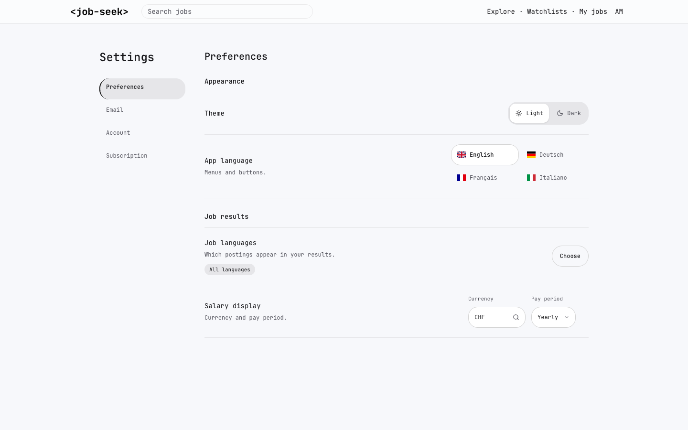
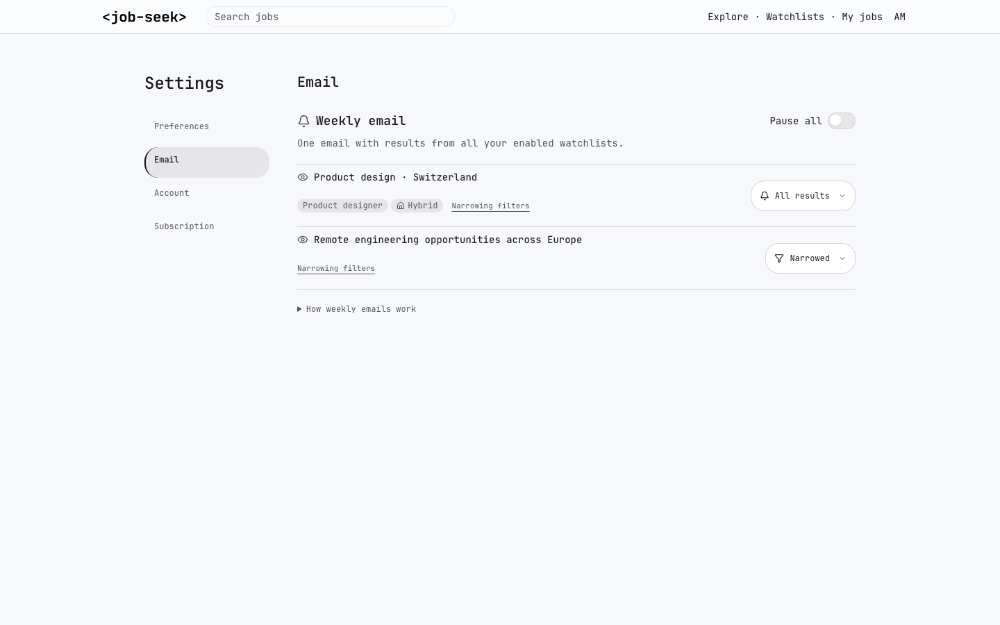
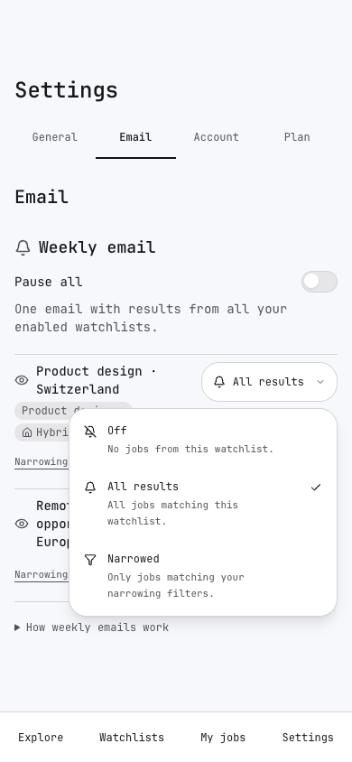
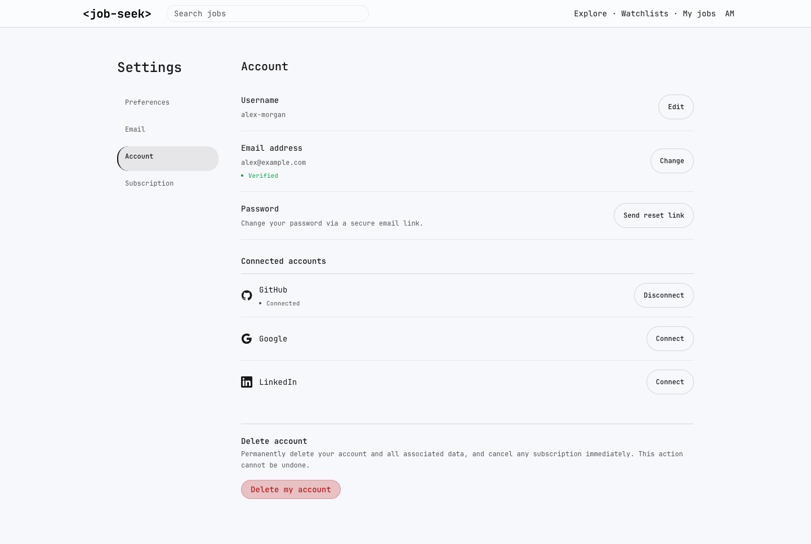
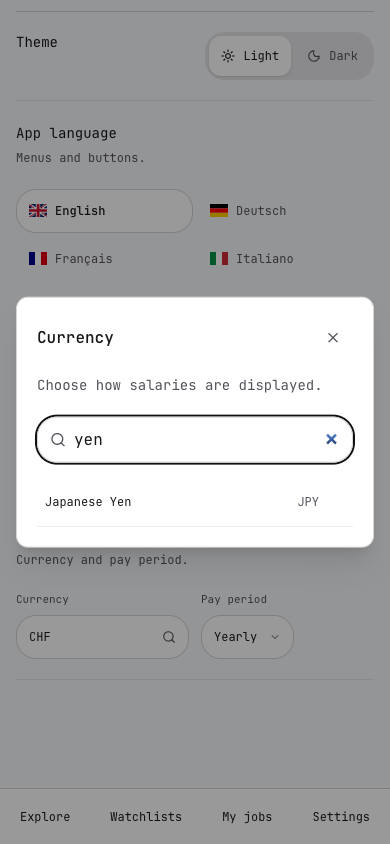
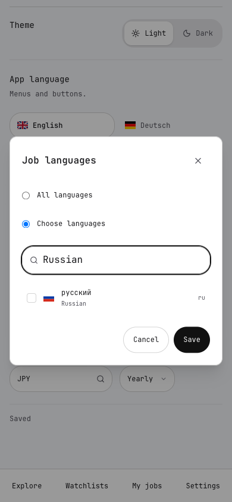

# Settings redesign review

Open [index.html](index.html) locally for a keyboard-operated HTML review deck. The images render the actual source components with fictional accounts and stubbed actions, rather than the original proposal markup.

- Preferences, Email, Account and Subscription use a desktop rail and four mobile tabs.
- Job languages default to all. Explicit stored selections remain active; all catalogue languages can be selected without current postings.
- Currency choices come from the server-provided rates catalogue (31 in the inspected catalogue), with name/code search.
- Email watchlist rows use the horizontal space and reveal mode explanations in their menu. Narrowing filters open on demand.
- Watchlist result controls explicitly show All results and Narrowed. Forms and dialogs retain the existing account, email and billing actions.

## Verification

The full web suite passed (2,992 tests, 61 skipped); 78 focused tests passed after the final refinements. Production build, TypeScript, ESLint and translation coverage passed. UI rendering checks covered 56 settings combinations across 320/390/1440 px, all four locales, light/dark, Free/Pro, trial/ending/payment issue, OAuth/unverified and paused/empty email states. The watchlist chooser passed 12 localized viewport cases, and account dialogs were checked at three widths. Currency search, selection, cancellation, language drafts, Russian without current postings, failed-save retry and focus restoration are covered.

The built Next app was checked on 16 localized guest routes, including currency search and the legacy notification-link redirect. Authenticated rendering used fixtures; checkout, payment-provider and OAuth redirects were not exercised against live external services.

## Screenshots

