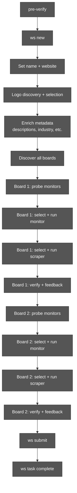
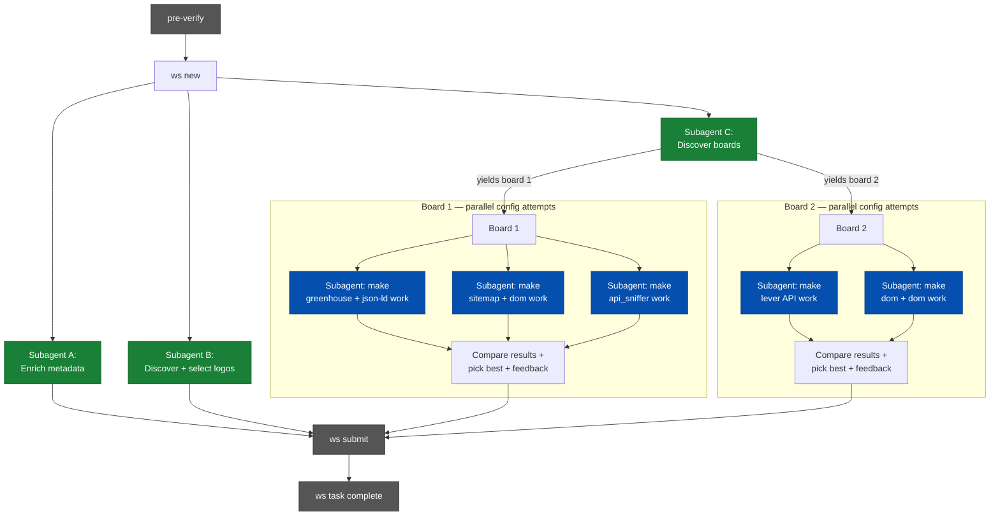
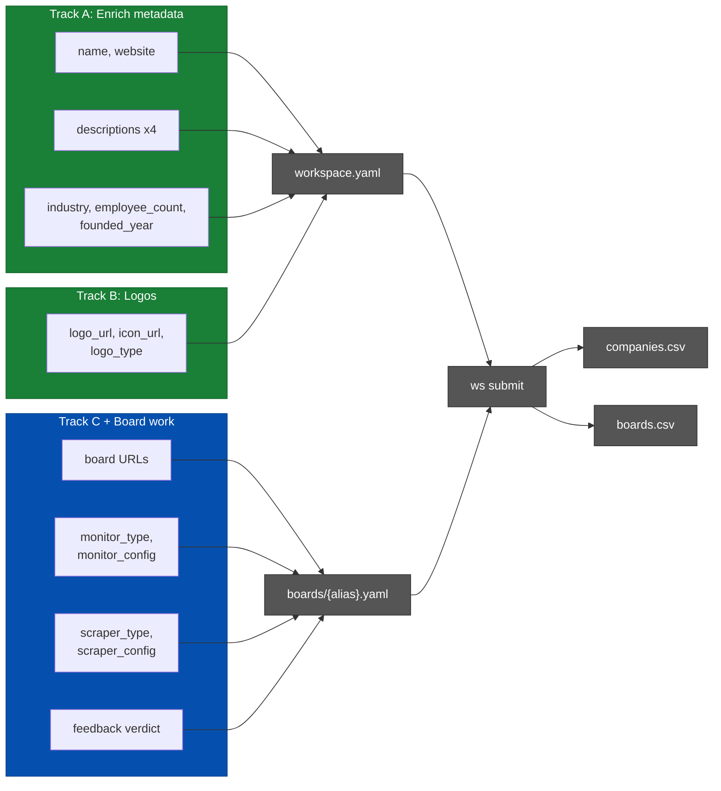

# Parallel Agent Pipeline

RFC for parallelizing the `ws` guided setup workflow.

## Problem

The current agent pipeline is fully sequential. Every step blocks the next,
even when there are no data dependencies between them. A single company
addition takes 15-50 minutes, dominated by serial I/O and agent reasoning
time.

## Current Pipeline

Every box waits for the previous one. Total wall time is the sum of all steps.

## Proposed Pipeline

**Green** = independent subagents running in background.
**Blue** = parallel config testing subagents per board.
**Grey** = sequential checkpoints.

Wall time drops from the sum of all steps to the length of the critical path
(typically: board discovery + longest board config testing).

## Data Dependencies

The key insight: **board configuration is 100% independent of company
metadata**. No `ws probe`, `ws select`, or `ws run` command reads company
name, description, industry, or logos. The only convergence point is
`ws submit`, which writes both company and board data to CSV.

No arrows cross between the green tracks and the blue track — they are fully
independent until `ws submit` reads both.

## Config Selection Policy

### Required fields are non-negotiable

A config is only acceptable if it extracts **all required fields** cleanly:
title, location, and description. A config that misses any required field is
unusable — no exceptions, no "it's close enough". Report failure and try
another approach rather than accepting incomplete extraction.

### Maximize optional field coverage

After required fields are satisfied, prefer configs that extract the most
optional fields. Priority order for optional fields:

1. **Important:** employment type, seniority level, department, salary
2. **Nice-to-have:** posted date, application URL, remote/hybrid flag

A config extracting 6 fields cleanly beats one extracting 3 fields cleanly,
even if the 3-field config is simpler.

### Minimize monitoring cost

Among configs that meet field requirements, **always prefer the cheapest
monitor**. Cost is reported by `ws probe monitor` and stored per config.

Preference order (cheapest → most expensive):
1. API monitors (greenhouse, lever, ashby, etc.) — single HTTP request
2. Sitemap — single XML fetch
3. DOM / nextdata — one page load, possibly paginated
4. api_sniffer (httpx) — multiple API calls
5. api_sniffer (Playwright) — browser rendering + API interception

A more expensive monitor is only justified when cheaper options fail to
capture all listings or required fields.

### Failure is better than a bad config

Agents must **reject configs that don't work** rather than accepting them to
avoid appearing to fail. A submitted config that misses jobs or garbles
fields will produce bad data in production — that is worse than reporting
failure and letting a human investigate.

If no config combination works after exhausting options, the correct action
is `ws task fail --reason "..."`, not `ws feedback --verdict acceptable` on
a config the agent knows is broken.

## Board Config Subagent Design

### Subagent framing: goal-oriented, not mechanical

When the main agent spawns a subagent to work on a board, it should **not**
say "test api_sniffer config". Instead, the subagent receives a goal-oriented
prompt with full context:

> "Make a working config for board X (URL: ...) using the **greenhouse**
> monitor and **json-ld** scraper. Required fields: title, location,
> description. The probe detected a greenhouse token `abc123` with
> ~150 jobs. Previous agents found that this company's greenhouse pages
> use non-standard JSON-LD — try `render: true` if plain fetch fails.
> If this combination cannot extract required fields cleanly, report
> failure with specifics."

Key elements of the subagent prompt:
- **The board URL and monitor/scraper combination to try**
- **Required fields that must be extracted** (non-negotiable)
- **Probe context** (detected tokens, job counts, cost estimates)
- **Prior knowledge** (what other configs were tried, what failed, KB entries)
- **Explicit permission to fail** with a clear failure report

### Subagent outputs

Each config-testing subagent reports back one of:
- **Success:** config name, job count, fields extracted, cost, verdict
- **Failure:** what was tried, what went wrong, which fields were missing

The main agent collects all reports and picks the best success, or escalates
if all subagents report failure.

## Quality Standards

### Known anti-patterns to eliminate

Current agents exhibit several bad habits that the parallel pipeline must
fix, not inherit:

**1. Accepting bad configs to avoid failure.**
Agents submit configs with `--verdict acceptable` when the extraction is
clearly broken — missing descriptions, garbled locations, wrong job counts.
Fix: subagent instructions must explicitly state that failure is an expected
outcome and carries no penalty. The prompt must say: "If this doesn't work,
say so. Do not force a passing verdict."

**2. Not finding all boards.**
Agents discover 1 board and stop, even when the company has regional
variants (careers-us, careers-de, careers-uk) or multiple ATS platforms.
Fix: the board discovery subagent must:
- Check for hreflang links on the careers page
- Search for regional career domains (company.com/careers, company.de/karriere)
- Look for multiple ATS platforms (Greenhouse for engineering, Lever for
  sales, Workday for corporate)
- Report the total board count and which regions/departments are covered

**3. Not verifying job counts.**
Agents run `ws run monitor`, see "145 jobs", and move on without checking
if the careers page says "247 open positions". A 40% gap means the monitor
is misconfigured. Fix: the subagent prompt must include the expected job
count from web research. The subagent must compare crawled vs expected and
flag significant gaps (>15% difference).

**4. Making assumptions instead of verifying.**
Agents assume a sitemap covers all jobs, assume json-ld has all fields,
assume the first probe result is correct. Fix: every assumption must be
verified by running the config and checking the output. The subagent must
inspect actual extracted content, not just field presence counts.

**5. Taking shortcuts on scraper verification.**
Agents check that fields are "present" (non-empty) but don't verify the
content makes sense — a description field containing just a page header,
a location field with "null", a title with HTML artifacts. Fix: subagents
must read 2-3 sample extractions and confirm the content is semantically
correct, not just non-empty.

### Backtracking on new evidence

The current workflow only moves forward. Once a step is "done", the agent
never revisits it — even when later evidence proves an earlier decision wrong.
This must change.

Examples of legitimate backtracking triggers:

- **Monitor testing reveals a missing board.** A subagent configuring
  board 1 notices the API returns jobs from two distinct departments that
  the board discovery subagent mapped to a single board. The main agent
  should split the board or add a new one — going back to board discovery.
- **Scraper output contradicts monitor assumptions.** The monitor reported
  200 jobs, but scraper extraction shows half the URLs are 404s or redirect
  to a different site. The monitor config is wrong — go back to monitor
  selection.
- **Enrichment subagent finds a different careers domain.** The metadata
  subagent discovers that the company recently migrated from
  `jobs.company.com` to `careers.company.com`. Board discovery used the
  old domain — re-run board discovery with the new URL.
- **Job count mismatch surfaces late.** The web page says 300 jobs, the
  monitor found 150, the agent moved on. During feedback, the agent
  realizes this gap. Go back to monitor selection, don't paper over it.
- **A config subagent discovers a better approach.** While testing
  api_sniffer, a subagent finds that the site has a public GraphQL
  endpoint that returns richer data than the sitemap monitor. The main
  agent should reconsider the monitor choice, not ignore the finding.

**Implementation:** The workflow engine must support `ws task back --to
<step> --reason "..."`. The gate system should not prevent revisiting
completed steps. The reason is logged to reflections so the backtrack is
auditable. For the parallel pipeline, the main agent is responsible for
deciding when to backtrack — subagents report findings, the main agent
acts on them.

## Blockers and Required Changes

### 1. Relax `company_complete` gate

**Status quo:** The `company_complete` gate blocks advancement from step 1
(setup) to step 2 (add boards). It requires name, website, description (en),
and industry to all be set.

**Problem:** This prevents board work from starting until metadata enrichment
is done, even though board probing/configuration never reads these fields.

**Change:** Remove `company_complete` as a gate for `add_boards`. The same
checks already exist in `run_quality_gates()` at submit time, so nothing is
lost.

**Files:** `workflow.yaml`, `workflow.py`
**Effort:** Small

### 2. Add `--no-discover` to `ws set --website`

**Status quo:** `ws set --website` triggers `_inspect_logo_candidates()` as a
synchronous side effect — fetching the homepage, extracting images, downloading
PNGs.

**Problem:** This couples website-setting with logo discovery. A metadata
subagent that only needs to set the website field gets blocked by logo I/O.

**Change:** Add `--no-discover` flag that skips the logo discovery side
effect. The logo subagent calls `ws set --website` without the flag (or a new
dedicated command) independently.

**Files:** `commands/config.py`
**Effort:** Small

### 3. Add `--config <name>` to `ws run monitor` and `ws run scraper`

**Status quo:** `ws run monitor` always runs `board.active_config`. To test a
different config, you must first `ws select config <name>` which mutates shared
board state.

**Problem:** Two subagents testing different configs for the same board race on
`active_config`. Agent A selects config-1, agent B selects config-2, agent A
runs — but now runs config-2 instead of config-1.

**Change:** Add `--config <name>` flag to `ws run monitor` and
`ws run scraper`. The command runs the named config directly without touching
`active_config`. After all configs are tested, the main agent picks the winner
and calls `ws select config <best>`.

**Files:** `commands/crawl.py`
**Effort:** Medium

### 4. New parallel-mode agent instructions

**Status quo:** Step instructions (`steps/01-setup.md` through
`steps/07-reflect.md`) assume a single agent following a linear path.

**Problem:** A parallel agent needs different instructions: "launch these
subagents, then process boards as they arrive."

**Change:** Add parallel-mode step instructions (new `.md` files or a new
prompt template). The main agent follows these instead of the sequential
`ws task` flow. Sequential mode remains available for simpler agents or
GitHub Actions.

**Files:** `steps/` (new files), possibly `workflow.yaml`
**Effort:** Medium

## Implementation Plan

### Phase 0: Groundwork

Prerequisite changes that unblock everything else.

- [ ] **0.1** Relax `company_complete` gate — change `workflow.yaml` so
  `add_boards` has no gate (or a trivial gate like "slug exists"). Move
  company completeness check to submit-only.
- [ ] **0.2** Add `--no-discover` flag to `ws set --website` in `config.py`.
  When set, skip the `_inspect_logo_candidates()` and
  `_auto_enrich()` side effects.
- [ ] **0.3** Add `--config <name>` flag to `ws run monitor` and
  `ws run scraper` in `crawl.py`. Look up the named config from
  `board.configs[name]` instead of `board.active_config`. Write run results
  back to the named config entry.
- [ ] **0.4** Add `ws task back --to <step> --reason "..."` command. Resets
  `current_step` (and `current_board` if applicable) in workflow state.
  Logs the reason to reflections for auditability. Must work for both
  global and per-board steps. Does not discard any existing configs or
  state — only moves the workflow cursor backward.

### Phase 1: Parallel Enrichment Tracks

Decouple metadata, logos, and board discovery into independent operations.

- [ ] **1.1** Write a parallel-mode prompt/instructions for Track A (metadata
  enrichment). The subagent receives slug + company name + website URL and
  runs the `ws set` commands for descriptions, industry, employee count,
  founded year.
- [ ] **1.2** Write a parallel-mode prompt/instructions for Track B (logo
  discovery). The subagent receives slug + website URL, runs logo discovery,
  reviews candidates, and calls `ws set --logo-candidate / --icon-candidate`.
- [ ] **1.3** Write a parallel-mode prompt/instructions for Track C (board
  discovery). The subagent receives slug + website URL, researches career
  pages, and calls `ws add board` for each board found.
- [ ] **1.4** Write the main agent orchestration prompt: pre-verify, ws new,
  spawn tracks A/B/C as background subagents, then enter the board processing
  loop.

### Phase 2: Parallel Config Testing

Enable testing multiple monitor+scraper combinations simultaneously per board.

- [ ] **2.1** Write goal-oriented subagent prompt template for board config
  work. Each subagent receives: board URL, monitor+scraper combination to
  try, expected job count from web research, required fields, prior context
  (KB entries, failed configs from other subagents), and explicit permission
  to report failure. Subagent returns success (with metrics) or failure
  (with specifics).
- [ ] **2.2** Update main agent instructions for board processing: after
  `ws probe monitor`, identify top N viable monitor+scraper combinations,
  spawn a goal-oriented subagent for each. Main agent collects results,
  compares, picks the best config that meets all required fields at lowest
  cost.
- [ ] **2.3** Add a comparison/summary command (e.g. `ws compare configs
  --board <alias>`) that shows all tested configs side-by-side — job count,
  cost, fields extracted, verdict — so the main agent can pick the best
  without reading raw YAML.
- [ ] **2.4** Add job count verification to subagent prompt: subagent must
  compare crawled job count against expected count (from web research or
  probe). Flag gaps >15% as monitor misconfiguration rather than accepting.

### Phase 3: Polish

- [ ] **3.1** Add `ws task status --parallel` that shows progress across all
  tracks (enrichment, logos, boards, per-board configs) in a single view.
- [ ] **3.2** Update `docs/01-agent-workflow.md` to document both sequential
  and parallel modes.
- [ ] **3.3** Add timeout/fallback logic: if a subagent doesn't complete
  within a threshold, the main agent can proceed with defaults or skip
  optional fields.

## Expected Impact

| Metric | Sequential | Parallel | Improvement |
|--------|-----------|----------|-------------|
| 1-board company | 15-30 min | 8-15 min | ~50% faster |
| 3-board company | 30-50 min | 15-25 min | ~50% faster |
| Agent turns used | 20-25 | 10-15 (main) + 5-8 (per subagent) | Better focus per agent |

The biggest wins come from:

1. **Overlapping enrichment with board work** — saves 5-10 min per company
2. **Parallel config testing** — saves 5-10 min per board when multiple
   configs need testing
3. **Progressive board discovery** — saves 3-5 min for multi-board companies

## Constraints

- **Only the main agent can spawn subagents.** Subagents cannot delegate
  further. This limits the parallelism depth to two levels.
- **Subagents share the filesystem.** The `ws` state files use advisory locks
  (`fcntl`) for atomic writes, so concurrent `ws set` / `ws add board` calls
  from different subagents are safe as long as they write to different keys
  or files.
- **`active_config` is shared per board.** This is why `--config <name>` is
  needed — without it, parallel config testing is impossible.
- **Sequential mode must remain functional.** GitHub Actions agents and
  simpler agent runtimes still use the linear `ws task` flow. Parallel mode
  is an optimization for capable orchestrators (Claude Code with subagents).
