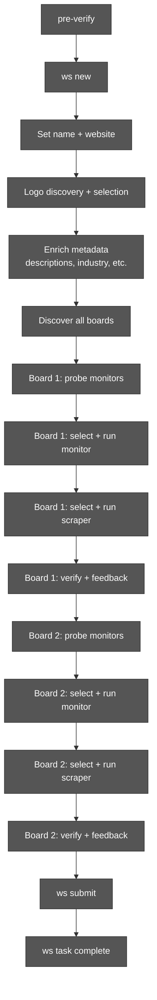
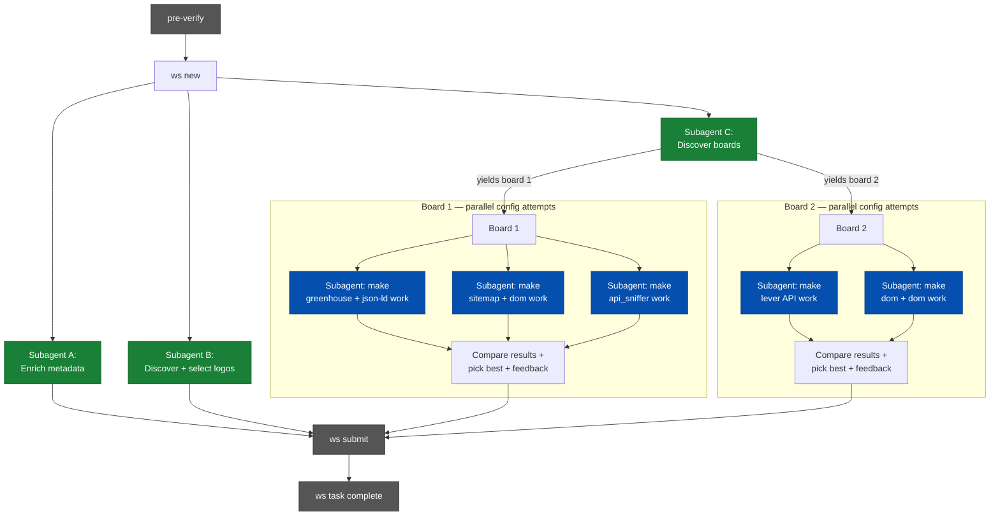
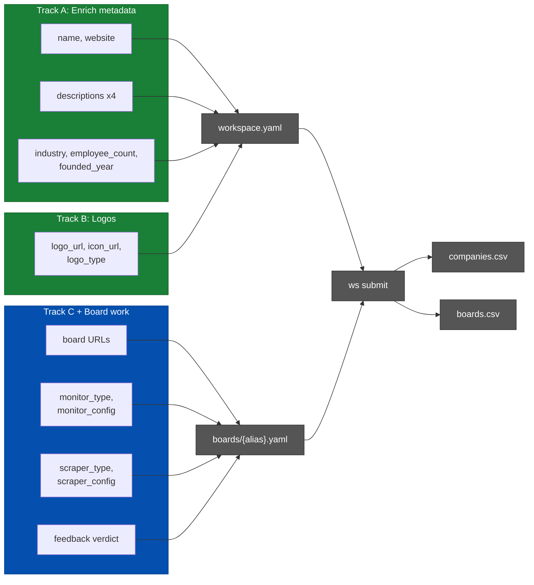

# Parallel Agent Pipeline

Implementation plan for parallelizing the `ws` guided setup workflow.

## Problem

The current agent pipeline is fully sequential. Every step blocks the next,
even when there are no data dependencies between them. A single company
addition takes 15-50 minutes, dominated by serial I/O and agent reasoning
time.

## Current Pipeline

Every box waits for the previous one. Total wall time is the sum of all steps.

## Proposed Pipeline

**Green** = independent subagents running in background.
**Blue** = parallel config testing subagents per board.
**Grey** = sequential checkpoints.

Wall time drops from the sum of all steps to the length of the critical path
(typically: board discovery + longest board config testing).

## Data Dependencies

**Board configuration is 100% independent of company metadata.** No
`ws probe`, `ws select`, or `ws run` command reads company name, description,
industry, or logos. The only convergence point is `ws submit`, which writes
both company and board data to CSV.

No arrows cross between the green tracks and the blue track — they are fully
independent until `ws submit` reads both.

---

## Design Principles

### Required fields are non-negotiable

A config is only acceptable if it extracts **all required fields** cleanly:
title, location, and description. A config that misses any required field is
unusable — no exceptions, no "it's close enough". Report failure and try
another approach rather than accepting incomplete extraction.

### Failure is better than a bad config

Agents must **reject configs that don't work** rather than accepting them to
avoid appearing to fail. A submitted config that misses jobs or garbles
fields will produce bad data in production — that is worse than reporting
failure and letting a human investigate.

If no config combination works after exhausting options, the correct action
is `ws task fail --reason "..."`, not `ws feedback --verdict acceptable` on
a config the agent knows is broken.

---

## Config Selection Policy

### Monitor preference order

Among configs that meet field requirements, prefer the cheapest and most
reliable monitor. Rich or partially-rich monitors that return full job data
save the entire scraper step and are always preferred.

1. **API monitors** (greenhouse, lever, ashby, workday, etc.) — always rich,
   cheapest, single HTTP call per page
2. **Sitemap** — cheap URL-only, good coverage for large sites
3. **api_sniffer (httpx) / nextdata** — similar cost to DOM, but can return
   **rich or partially-rich data**, more reliable extraction, structured JSON
   endpoints
4. **DOM** — URL-only, pagination is fragile, last resort for monitoring
5. **api_sniffer (Playwright)** — expensive browser rendering, only when
   httpx cannot reach the API (browser-dependent SPAs)

A more expensive monitor is only justified when cheaper options fail to
capture all listings or required fields.

### Maximize optional field coverage

After required fields are satisfied, prefer configs that extract the most
optional fields. Priority order:

1. **Important:** employment type, seniority level, department, salary
2. **Nice-to-have:** posted date, application URL, remote/hybrid flag

A config extracting 6 fields cleanly beats one extracting 3 fields cleanly,
even if the 3-field config is simpler.

---

## Quality Enforcement

### Description quality requirements

A valid job description must contain **substantive structured content** —
sections like responsibilities, requirements, qualifications, or project
context. The following are NOT acceptable descriptions:

- A single sentence or job title repeated
- "Apply now" or other boilerplate without actual job content
- Only a company overview without role-specific information
- HTML fragments or navigation text extracted by mistake

**This must be enforced programmatically, not just in agent instructions.**

### Enforcement levels

1. **Quality gates** (`run_quality_gates()` in `crawl.py`): Check
   scraper_run sample descriptions for minimum substance. Descriptions
   shorter than ~200 characters or lacking structural markers (multiple
   paragraphs, list items, or section headings) should be flagged as
   blockers.

2. **Feedback command** (`ws feedback`): Warn when description quality is
   rated "clean" but stored sample descriptions are suspiciously short or
   lack structure. The agent must justify the rating.

3. **Subagent instructions**: Every config-testing subagent must read 2-3
   sample descriptions and confirm they contain real job content — not just
   verify that the description field is non-empty.

### Semantic verification for all fields

All 11 feedback fields must be verified for **semantic correctness**, not
just presence. Examples of false positives agents currently accept:

- A location of `"null"` or `"undefined"` — reported as "present"
- A title containing HTML tags or navigation breadcrumbs
- An employment type of `"Other"` on every job
- A description that is identical across all jobs (template, not content)

---

## Board Config Subagent Design

### Goal-oriented framing

When the main agent spawns a subagent to work on a board, it should **not**
say "test api_sniffer config". Instead, the subagent receives a goal-oriented
prompt with full context:

> "Make a working config for board X (URL: ...) using the **greenhouse**
> monitor and **json-ld** scraper. Required fields: title, location,
> description. The probe detected a greenhouse token `abc123` with ~150 jobs.
> The careers page shows '247 open positions' — verify the crawled count is
> within 15% of this. Previous agents found that this company's greenhouse
> pages use non-standard JSON-LD — try `render: true` if plain fetch fails.
> If this combination cannot extract required fields cleanly, report failure
> with specifics."

Key elements of every subagent prompt:
- **The board URL and monitor/scraper combination to try**
- **Required fields that must be extracted** (non-negotiable)
- **Expected job count from web research** (for verification)
- **Probe context** (detected tokens, job counts, cost estimates)
- **Prior knowledge** (KB entries, failed configs, reconfig context)
- **Explicit permission to fail** with a clear failure report

### Subagent outputs

Each config-testing subagent reports back one of:
- **Success:** config name, job count, fields extracted, cost, verdict
- **Failure:** what was tried, what went wrong, which fields were missing

The main agent collects all reports and picks the best success, or escalates
if all subagents report failure.

---

## Reconfiguration Support

### Current state

`ws new <slug> --reconfig` pre-loads existing company data from CSV and
fast-tracks the workflow to `select_monitor` for the first board
(`lifecycle.py:293-301`). Company metadata, descriptions, and board URLs
are all restored from their existing CSV rows.

### Reconfig scenarios

Not all reconfigurations are the same. The parallel pipeline must support
targeted re-runs where only the broken component is re-tested:

| Scenario | Skip | Start at | Example |
|----------|------|----------|---------|
| Scraper broke | Monitor + enrichment | `select_scraper` | JSON-LD fields renamed after site redesign |
| Monitor broke | Enrichment | `select_monitor` | API endpoint moved, returns 0 jobs |
| Board URL changed | Enrichment | `add_boards` | Company migrated from Lever to Greenhouse |
| Site fully migrated | Nothing | `add_boards` | New domain, new ATS, everything different |
| Full reconfig | Nothing | `add_boards` | User-reported misconfiguration, unclear what broke |

**Proposed change:** Add `--start-at <step>` flag to `ws new --reconfig`.
Currently the start step is hardcoded to `select_monitor`. With `--start-at`,
agents can target the exact broken component. Default remains
`select_monitor` for backward compatibility.

### Parallel pipeline integration

Reconfig subagents must receive existing config as context:

> "Previous monitor was **greenhouse** with token `abc123`, found 200 jobs.
> Now it returns 0. The board URL hasn't changed. Investigate whether the
> token is still valid, whether the API endpoint moved, or whether the
> company switched ATS platforms."

The `ws task back` command enables course correction within a reconfig run —
e.g., a scraper-only reconfig that discovers the monitor also broke can
backtrack to `select_monitor` without starting over.

---

## Backtracking on New Evidence

The current workflow only moves forward. Once a step is "done", the agent
never revisits it — even when later evidence proves an earlier decision
wrong. This must change.

### Backtracking triggers

- **Monitor testing reveals a missing board.** A subagent configuring
  board 1 notices the API returns jobs from two distinct departments that
  the board discovery subagent mapped to a single board. The main agent
  should split the board or add a new one — going back to board discovery.
- **Scraper output contradicts monitor assumptions.** The monitor reported
  200 jobs, but scraper extraction shows half the URLs are 404s or redirect
  to a different site. The monitor config is wrong — go back to monitor
  selection.
- **Enrichment subagent finds a different careers domain.** The metadata
  subagent discovers that the company recently migrated from
  `jobs.company.com` to `careers.company.com`. Board discovery used the
  old domain — re-run board discovery with the new URL.
- **Job count mismatch surfaces late.** The web page says 300 jobs, the
  monitor found 150, the agent moved on. During feedback, the agent
  realizes this gap. Go back to monitor selection, don't paper over it.
- **A config subagent discovers a better approach.** While testing
  api_sniffer, a subagent finds that the site has a public GraphQL
  endpoint that returns richer data than the sitemap monitor. The main
  agent should reconsider the monitor choice, not ignore the finding.
- **Reconfig discovers deeper breakage.** A scraper-only reconfig reveals
  the monitor also broke (board URL redirects, API returns errors). Back
  to monitor selection.
- **Reconfig finds the board URL changed.** The existing board URL now
  404s. Back to board discovery to find the new URL.

### Implementation

`ws task back --to <step> --reason "..." [--board <alias>]`

- Does not discard configs or state — only moves the workflow cursor
- Logs the reason to reflections for auditability
- For per-board targets: sets `current_board` and removes it from
  `completed_boards` if it was already completed
- For global targets: clears `current_board`
- The main agent decides when to backtrack — subagents report findings

---

## Quality Standards

### Known anti-patterns to eliminate

Current agents exhibit bad habits that the parallel pipeline must fix,
not inherit:

**1. Accepting bad configs to avoid failure.**
Agents submit configs with `--verdict acceptable` when the extraction is
clearly broken — missing descriptions, garbled locations, wrong job counts.
Fix: subagent prompts must say "failure is expected and carries no penalty."

**2. Not finding all boards.**
Agents discover 1 board and stop, even when the company has regional
variants (careers-us, careers-de, careers-uk) or multiple ATS platforms.
Fix: the board discovery subagent must check hreflang links, regional
domains, and multiple ATS platforms. Report total board count and coverage.

**3. Not verifying job counts.**
Agents run `ws run monitor`, see "145 jobs", and move on without checking
if the careers page says "247 open positions". A 40% gap means the monitor
is misconfigured. Fix: subagent prompts must include expected job count;
flag >15% gaps as misconfiguration.

**4. Making assumptions instead of verifying.**
Agents assume a sitemap covers all jobs, assume json-ld has all fields,
assume the first probe result is correct. Fix: every assumption verified
by running the config and checking actual output.

**5. Taking shortcuts on scraper verification.**
Agents check that fields are "present" (non-empty) but don't verify the
content makes sense. Fix: subagents must read 2-3 sample extractions and
confirm semantic correctness, not just non-empty.

**6. Accepting trivial descriptions.**
Agents accept descriptions that are one-liners, bare titles, or boilerplate.
A real description has structured sections — responsibilities, requirements,
qualifications. Fix: enforced programmatically in quality gates (minimum
length + structural markers), not just in agent judgment.

---

## Required Code Changes

### 0.1 Relax `company_complete` gate

Remove `check: company_complete` from the setup step in `workflow.yaml`.
Board work doesn't read company metadata. The same validation exists in
`run_quality_gates()` at submit time.

**Files:** `workflow.yaml`, tests in `test_workflow.py`
**Effort:** Small

### 0.2 Add `--no-discover` to `ws set --website`

Add flag to skip `_inspect_logo_candidates()` and `_auto_enrich()` side
effects. Enables metadata subagent to set website without triggering logo
I/O.

**Files:** `commands/config.py`, tests in `test_ws_commands.py`
**Effort:** Small

### 0.3 Add `--config <name>` to `ws run monitor` and `ws run scraper`

Run a specific named config without touching `active_config`. Enables
parallel config testing where multiple subagents test different configs
on the same board simultaneously.

**Files:** `commands/crawl.py`, tests in `test_ws_commands.py`
**Effort:** Medium

### 0.4 Add `ws task back` command

`ws task back --to <step> --reason "..." [--board <alias>]`. Moves the
workflow cursor backward. Logs reason as reflection. Handles board pointer
and `completed_boards` list. Works in both fresh and reconfig workflows.

**Files:** `workflow.py`, `commands/task.py`, tests in `test_workflow.py`
**Effort:** Medium

### 0.5 Description quality check in quality gates

Add programmatic validation to `run_quality_gates()`: check scraper_run
sample descriptions for minimum substance (~200 chars, structural markers).
Add warning in `ws feedback` when description rated "clean" but samples
are suspiciously short.

**Files:** `commands/crawl.py`, tests in `test_ws_commands.py`
**Effort:** Medium

### 0.6 Reconfig `--start-at <step>` support

Add `--start-at` option to `ws new --reconfig`. Override the hardcoded
`current_step="select_monitor"` so agents can target specific reconfig
scenarios (scraper-only fix, full re-probe, etc.).

**Files:** `commands/lifecycle.py`, tests in `test_ws_commands.py`
**Effort:** Small

---

## Implementation Phases

### Phase 0: Code groundwork

Changes 0.1-0.4. Prerequisite code changes that unblock parallel execution.
No agent prompt changes yet.

- [ ] **0.1** Relax `company_complete` gate
- [ ] **0.2** Add `--no-discover` flag to `ws set --website`
- [ ] **0.3** Add `--config <name>` flag to `ws run monitor/scraper`
- [ ] **0.4** Add `ws task back` command

### Phase 1: Quality enforcement

Change 0.5. Programmatic description quality checks. Update step
instruction `05-verify-and-feedback.md` to be explicit about description
substance requirements.

- [ ] **0.5** Description quality check in quality gates
- [ ] Update `steps/05-verify-and-feedback.md` with description quality
  requirements

### Phase 2: Parallel enrichment tracks

Write subagent prompts for independent background work:

- [ ] **Track A prompt:** metadata enrichment (descriptions x4, industry,
  employee count, founded year)
- [ ] **Track B prompt:** logo discovery and selection
- [ ] **Track C prompt:** board discovery (yields boards progressively)
- [ ] **Main agent orchestration prompt:** pre-verify → ws new → spawn
  tracks A/B/C → process boards as they appear → submit

### Phase 3: Parallel config testing

Write goal-oriented subagent prompts for board configuration:

- [ ] **Config subagent prompt template:** board URL, monitor+scraper combo,
  expected job count, required fields, probe context, prior knowledge,
  permission to fail
- [ ] **Main agent board processing flow:** probe → identify top N combos →
  spawn config subagents → collect results → pick best → feedback
- [ ] `ws compare configs --board <alias>` summary command

### Phase 4: Reconfig integration

Change 0.6. Make reconfig a first-class parallel workflow:

- [ ] **0.6** `--start-at <step>` flag on `ws new --reconfig`
- [ ] **Reconfig subagent prompts:** receive existing config as context,
  investigate what broke, reuse what still works
- [ ] Verify `ws task back` works within reconfig workflows

### Phase 5: Polish

- [ ] `ws task status --parallel` for multi-track progress view
- [ ] Update `docs/01-agent-workflow.md` with parallel + reconfig modes
- [ ] Timeout/fallback logic for subagents

---

## Expected Impact

| Metric | Sequential | Parallel | Improvement |
|--------|-----------|----------|-------------|
| 1-board company | 15-30 min | 8-15 min | ~50% faster |
| 3-board company | 30-50 min | 15-25 min | ~50% faster |
| Agent turns used | 20-25 | 10-15 (main) + 5-8 (per subagent) | Better focus |

Biggest wins:
1. **Overlapping enrichment with board work** — saves 5-10 min per company
2. **Parallel config testing** — saves 5-10 min per board
3. **Progressive board discovery** — saves 3-5 min for multi-board companies
4. **Reconfig targeting** — saves 10-20 min by skipping unnecessary steps

## Constraints

- **Only the main agent can spawn subagents.** Subagents cannot delegate
  further. Parallelism depth is limited to two levels.
- **Subagents share the filesystem.** State files use advisory locks
  (`fcntl`) for atomic writes. Concurrent `ws set` / `ws add board` calls
  are safe as long as they write to different keys or files.
- **`active_config` is shared per board.** This is why `--config <name>` is
  needed — without it, parallel config testing is impossible.
- **Sequential mode must remain functional.** GitHub Actions agents and
  simpler runtimes keep using the linear `ws task` flow. Parallel mode is
  an optimization for capable orchestrators.
- **Reconfiguration workflows must be supported.** Parallel mode cannot
  assume a clean slate — subagents may receive pre-existing configs that
  need investigation, not just blank boards to configure from scratch.
