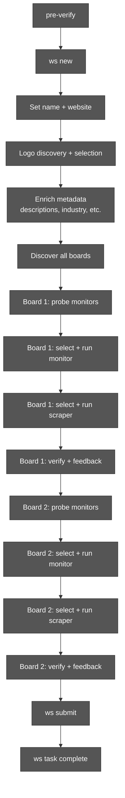
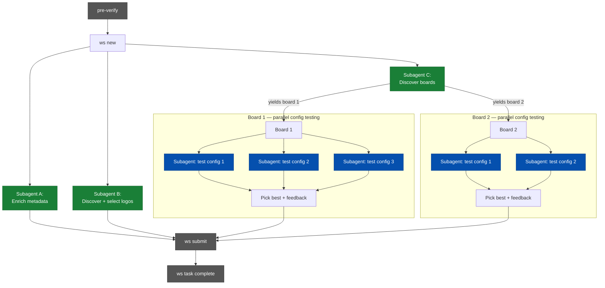

# Parallel Agent Pipeline

RFC for parallelizing the `ws` guided setup workflow.

## Problem

The current agent pipeline is fully sequential. Every step blocks the next,
even when there are no data dependencies between them. A single company
addition takes 15-50 minutes, dominated by serial I/O and agent reasoning
time.

## Current Pipeline



Every box waits for the previous one. Total wall time is the sum of all steps.

## Proposed Pipeline



**Green** = independent subagents running in background.
**Blue** = parallel config testing subagents per board.
**Grey** = sequential checkpoints.

Wall time drops from the sum of all steps to the length of the critical path
(typically: board discovery + longest board config testing).

## Data Dependencies

The key insight: **board configuration is 100% independent of company
metadata**. No `ws probe`, `ws select`, or `ws run` command reads company
name, description, industry, or logos. The only convergence point is
`ws submit`, which writes both company and board data to CSV.

```
                    ┌─────────────────────────────────────────┐
                    │         workspace.yaml                   │
                    │                                         │
  Track A writes:   │  name, website, descriptions,           │
                    │  industry, employee_count, founded_year │
                    │                                         │
  Track B writes:   │  logo_url, icon_url, logo_type          │
                    │                                         │
  Submit reads:     │  ALL of the above → companies.csv       │
                    └─────────────────────────────────────────┘

                    ┌─────────────────────────────────────────┐
                    │     boards/<alias>.yaml  (per board)     │
                    │                                         │
  Board work writes:│  monitor_type, monitor_config,          │
                    │  scraper_type, scraper_config, feedback  │
                    │                                         │
  Submit reads:     │  ALL of the above → boards.csv          │
                    └─────────────────────────────────────────┘

  No cross-reads between company metadata and board configs.
```

## Blockers and Required Changes

### 1. Relax `company_complete` gate

**Status quo:** The `company_complete` gate blocks advancement from step 1
(setup) to step 2 (add boards). It requires name, website, description (en),
and industry to all be set.

**Problem:** This prevents board work from starting until metadata enrichment
is done, even though board probing/configuration never reads these fields.

**Change:** Remove `company_complete` as a gate for `add_boards`. The same
checks already exist in `run_quality_gates()` at submit time, so nothing is
lost.

**Files:** `workflow.yaml`, `workflow.py`
**Effort:** Small

### 2. Add `--no-discover` to `ws set --website`

**Status quo:** `ws set --website` triggers `_inspect_logo_candidates()` as a
synchronous side effect — fetching the homepage, extracting images, downloading
PNGs.

**Problem:** This couples website-setting with logo discovery. A metadata
subagent that only needs to set the website field gets blocked by logo I/O.

**Change:** Add `--no-discover` flag that skips the logo discovery side
effect. The logo subagent calls `ws set --website` without the flag (or a new
dedicated command) independently.

**Files:** `commands/config.py`
**Effort:** Small

### 3. Add `--config <name>` to `ws run monitor` and `ws run scraper`

**Status quo:** `ws run monitor` always runs `board.active_config`. To test a
different config, you must first `ws select config <name>` which mutates shared
board state.

**Problem:** Two subagents testing different configs for the same board race on
`active_config`. Agent A selects config-1, agent B selects config-2, agent A
runs — but now runs config-2 instead of config-1.

**Change:** Add `--config <name>` flag to `ws run monitor` and
`ws run scraper`. The command runs the named config directly without touching
`active_config`. After all configs are tested, the main agent picks the winner
and calls `ws select config <best>`.

**Files:** `commands/crawl.py`
**Effort:** Medium

### 4. New parallel-mode agent instructions

**Status quo:** Step instructions (`steps/01-setup.md` through
`steps/07-reflect.md`) assume a single agent following a linear path.

**Problem:** A parallel agent needs different instructions: "launch these
subagents, then process boards as they arrive."

**Change:** Add parallel-mode step instructions (new `.md` files or a new
prompt template). The main agent follows these instead of the sequential
`ws task` flow. Sequential mode remains available for simpler agents or
GitHub Actions.

**Files:** `steps/` (new files), possibly `workflow.yaml`
**Effort:** Medium

## Implementation Plan

### Phase 0: Groundwork

Prerequisite changes that unblock everything else.

- [ ] **0.1** Relax `company_complete` gate — change `workflow.yaml` so
  `add_boards` has no gate (or a trivial gate like "slug exists"). Move
  company completeness check to submit-only.
- [ ] **0.2** Add `--no-discover` flag to `ws set --website` in `config.py`.
  When set, skip the `_inspect_logo_candidates()` and
  `_auto_enrich()` side effects.
- [ ] **0.3** Add `--config <name>` flag to `ws run monitor` and
  `ws run scraper` in `crawl.py`. Look up the named config from
  `board.configs[name]` instead of `board.active_config`. Write run results
  back to the named config entry.

### Phase 1: Parallel Enrichment Tracks

Decouple metadata, logos, and board discovery into independent operations.

- [ ] **1.1** Write a parallel-mode prompt/instructions for Track A (metadata
  enrichment). The subagent receives slug + company name + website URL and
  runs the `ws set` commands for descriptions, industry, employee count,
  founded year.
- [ ] **1.2** Write a parallel-mode prompt/instructions for Track B (logo
  discovery). The subagent receives slug + website URL, runs logo discovery,
  reviews candidates, and calls `ws set --logo-candidate / --icon-candidate`.
- [ ] **1.3** Write a parallel-mode prompt/instructions for Track C (board
  discovery). The subagent receives slug + website URL, researches career
  pages, and calls `ws add board` for each board found.
- [ ] **1.4** Write the main agent orchestration prompt: pre-verify, ws new,
  spawn tracks A/B/C as background subagents, then enter the board processing
  loop.

### Phase 2: Parallel Config Testing

Enable testing multiple monitor/scraper configs simultaneously per board.

- [ ] **2.1** Update main agent instructions for board processing: after
  `ws probe monitor`, spawn N subagents to test the top N candidates in
  parallel. Each subagent calls `ws select monitor <type> --as <name>` then
  `ws run monitor --config <name>`.
- [ ] **2.2** Add a comparison/summary command (e.g. `ws compare configs
  --board <alias>`) that shows all tested configs side-by-side — job count,
  cost, fields extracted — so the main agent can pick the best without reading
  raw YAML.
- [ ] **2.3** Update scraper testing similarly: after monitor is selected, if
  scraper is needed, spawn subagents to test top scraper candidates in
  parallel.

### Phase 3: Polish

- [ ] **3.1** Add `ws task status --parallel` that shows progress across all
  tracks (enrichment, logos, boards, per-board configs) in a single view.
- [ ] **3.2** Update `docs/01-agent-workflow.md` to document both sequential
  and parallel modes.
- [ ] **3.3** Add timeout/fallback logic: if a subagent doesn't complete
  within a threshold, the main agent can proceed with defaults or skip
  optional fields.

## Expected Impact

| Metric | Sequential | Parallel | Improvement |
|--------|-----------|----------|-------------|
| 1-board company | 15-30 min | 8-15 min | ~50% faster |
| 3-board company | 30-50 min | 15-25 min | ~50% faster |
| Agent turns used | 20-25 | 10-15 (main) + 5-8 (per subagent) | Better focus per agent |

The biggest wins come from:

1. **Overlapping enrichment with board work** — saves 5-10 min per company
2. **Parallel config testing** — saves 5-10 min per board when multiple
   configs need testing
3. **Progressive board discovery** — saves 3-5 min for multi-board companies

## Constraints

- **Only the main agent can spawn subagents.** Subagents cannot delegate
  further. This limits the parallelism depth to two levels.
- **Subagents share the filesystem.** The `ws` state files use advisory locks
  (`fcntl`) for atomic writes, so concurrent `ws set` / `ws add board` calls
  from different subagents are safe as long as they write to different keys
  or files.
- **`active_config` is shared per board.** This is why `--config <name>` is
  needed — without it, parallel config testing is impossible.
- **Sequential mode must remain functional.** GitHub Actions agents and
  simpler agent runtimes still use the linear `ws task` flow. Parallel mode
  is an optimization for capable orchestrators (Claude Code with subagents).
