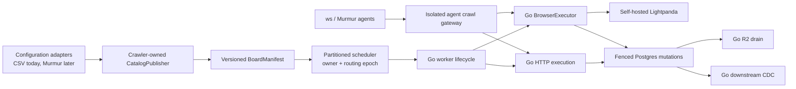

# Go and Lightpanda crawler migration

## Outcome

Replace the production crawler runtime with Go and self-hosted Lightpanda,
then retire Python, Playwright, and Chromium from production crawling. The
target is an economical global crawler for millions of boards, not an
optimization around the present fleet.

There is one authoritative implementation for a task at a time. During
migration, Python and Go may coexist only for mutually exclusive cohorts.
Offline replay may compare both implementations from one captured upstream
response. We do not run permanent duplicate fleets, issue duplicate origin
requests, or silently fall back per task.

## Provisional capacity floor

The capacity-design issue must replace these floors with a measured model
before global rollout. They prevent decisions that only fit today's volume:

- 10 million configured boards and 100 million active postings.
- At least 1 million boards due in one hour (16,667 monitor requests/minute).
- At least 5 million detail fetches due in one hour during catch-up (83,333
  scrape requests/minute), subject to origin policy.
- A 2x synthetic overload and one-shard-loss catch-up test without queue loss,
  origin-policy violation, or unbounded memory growth.
- Horizontal partitions that remain below 70% steady-state memory and CPU so
  a shard can absorb recovery traffic.

Throughput is subordinate to publisher policy. Provider-, tenant-, and
egress-scoped rate/concurrency limits, `Retry-After`, TDM reservations, and
circuit breakers remain hard ceilings.

## Existing isolation points

| Segment | Existing boundary | Important semantics |
|---|---|---|
| Monitor implementations | `src/core/monitors` registry and `MonitorResult` | Rich/hybrid results, metadata watermarks, sitemap changes, truncation, filters |
| Scraper implementations | `src/core/scrapers` registry and `JobContent` | Fallback steps, missing versus empty fields, typed failure behavior |
| Scheduler | Redis Lua scripts in `src/lua` | Atomic claim, priority tiers, rate-limit readiness, leases, reaping, dead letters |
| Persistence | Named SQL in `src/queries` plus board/scrape transaction boundaries | Cross-board ownership, relisting, empty confirmation, gone guards, tombstone budgets |
| R2 drain | Independent `crawler drain` process | Three-state claims, content-hash guards, superseded uploads, retry schedule |
| Downstream CDC | Independent exporter cursors | Commit-safe cutoff, advisory fences, Typesense acknowledgement and projection |
| Proxy | `ProxyProvider` protocol | Provider-neutral egress configuration |
| Agent setup | `workspace/lib`, `ws` command shell, and Murmur shim | Configuration authoring must not become crawler-runtime ownership |
| Deployment | Quiesced Compose replacement and immutable images | Old and new Postgres writers do not overlap |

## Isolation added before translation

The first migration change adds boundaries without adding another production
implementation:

- `BoardRuntimeConfig` centralizes compatibility decoding for the current
  Redis/Postgres worker snapshot. The future cross-source `BoardManifest`
  remains owned by #7937/#7942; this seam does not pretend that CSV and Murmur
  already share a validated model.
- `MonitorRuntime` and `ScrapeRuntime` are in-process Python injection seams
  that separate extraction from scheduling and persistence. The framed v1
  execution protocol is the language-neutral boundary for Go.
- `BrowserBackend` separates browser lifecycle/page allocation from callers;
  the language-neutral browser plan/result contract is tracked separately so
  Go does not inherit a raw Playwright API as its public surface.
- `apps/crawler/contracts/v1/runtime.proto` is the wire-authoritative execution
  IDL. Its generated Python/Go bindings, shared stateful conformance fixtures,
  and bounded offline replay corpus freeze the core boundary. Provider-family
  and Lightpanda capability corpora are expanded in #7953–#7963.
- `crawler_runtime_*` and `crawler_browser_backend_lifecycle_total` establish
  bounded implementation/backend metrics before the first cutover.

These are migration seams, not a promise to preserve adapters forever. The
Python adapter for a segment is deleted when its Go successor owns that
segment and the cold rollback window expires.

## Target architecture

Murmur eventually owns configuration workflow and agent interaction. It does
not write crawler tables directly or own crawler scheduling, politeness,
leases, or persistence. CSV and Murmur are input adapters to a crawler-owned
catalog publisher. Until the Murmur epic is ready, `ws` continues to author
current configuration and must not be coupled to unfinished Go internals.
Both surfaces converge on versioned catalog drafts/manifests and the isolated
agent crawl gateway.

## Safety decisions

### Fenced ownership before mixed generations

The current lease member is reusable and does not fence a stale claimant. A
queue protocol revision must add `shard_id`, `routing_epoch`, `engine_owner`,
`config_revision`, and a unique `claim_token`. Heartbeat, complete,
reschedule, reaping, and every database mutation compare the token and epoch.
A stale result is rejected and counted.

### Replay, not duplicate crawling

Capture one redacted upstream HTTP/browser transcript from the authoritative
owner. Replay it offline through Python and Go and compare normalized result,
failure class, request plan, and projected database effects. A live canary is
allowed only after replay passes and owns an exclusive cohort and traffic
budget.

### Cold reversal, not a live fallback fleet

Keep the previous Python/Chromium image digest and deployment manifest for a
time-boxed rollback window. To reverse a cohort: freeze new claims, drain or
expire leases, verify conservation, increment/revoke the routing epoch,
restore the pinned image, reseed if required, and resume. Never let two owners
claim the same epoch. Every Postgres, Redis, or catalog schema change inside
the window must prove compatibility with that pinned artifact; otherwise pin
a replacement artifact and repeat the drill. The final drill runs against the
actual production schema and data shape immediately before retirement.

### Lightpanda compatibility is explicit

Classify every browser configuration by capability: rendering, evaluation,
actions/pagination, response capture/interception, frames, persistent or
headful identity, proxying, and transport quirks. An unsupported capability is
a typed blocking result, never a silent no-op or automatic Chromium fallback.
Before final retirement, every exception is either implemented in Lightpanda,
refactored to HTTP/API execution, or deliberately retired.

An unsupported required capability rejects the entire browser result before
any discovery diff, gone decision, watermark, or failure budget is mutated.
Partial HTML, captures, or evaluations from that attempt are diagnostic only.

### Agent egress is not board proxying

The future agent crawl gateway is a separate service with no database, Redis,
Typesense, deployment, or raw CDP credentials. It applies network-level SSRF
controls and URL/time/byte/concurrency budgets to redirects, subresources,
WebSockets, and in-page fetches. This is distinct from a board config choosing
paid proxy egress.

## Scorecard and reversal metrics

Metrics use bounded labels such as implementation, release, work class,
browser class, provider family, region, and cohort. Board IDs and arbitrary
hosts belong in sampled structured logs/traces rather than global-scale
Prometheus labels.

| Dimension | Required evidence |
|---|---|
| Freshness | Due-to-claim and due-to-complete p50/p95/p99/max, oldest due age, percent within schedule plus grace |
| Correctness | Exact/canonical URL-set parity, normalized field hashes, all result flags, projected DB effects, zero unexplained gone candidates |
| Queue safety | Due/future/inflight counts, conservation, lease age/loss/reap/dead-letter, epoch/token mismatch, stale-write rejection |
| Politeness | Requests and bytes per success, retries, 403/429/challenges, `Retry-After`, concurrency and rate per policy key |
| Browser | Startup/session/crash/protocol errors, navigation/status, actions, evaluation, capture, frames, content completeness by capability class |
| Efficiency | CPU-seconds, peak/steady RSS, network/proxy bytes, and browser-seconds per successful board/posting and per GiB-hour |
| Downstream | Postgres commit-to-R2/export/index freshness, cursor lag, hash/reconciliation drift, malformed acknowledgements |

Immediate freeze and reversal triggers include any stale-epoch persistence
write, unexplained gone/delist burst, TDM violation, queue loss/duplication,
origin-policy violation, more than 1.05x request amplification without an
approved reason, material anti-bot regression, or freshness error-budget burn.

## Migration order

1. Freeze contracts, capacity envelope, replay corpus, SLOs, fencing, global
   politeness, and cohort ownership.
2. Port independently replaceable processes first: R2 drain and downstream
   CDC/projection.
3. Build and deploy the Lightpanda capability harness/service without board
   ownership, then implement the typed Go browser executor by capability class.
4. Implement the Go worker lifecycle, HTTP transport, monitor/scraper state
   machines, extraction families, and enrichment in bounded issues.
5. Route exclusive cohorts only after replay and fault-injection gates pass.
6. Move the configuration compiler/control plane last, coordinated with the
   existing Murmur epic and without prematurely breaking `ws`.
7. Run a full capacity/recovery test, rehearse cold reversal, soak the all-Go
   fleet, then delete Python/Chromium production paths and expire the rollback
   artifact.

## Tracked work

### Foundations and safe ownership

- [ ] #7936 - global capacity envelope and shard topology
- [ ] #7937 - runtime IDL, typed errors, and golden offline replay
- [ ] #7938 - queue protocol v2 fencing and conservation
- [ ] #7939 - global politeness, TDM, circuits, and egress policy
- [ ] #7940 - migration SLOs, alerts, and cardinality budgets
- [ ] #7941 - deterministic cohort routing and cold cutover/reversal

### Catalog, `ws`, and Murmur

- [ ] #7942 - crawler-owned CatalogPublisher and transactional outbox
- [ ] #7943 - versioned catalog/runtime adapters for `ws` and Murmur
- [ ] #7944 - isolated agent crawl gateway

These supersede the direct-database-write, early CSV deletion, and early `ws`
retirement portions of the existing Murmur epic #2852. Murmur product work may
continue, but catalog authority cannot switch before #7942 and #7943, and the
control-plane cutover cannot occur before #7965. The current demo shim is not
authoritative.

#7944 is coordinated scope for Murmur/agent correctness, not a prerequisite
for crawler-runtime retirement. It may proceed on its own schedule once the
runtime contracts and security boundary are ready.

### Independently replaceable processes

- [ ] #7945 - Go R2 description drain
- [ ] #7946 - frozen projections and Go Typesense CDC target
- [ ] #7947 - Go exporter coordination and retained reconciliation targets

### Worker, transport, state, and enrichment

- [ ] #7948 - Go Redis client and worker lifecycle shell
- [ ] #7949 - Go HTTP/proxy/retry/transcript layer
- [ ] #7950 - fenced board mutations and monitor state machine
- [ ] #7951 - fenced scrape fallback/persistence state machine
- [ ] #7952 - Go normalization and enrichment

### Monitor and scraper protocol families

- [ ] #7953 - sitemap, RSS, static DOM, inline, and raw monitors
- [ ] #7954 - rich JSON ATS monitors
- [ ] #7955 - stateful, paginated, and session HTTP monitors
- [ ] #7956 - static structured-data and HTML scrapers
- [ ] #7957 - ATS/API detail scrapers
- [ ] #7958 - bounded PDF/document extraction

### Self-hosted Lightpanda

- [ ] #7959 - pinned capability census and replay harness
- [ ] #7960 - isolated self-hosted service and lifecycle controls
- [ ] #7961 - generic Go BrowserExecutor for render/evaluate
- [ ] #7962 - actions, pagination, response capture, and interception
- [ ] #7963 - frames, identity, proxy, and transport edge classes

### Completion

- [ ] #7964 - runtime maintenance, repair, reconciliation, and operator commands
- [ ] #7965 - catalog compiler/control-plane sync, deliberately last
- [ ] #7966 - retire Python, Playwright, Chromium, and legacy runtime paths
