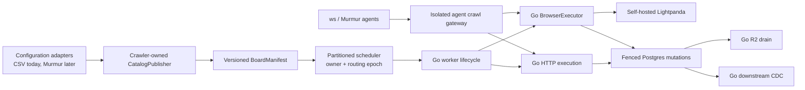

# Go and Lightpanda crawler migration

## Outcome

Replace the production crawler runtime with Go and self-hosted Lightpanda,
then retire Python, Playwright, and Chromium from production crawling. The
economic decision compares the complete crawler runtime at today's measured
load and at the same projected load. It is not a total-platform cost model.

There is one authoritative implementation for a task at a time. During
migration, Python and Go may coexist only for mutually exclusive cohorts.
Offline replay may compare both implementations from one captured upstream
response. We do not run permanent duplicate fleets, issue duplicate origin
requests, or silently fall back per task.

## Projected crawler workload

Issue #7936 prices both implementations against one versioned workload. These
floors prevent decisions that only fit today's volume:

- 10 million configured boards and 100 million active postings.
- At least 1 million boards due in one hour (16,667 monitor requests/minute).
- At least 5 million detail fetches due in one hour during catch-up (83,333
  scrape requests/minute), subject to origin policy.
- A 2x synthetic overload and one-runtime-instance-loss catch-up test without
  queue loss, origin-policy violation, or unbounded memory growth.
- Identical utilization, recovery, regional pricing, capability-mix, and
  publisher-policy assumptions for Python and Go.

Throughput is subordinate to publisher policy. Provider-, tenant-, and
egress-scoped rate/concurrency limits, `Retry-After`, TDM reservations, and
circuit breakers remain hard ceilings.

CHF 50/month is the current allocated crawler budget and is already known to
be insufficient. It is shown only to quantify the current funding shortfall;
it is not the observed Python cost or a ceiling for the projected fleet.

### Runtime-cost evidence and interface

The source-controlled comparison contract lives in
`apps/crawler/runtime-cost/`:

- `projected-workload-v1.json` freezes the 10M-board/100M-posting workload,
  the current 24-hour success mix, the 1M monitor/5M detail projected peak,
  shared headroom, and unresolved evidence requirements;
- `python-production-targets-v1.json` maps existing bounded Prometheus
  instances to crawler runtime roles, the shared `DISCOVERY_CONCURRENCY`
  pool, and its `MONITOR_CONCURRENCY` sub-cap;
- `evidence/python-production-2026-08-29-24h.json` is the first sanitized,
  read-only Python measurement; and
- `pricing/hetzner-eu-2026-06-15.json` preserves official EU-Central Hetzner
  prices in EUR, whole server shapes, IPv4 and traffic assumptions, VAT
  treatment, and the dated official EUR-to-CHF input; and
- `schemas/` defines the language-neutral workload, capture, measurement, and
  pricing interfaces that a later Go + Lightpanda measurement must also use.

Capture makes Prometheus read queries only; it does not crawl or replay any
publisher origin. Credentials are read from environment variables and neither
the read URL nor credentials are written to evidence:

```bash
cd apps/crawler
python -m src.runtime_cost capture-prometheus \
  --targets runtime-cost/python-production-targets-v1.json \
  --prometheus-url "$PROMETHEUS_READ_URL" \
  --source-revision <deployed-git-sha> \
  --window-seconds 86400 \
  --out <measurement.json>
```

The captured production release is also recorded from `crawler_build_info`.
Use `GRAFANA_PROM_USERNAME` and `GRAFANA_PROM_PASSWORD` by default, or select
different secret-bearing environment variable names with `--username-env`
and `--password-env`.

An exact 86,400-second capture is accepted only for the frozen six-target set:
`worker-1`, `worker-2`, `worker-3`, `browser-1`, `exporter`, and `drain`.
Start and end build identity must be the same single release on every target.
Missing targets, duplicate series, label drift, fractional counters, counter
resets, stale boundaries, or an incomplete paired observation remain explicit
blockers; the adapter never converts absence into a healthy zero.

The checked-in pricing revision uses the official price change effective 15
June 2026 for the FSN/NBG/HEL price group. The current crawler is evidenced as
a CX43, but its exact datacenter within that price group is unknown. Long-lived
instances use the monthly price cap, all prices exclude VAT, each server is
charged one primary IPv4, and EUR is converted at 0.9376 CHF per EUR from the
official 27 August 2026 reference rate. The source URLs and retrieval dates
are part of the pricing document.

The neutral model packs the measured resource requirement into whole Hetzner
servers. It reports every listed CX, CPX, and CCX scenario as pricing
sensitivity while keeping the observed CX43 selected for current load. It
does not choose a projected production SKU before shared-versus-dedicated load
tests exist:

```bash
python -m src.runtime_cost project \
  --workload runtime-cost/projected-workload-v1.json \
  --measurement <measurement.json> \
  --pricing runtime-cost/pricing/hetzner-eu-2026-06-15.json \
  --out <projection.json>
```

The cost boundary includes only worker/browser runtime, queue/scheduler,
runtime support, proxy, and network resources attributable to crawling. It
excludes Postgres, Typesense, R2, web, backups, and unrelated telemetry or
control-plane resources. An excluded service may be reported separately only
when the migration causes a measured attributable delta; its complete fleet
is never charged to this comparison.

Readiness is structural rather than an editable checklist. Worker sizing uses
the maximum of shared discovery-pool saturation and the monitor sub-cap; it
does not add monitor and detail as independent worker pools. The cost ledger
must cover all seven in-scope categories. Queue, scheduler, runtime-support,
and proxy require explicit current and projected monthly EUR values;
runtime-support also names every observed support role it covers. Network
pricing consumes measured response bytes, explicit monthly hours at the load
point, per-SKU included traffic, overage pricing, and IPv4. Missing entries,
uncovered support roles, null usage measurements, or an unselected SKU create
model-generated blockers even if every descriptive evidence status is edited
to `frozen`.

The first Python capture intentionally leaves browser-child CPU/RSS, complete
origin-attempt and response-byte counts, proxy attribution, and Redis resource
allocation unknown. The monthly traffic duty cycle, provider-weighted load,
response-size distribution, and capability/publisher-policy evidence are not
yet frozen. Queue, scheduler, runtime-support, and proxy ledger entries are
present but explicitly `unknown`. These are emitted as decision blockers
rather than inferred as zero, so the current artifact does not yet claim a
minimum CHF budget or any Go saving. Its selected current CX43 scenario
reports only a compute-plus-IPv4 subtotal of EUR 32.98 / CHF 30.92 per month,
excluding VAT. Because that subtotal omits blocked attributable costs,
`minimum_sustainable_monthly_chf_excluding_vat` and the CHF 50 funding
shortfall remain `null`; the subtotal must not be interpreted as evidence that
CHF 50 is sufficient.

Closed #8159 and merged #8161 are sampler provenance. Successor repair #8401
defines the capture contract after the #8228 preflight rejected the first
attempt. Every long-running crawler metrics process samples at monotonic,
absolute deadlines (`D(n) = D(0) + n*I`) with `0 < I <= 1s`; collection time is
not added to the cadence, skipped deadlines are counted exactly, and the loop
never runs an unbounded catch-up burst.

One frozen sample contains absolute root and container-tree CPU, root and tree
RSS, descendant count, observation sequence, interval, and observation time.
The metrics collector stores that object under one lock and exposes every
component from the same generation. Bounded per-component sequence and time
children let the read-only adapter reject cross-generation or stale pairs.
The first cgroup-v2 observation publishes full CPU usage instead of an
artificial zero. The sampler withholds a sample if tree CPU or RSS is below its
paired root value; the adapter also checks the in-window paired margins.
Cgroup CPU remains exit-safe for Chromium children that disappear between
`/proc` traversals.

#8405 isolates those absolute deadlines and `/proc` reads in one spawned
sampler process inside the same crawler container and cgroup. The process is a
descendant of the exact crawler root, so its bounded monitoring overhead stays
inside the tree totals while root-process totals retain their prior meaning.
The child publishes cumulative evidence over bounded Unix datagrams: each
datagram is an atomic complete snapshot, truncated or malformed frames are
discarded, and the parent never assembles fields from separate generations.
Each sampling cycle has exactly one publication boundary. Serialization and
send time are included in that cycle's handoff duration before elapsed
deadlines are classified; the next cumulative datagram carries that completed
handoff and classification, avoiding any self-referential partial flush.
The parent supervisor preserves monotonic counters across a child replacement;
death, stale output, malformed IPC, and a restart all remain explicit failure
or start evidence that blocks capture promotion. Staleness uses the parent's
local receipt time, not a child-controlled emission timestamp. Frames with an
unreasonable future emission, sample-after-emission ordering, or a regressing
sample time are rejected without replacing the last immutable sample or
refreshing the stale deadline.

Skipped deadlines retain the existing total counter and are additionally
partitioned, exactly once, into `scheduler_late` deadlines that elapsed before
collection began and `collection_overrun` deadlines that elapsed during
collection or handoff. Bounded, label-free histograms expose wake lateness,
collection duration, and handoff duration. The capture schema stays backward
compatible and continues to reject any total gap, failure, reset, or sampler
restart; the reason and timing metrics provide causal burn-in evidence rather
than relaxing that gate. Sampling interval, workload, browser concurrency,
container CPU quota, and host size are not changed by this isolation repair.

Strict timing promotion additionally uses the pre-seeded fixed-cardinality
`crawler_runtime_process_tree_sampler_timing_limit_violations_total` family.
Its only label is `phase`, with exactly `wake_lateness`, `collection`, and
`handoff`; each child increments for a finite non-negative duration greater
than or equal to 0.25 seconds, so equality fails the strict less-than limit.
The count shares the histogram's atomic child snapshot and remains monotonic
through sampler-child replacement. Capture retains raw integer start/end
values, their exact difference, and per-series reset counts for every phase.
Complete process-tree evidence requires the exact phase set, unchanged source
identity, zero resets, zero differences, and `limit_seconds` exactly 0.25.
Missing, extra, duplicate, fractional, negative, regressing, or threshold-
mismatched evidence fails closed; `increase()` and inclusive histogram buckets
are not accepted as strict-maximum proof. Historical generic measurement-v1
root-process evidence remains valid because the strict object is additive, but
all newly promoted complete process-tree coverage requires it.

Navigation-network, content, and target-closed retry children are pre-created
for every declared bounded reason/outcome, including healthy zeros. The
target-closed counter emits one `outcome="retry"` at the accepted redispatch
edge, followed by exactly one `recovered` or `failed` terminal outcome. Capture
reads exact start/end counter values and reset evidence for every required
child. Missing children, unknown reasons/outcomes, duplicate or fractional
values, and resets block promotion. Labels remain limited to the declared
reason/outcome dimensions: URLs, hosts, companies, boards, postings, exception
text, image identities, and endpoints are forbidden.

The adapter promotes a role from `root-process` to `process-tree` only when
every target has coherent fresh boundaries, exact integer conservation, zero
failures/resets/restarts/gaps, at least 95% scheduled coverage, and paired tree
CPU/RSS no lower than root. The schema and model enforce the same evidence,
including complete browser retry matrices. The checked-in 2026-08-29 evidence
predates these metrics and remains `root-process`; no child usage or retry zero
is inferred into it. A new normally deployed release, passive burn-in, and
independently authorized exact window are still required. #8228 remains
clockless until those operational gates pass.

## Existing isolation points

| Segment | Existing boundary | Important semantics |
|---|---|---|
| Monitor implementations | `src/core/monitors` registry and `MonitorResult` | Rich/hybrid results, metadata watermarks, sitemap changes, truncation, filters |
| Scraper implementations | `src/core/scrapers` registry and `JobContent` | Fallback steps, missing versus empty fields, typed failure behavior |
| Scheduler | Redis Lua scripts in `src/lua` | Atomic claim, priority tiers, rate-limit readiness, leases, reaping, dead letters |
| Persistence | Named SQL in `src/queries` plus board/scrape transaction boundaries | Cross-board ownership, relisting, empty confirmation, gone guards, tombstone budgets |
| R2 drain | Independent `crawler drain` process | Three-state claims, content-hash guards, superseded uploads, retry schedule |
| Downstream CDC | Independent exporter cursors | Commit-safe cutoff, advisory fences, Typesense acknowledgement and projection |
| Proxy | `ProxyProvider` protocol | Provider-neutral egress configuration |
| Agent setup | `workspace/lib`, `ws` command shell, and Murmur shim | Configuration authoring must not become crawler-runtime ownership |
| Deployment | Quiesced Compose replacement and immutable images | Old and new Postgres writers do not overlap |

## Isolation added before translation

The first migration change adds boundaries without adding another production
implementation:

- `BoardRuntimeConfig` centralizes compatibility decoding for the current
  Redis/Postgres worker snapshot. The future cross-source `BoardManifest`
  remains owned by #7937/#7942; this seam does not pretend that CSV and Murmur
  already share a validated model.
- `MonitorRuntime` and `ScrapeRuntime` are in-process Python injection seams
  that separate extraction from scheduling and persistence. The framed v1
  execution protocol is the language-neutral boundary for Go.
- `BrowserBackend` separates browser lifecycle/page allocation from callers;
  the language-neutral browser plan/result contract is tracked separately so
  Go does not inherit a raw Playwright API as its public surface.
- `apps/crawler/contracts/v1` records provisional normalized input/output and
  queue invariants. #7937 must promote a generated, fully specified IDL before
  any Go consumer treats it as wire-authoritative.
- `crawler_runtime_*` and `crawler_browser_backend_lifecycle_total` establish
  bounded implementation/backend metrics before the first cutover.

These are migration seams, not a promise to preserve adapters forever. The
Python adapter for a segment is deleted when its Go successor owns that
segment and the cold rollback window expires.

## Target architecture



Murmur eventually owns configuration workflow and agent interaction. It does
not write crawler tables directly or own crawler scheduling, politeness,
leases, or persistence. CSV and Murmur are input adapters to a crawler-owned
catalog publisher. Until the Murmur epic is ready, `ws` continues to author
current configuration and must not be coupled to unfinished Go internals.
Both surfaces converge on versioned catalog drafts/manifests and the isolated
agent crawl gateway.

## Safety decisions

### Fenced ownership before mixed generations

The current lease member is reusable and does not fence a stale claimant. A
queue protocol revision must add `shard_id`, `routing_epoch`, `engine_owner`,
`config_revision`, and a unique `claim_token`. Heartbeat, complete,
reschedule, reaping, and authoritative database mutations compare the token
and epoch. A stale result is rejected and counted.

### Replay, not duplicate crawling

Capture one redacted upstream HTTP/browser transcript from the authoritative
owner. Replay it offline through Python and Go and compare normalized result,
failure class, request plan, and projected database effects. A live canary is
allowed only after replay passes and owns an exclusive cohort and traffic
budget.

### Cold reversal, not a live fallback fleet

Keep the previous Python/Chromium image digest and deployment manifest for a
time-boxed rollback window. To reverse a cohort: freeze new claims, drain or
expire leases, verify conservation, increment/revoke the routing epoch,
restore the pinned image, reseed if required, and resume. Never let two owners
claim the same epoch. Every Postgres, Redis, or catalog schema change inside
the window must prove compatibility with that pinned artifact; otherwise pin
a replacement artifact and repeat the drill. The final drill runs against the
actual production schema and data shape immediately before retirement.

### Lightpanda compatibility is explicit

Classify every browser configuration by capability: rendering, evaluation,
actions/pagination, response capture/interception, frames, persistent or
headful identity, proxying, and transport quirks. An unsupported capability is
a typed blocking result, never a silent no-op or automatic Chromium fallback.
Before final retirement, every exception is either implemented in Lightpanda,
refactored to HTTP/API execution, or deliberately retired.

An unsupported required capability rejects the entire browser result before
any discovery diff, gone decision, watermark, or failure budget is mutated.
Partial HTML, captures, or evaluations from that attempt are diagnostic only.

### Agent egress is not board proxying

The future agent crawl gateway is a separate service with no database, Redis,
Typesense, deployment, or raw CDP credentials. It applies network-level SSRF
controls and URL/time/byte/concurrency budgets to redirects, subresources,
WebSockets, and in-page fetches. This is distinct from a board config choosing
paid proxy egress.

## Scorecard and reversal metrics

Metrics use bounded labels such as implementation, release, work class,
browser class, provider family, region, and cohort. Board IDs and arbitrary
hosts belong in sampled structured logs/traces rather than global-scale
Prometheus labels.

| Dimension | Required evidence |
|---|---|
| Freshness | Due-to-claim and due-to-complete p50/p95/p99/max, oldest due age, percent within schedule plus grace |
| Correctness | Exact/canonical URL-set parity, normalized field hashes, all result flags, projected DB effects, zero unexplained gone candidates |
| Queue safety | Due/future/inflight counts, conservation, lease age/loss/reap/dead-letter, epoch/token mismatch, stale-write rejection |
| Politeness | Requests and bytes per success, retries, 403/429/challenges, `Retry-After`, concurrency and rate per policy key |
| Browser | Startup/session/crash/protocol errors, navigation/status, actions, evaluation, capture, frames, content completeness by capability class |
| Efficiency | CPU-seconds, peak/steady RSS, network/proxy bytes, and browser-seconds per successful board/posting and per GiB-hour |
| Downstream | Postgres commit-to-R2/export/index freshness, cursor lag, hash/reconciliation drift, malformed acknowledgements |

Immediate freeze and reversal triggers include any stale-epoch authoritative
write, unexplained gone/delist burst, TDM violation, queue loss/duplication,
origin-policy violation, more than 1.05x request amplification without an
approved reason, material anti-bot regression, or freshness error-budget burn.

## Migration order

1. Freeze contracts, crawler-runtime workload/cost evidence, replay corpus,
   SLOs, fencing, global politeness, and cohort ownership.
2. Port independently replaceable processes first: R2 drain and downstream
   CDC/projection.
3. Build and deploy the Lightpanda capability harness/service without board
   ownership, then implement the typed Go browser executor by capability class.
4. Implement the Go worker lifecycle, HTTP transport, monitor/scraper state
   machines, extraction families, and enrichment in bounded issues.
5. Route exclusive cohorts only after replay and fault-injection gates pass.
6. Move the configuration compiler/control plane last, coordinated with the
   existing Murmur epic and without prematurely breaking `ws`.
7. Run a full capacity/recovery test, rehearse cold reversal, soak the all-Go
   fleet, then delete Python/Chromium production paths and expire the rollback
   artifact.

## Tracked work

### Foundations and safe ownership

- [ ] #7936 - Python versus Go + Lightpanda crawler-runtime cost at projected load
- [ ] #7937 - runtime IDL, typed errors, and golden offline replay
- [ ] #7938 - queue protocol v2 fencing and conservation
- [ ] #7939 - global politeness, TDM, circuits, and egress policy
- [ ] #7940 - migration SLOs, alerts, and cardinality budgets
- [ ] #7941 - deterministic cohort routing and cold cutover/reversal

### Catalog, `ws`, and Murmur

- [ ] #7942 - crawler-owned CatalogPublisher and transactional outbox
- [ ] #7943 - versioned catalog/runtime adapters for `ws` and Murmur
- [ ] #7944 - isolated agent crawl gateway

These supersede the direct-database-write, early CSV deletion, and early `ws`
retirement portions of the existing Murmur epic #2852. Murmur product work may
continue, but catalog authority cannot switch before #7942 and #7943, and the
control-plane cutover cannot occur before #7965. The current demo shim is not
authoritative.

#7944 is coordinated scope for Murmur/agent correctness, not a prerequisite
for crawler-runtime retirement. It may proceed on its own schedule once the
runtime contracts and security boundary are ready.

### Independently replaceable processes

- [ ] #7945 - Go R2 description drain
- [ ] #7946 - frozen projections and Go Typesense CDC target
- [ ] #7947 - Go exporter coordination and retained reconciliation targets

### Worker, transport, state, and enrichment

- [ ] #7948 - Go Redis client and worker lifecycle shell
- [ ] #7949 - Go HTTP/proxy/retry/transcript layer
- [ ] #7950 - fenced board mutations and monitor state machine
- [ ] #7951 - fenced scrape fallback/persistence state machine
- [ ] #7952 - Go normalization and enrichment

### Monitor and scraper protocol families

- [ ] #7953 - sitemap, RSS, static DOM, inline, and raw monitors
- [ ] #7954 - rich JSON ATS monitors
- [ ] #7955 - stateful, paginated, and session HTTP monitors
- [ ] #7956 - static structured-data and HTML scrapers
- [ ] #7957 - ATS/API detail scrapers
- [ ] #7958 - bounded PDF/document extraction

### Self-hosted Lightpanda

- [ ] #7959 - pinned capability census and replay harness
- [ ] #7960 - isolated self-hosted service and lifecycle controls
- [ ] #7961 - generic Go BrowserExecutor for render/evaluate
- [ ] #7962 - actions, pagination, response capture, and interception
- [ ] #7963 - frames, identity, proxy, and transport edge classes

### Completion

- [ ] #7964 - runtime maintenance, repair, reconciliation, and operator commands
- [ ] #7965 - catalog compiler/control-plane sync, deliberately last
- [ ] #7966 - retire Python, Playwright, Chromium, and legacy runtime paths
