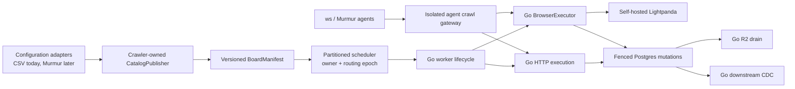

# Go and Lightpanda crawler migration

## Outcome

Replace the production crawler runtime with Go and self-hosted Lightpanda,
then retire Python, Playwright, and Chromium from production crawling. The
economic decision compares the complete crawler runtime at today's measured
load and at the same projected load. It is not a total-platform cost model.

There is one authoritative implementation for a task at a time. During
migration, Python and Go may coexist only for mutually exclusive cohorts.
Offline replay may compare both implementations from one captured upstream
response. We do not run permanent duplicate fleets, issue duplicate origin
requests, or silently fall back per task.

## Projected crawler workload

Issue #7936 prices both implementations against one versioned workload. These
floors prevent decisions that only fit today's volume:

- 10 million configured boards and 100 million active postings.
- At least 1 million boards due in one hour (16,667 monitor requests/minute).
- At least 5 million detail fetches due in one hour during catch-up (83,333
  scrape requests/minute), subject to origin policy.
- A 2x synthetic overload and one-runtime-instance-loss catch-up test without
  queue loss, origin-policy violation, or unbounded memory growth.
- Identical utilization, recovery, regional pricing, capability-mix, and
  publisher-policy assumptions for Python and Go.

Throughput is subordinate to publisher policy. Provider-, tenant-, and
egress-scoped rate/concurrency limits, `Retry-After`, TDM reservations, and
circuit breakers remain hard ceilings.

CHF 50/month is the current allocated crawler budget and is already known to
be insufficient. It is shown only to quantify the current funding shortfall;
it is not the observed Python cost or a ceiling for the projected fleet.

### Runtime-cost evidence and interface

The source-controlled comparison contract lives in
`apps/crawler/runtime-cost/`:

- `projected-workload-v1.json` freezes the 10M-board/100M-posting workload,
  the current 24-hour success mix, the 1M monitor/5M detail projected peak,
  shared headroom, and unresolved evidence requirements;
- `python-production-targets-v1.json` maps existing bounded Prometheus
  instances to crawler runtime roles, the shared `DISCOVERY_CONCURRENCY`
  pool, and its `MONITOR_CONCURRENCY` sub-cap;
- `evidence/python-production-2026-08-29-24h.json` is the first sanitized,
  read-only Python measurement; and
- `pricing/hetzner-eu-2026-06-15.json` preserves official EU-Central Hetzner
  prices in EUR, whole server shapes, IPv4 and traffic assumptions, VAT
  treatment, and the dated official EUR-to-CHF input; and
- `schemas/` defines the language-neutral workload, capture, measurement, and
  pricing interfaces that a later Go + Lightpanda measurement must also use.

Capture makes Prometheus read queries only; it does not crawl or replay any
publisher origin. Credentials are read from environment variables and neither
the read URL nor credentials are written to evidence:

```bash
cd apps/crawler
python -m src.runtime_cost capture-prometheus \
  --targets runtime-cost/python-production-targets-v1.json \
  --prometheus-url "$PROMETHEUS_READ_URL" \
  --source-revision <deployed-git-sha> \
  --window-seconds 86400 \
  --out <measurement.json>
```

The captured production release is also recorded from `crawler_build_info`.
Use `GRAFANA_PROM_USERNAME` and `GRAFANA_PROM_PASSWORD` by default, or select
different secret-bearing environment variable names with `--username-env`
and `--password-env`.

An exact 86,400-second capture is accepted only for the frozen six-target set:
`worker-1`, `worker-2`, `worker-3`, `browser-1`, `exporter`, and `drain`.
Start and end build identity must be the same single release on every target.
Missing targets, duplicate series, label drift, fractional counters, counter
resets, stale boundaries, or an incomplete paired observation remain explicit
blockers; the adapter never converts absence into a healthy zero.

The checked-in pricing revision uses the official price change effective 15
June 2026 for the FSN/NBG/HEL price group. The current crawler is evidenced as
a CX43, but its exact datacenter within that price group is unknown. Long-lived
instances use the monthly price cap, all prices exclude VAT, each server is
charged one primary IPv4, and EUR is converted at 0.9376 CHF per EUR from the
official 27 August 2026 reference rate. The source URLs and retrieval dates
are part of the pricing document.

The neutral model packs the measured resource requirement into whole Hetzner
servers. It reports every listed CX, CPX, and CCX scenario as pricing
sensitivity while keeping the observed CX43 selected for current load. It
does not choose a projected production SKU before shared-versus-dedicated load
tests exist:

```bash
python -m src.runtime_cost project \
  --workload runtime-cost/projected-workload-v1.json \
  --measurement <measurement.json> \
  --pricing runtime-cost/pricing/hetzner-eu-2026-06-15.json \
  --out <projection.json>
```

The cost boundary includes only worker/browser runtime, queue/scheduler,
runtime support, proxy, and network resources attributable to crawling. It
excludes Postgres, Typesense, R2, web, backups, and unrelated telemetry or
control-plane resources. An excluded service may be reported separately only
when the migration causes a measured attributable delta; its complete fleet
is never charged to this comparison.

Readiness is structural rather than an editable checklist. Worker sizing uses
the maximum of shared discovery-pool saturation and the monitor sub-cap; it
does not add monitor and detail as independent worker pools. The cost ledger
must cover all seven in-scope categories. Queue, scheduler, runtime-support,
and proxy require explicit current and projected monthly EUR values;
runtime-support also names every observed support role it covers. Network
pricing consumes measured response bytes, explicit monthly hours at the load
point, per-SKU included traffic, overage pricing, and IPv4. Missing entries,
uncovered support roles, null usage measurements, or an unselected SKU create
model-generated blockers even if every descriptive evidence status is edited
to `frozen`.

The first Python capture intentionally leaves browser-child CPU/RSS, complete
origin-attempt and response-byte counts, proxy attribution, and Redis resource
allocation unknown. The monthly traffic duty cycle, provider-weighted load,
response-size distribution, and capability/publisher-policy evidence are not
yet frozen. Queue, scheduler, runtime-support, and proxy ledger entries are
present but explicitly `unknown`. These are emitted as decision blockers
rather than inferred as zero, so the current artifact does not yet claim a
minimum CHF budget or any Go saving. Its selected current CX43 scenario
reports only a compute-plus-IPv4 subtotal of EUR 32.98 / CHF 30.92 per month,
excluding VAT. Because that subtotal omits blocked attributable costs,
`minimum_sustainable_monthly_chf_excluding_vat` and the CHF 50 funding
shortfall remain `null`; the subtotal must not be interpreted as evidence that
CHF 50 is sufficient.

Closed #8159 and merged #8161 are sampler provenance. Successor repair #8401
defines the capture contract after the #8228 preflight rejected the first
attempt. Every long-running crawler metrics process samples at monotonic,
absolute deadlines (`D(n) = D(0) + n*I`) with `0 < I <= 1s`; collection time is
not added to the cadence, skipped deadlines are counted exactly, and the loop
never runs an unbounded catch-up burst.

One frozen sample contains absolute root and container-tree CPU, root and tree
RSS, descendant count, observation sequence, interval, and observation time.
The metrics collector stores that object under one lock and exposes every
component from the same generation. Bounded per-component sequence and time
children let the read-only adapter reject cross-generation or stale pairs.
The first cgroup-v2 observation publishes full CPU usage instead of an
artificial zero. The sampler withholds a sample if tree CPU or RSS is below its
paired root value; the adapter also checks the in-window paired margins.
Cgroup CPU remains exit-safe for Chromium children that disappear between
`/proc` traversals.

#8405 isolates those absolute deadlines and `/proc` reads in one spawned
sampler process inside the same crawler container and cgroup. The process is a
descendant of the exact crawler root, so its bounded monitoring overhead stays
inside the tree totals while root-process totals retain their prior meaning.
The child publishes cumulative evidence over bounded Unix datagrams: each
datagram is an atomic complete snapshot, truncated or malformed frames are
discarded, and the parent never assembles fields from separate generations.
Each sampling cycle has exactly one publication boundary. Serialization and
send time are included in that cycle's handoff duration before elapsed
deadlines are classified; the next cumulative datagram carries that completed
handoff and classification, avoiding any self-referential partial flush.
The parent supervisor preserves monotonic counters across a child replacement;
death, stale output, malformed IPC, and a restart all remain explicit failure
or start evidence that blocks capture promotion. Staleness uses the parent's
local receipt time, not a child-controlled emission timestamp. Frames with an
unreasonable future emission, sample-after-emission ordering, or a regressing
sample time are rejected without replacing the last immutable sample or
refreshing the stale deadline.

Skipped deadlines retain the existing total counter and are additionally
partitioned, exactly once, into `scheduler_late` deadlines that elapsed before
collection began and `collection_overrun` deadlines that elapsed during
collection or handoff. Bounded, label-free histograms expose wake lateness,
collection duration, and handoff duration. The capture schema stays backward
compatible and continues to reject any total gap, failure, reset, or sampler
restart; the reason and timing metrics provide causal burn-in evidence rather
than relaxing that gate. Sampling interval, workload, browser concurrency,
container CPU quota, and host size are not changed by this isolation repair.

Strict timing promotion additionally uses the pre-seeded fixed-cardinality
`crawler_runtime_process_tree_sampler_timing_limit_violations_total` family.
Its only label is `phase`, with exactly `wake_lateness`, `collection`, and
`handoff`; each child increments for a finite non-negative duration greater
than or equal to 0.25 seconds, so equality fails the strict less-than limit.
The count shares the histogram's atomic child snapshot and remains monotonic
through sampler-child replacement. Capture retains raw integer start/end
values, their exact difference, and per-series reset counts for every phase.
Complete process-tree evidence requires the exact phase set, unchanged source
identity shared by all three phase children, zero resets, zero differences,
and `limit_seconds` exactly 0.25. Strict process-tree promotion also requires
the complete exact six-target production fleet; a generic smaller capture
retains its raw strict object as incomplete and stays at root-process scope.
Missing, extra, duplicate, fractional, negative, regressing, or threshold-
mismatched evidence fails closed; `increase()` and inclusive histogram buckets
are not accepted as strict-maximum proof. Historical generic measurement-v1
root-process evidence remains valid because the strict object is additive, but
all newly promoted complete process-tree coverage requires it.

Installed-image lifecycle smoke treats these counters as structural evidence:
it requires exactly the three bounded labels and finite non-negative integer
values, but permits nonzero values on a contended hosted runner. Only a fresh
production capture proves performance, using zero reset-free raw boundary
deltas for every phase on every target.

Navigation-network, content, and target-closed retry children are pre-created
for every declared bounded reason/outcome, including healthy zeros. The
target-closed counter emits one `outcome="retry"` at the accepted redispatch
edge, followed by exactly one `recovered` or `failed` terminal outcome. Capture
reads exact start/end counter values and reset evidence for every required
child. Missing children, unknown reasons/outcomes, duplicate or fractional
values, and resets block promotion. Labels remain limited to the declared
reason/outcome dimensions: URLs, hosts, companies, boards, postings, exception
text, image identities, and endpoints are forbidden.

The adapter promotes a role from `root-process` to `process-tree` only when
every target has coherent fresh boundaries, exact integer conservation, zero
failures/resets/restarts/gaps, at least 95% scheduled coverage, and paired tree
CPU/RSS no lower than root. The schema and model enforce the same evidence,
including complete browser retry matrices. The checked-in 2026-08-29 evidence
predates these metrics and remains `root-process`; no child usage or retry zero
is inferred into it. A new normally deployed release, passive burn-in, and
independently authorized exact window are still required. #8228 remains
clockless until those operational gates pass.

## Existing isolation points

| Segment | Existing boundary | Important semantics |
|---|---|---|
| Monitor implementations | `src/core/monitors` registry and `MonitorResult` | Rich/hybrid results, metadata watermarks, sitemap changes, truncation, filters |
| Scraper implementations | `src/core/scrapers` registry and `JobContent` | Fallback steps, missing versus empty fields, typed failure behavior |
| Scheduler | Redis Lua scripts in `src/lua` | Atomic claim, priority tiers, rate-limit readiness, leases, reaping, dead letters |
| Persistence | Named SQL in `src/queries` plus board/scrape transaction boundaries | Cross-board ownership, relisting, empty confirmation, gone guards, tombstone budgets |
| R2 drain | Independent `crawler drain` process | Three-state claims, content-hash guards, superseded uploads, retry schedule |
| Downstream CDC | Independent exporter cursors | Commit-safe cutoff, advisory fences, Typesense acknowledgement and projection |
| Proxy | `ProxyProvider` protocol | Provider-neutral egress configuration |
| Agent setup | `workspace/lib`, `ws` command shell, and Murmur shim | Configuration authoring must not become crawler-runtime ownership |
| Deployment | Quiesced Compose replacement and immutable images | Old and new Postgres writers do not overlap |

## Isolation added before translation

The first migration change adds boundaries without adding another production
implementation:

- `BoardRuntimeConfig` centralizes compatibility decoding for the current
  Redis/Postgres worker snapshot. The future cross-source `BoardManifest`
  remains owned by #7937/#7942; this seam does not pretend that CSV and Murmur
  already share a validated model.
- `MonitorRuntime` and `ScrapeRuntime` are in-process Python injection seams
  that separate extraction from scheduling and persistence. The framed v1
  execution protocol is the language-neutral boundary for Go.
- `BrowserBackend` separates browser lifecycle/page allocation from callers;
  the language-neutral browser plan/result contract is tracked separately so
  Go does not inherit a raw Playwright API as its public surface.
- `apps/crawler/contracts/v1` records provisional normalized input/output and
  queue invariants. #7937 must promote a generated, fully specified IDL before
  any Go consumer treats it as wire-authoritative.
- `crawler_runtime_*` and `crawler_browser_backend_lifecycle_total` establish
  bounded implementation/backend metrics before the first cutover.

These are migration seams, not a promise to preserve adapters forever. The
Python adapter for a segment is deleted when its Go successor owns that
segment and the cold rollback window expires.

### Networkless dark claimant deployment

The normal crawler release continuously deploys one `lightpanda-claimant`
container in exact `dark` mode. It uses the slim crawler image's dedicated
`lightpanda-claimant` executable directly, not the shared crawler CLI. Docker
sets `network_mode: none`; the process imports no claimant, Redis, PostgreSQL,
or metrics code. It validates the fixed route and the mounted mTLS bundle,
publishes only a container-local health marker, then waits for SIGTERM.

Claimant credentials are a content-addressed host generation. The CA, client
certificate, claimant-owned mode-0400 client key, and public CA/server pin
files are read-only bind mounts with host-path creation disabled. PEM objects
never enter Compose or its environment file. A deploy installs a new immutable
generation without deleting the generations referenced by the active or
rollback release. Rollback stops a candidate claimant first, restores the
exact prior Compose/environment snapshot, and discovers whether that snapshot
defines the claimant before restarting or checking it. This makes both the
first rollout (no prior claimant) and later rollbacks safe without adding the
service to the PostgreSQL pool-budget override.

This deployment has zero task authority and zero network reachability. It does
not activate a renderer route, queue feeder, or PostgreSQL fence; activation
remains a separately reviewed migration step.

### Fixed B0 cohort activation and cold reversal

The ordinary deploy still loads only `docker-compose.yml`, so it remains dark.
The file `apps/crawler/lightpanda-b0-enabled.override.yml` is an explicit
operator overlay, not an automatic rollout. It admits only the fixed `c1`
(`browser-use-careers`) or `c4` cohort (c1 plus `eclypsium-careers`,
`kandou-ai-careers`, and `poke-and-wiggle-careers`). Each task freezes the
posting/board IDs, URL, parser assignment, route epoch, and payload digests.
The executor reads the mutable description hash and scrape interval from
PostgreSQL again at every fenced attempt. The DB-only executor has no
Redis, renderer, proxy, R2, or external HTTP credentials; its origin transport
rejects every request, so processing can only consume the Go-supplied result.
Its UDS admission is split into four task conversations plus one independently
reserved route-attestation conversation. Saturating all four task slots
therefore rejects a fifth task without consuming the health path.

The enabled overlay also starts a non-claiming `lightpanda-producer` Go
sidecar. It is the sole owner of c1/c4 membership classification, parser-
assignment validation, canonical task construction, revision selection, and
the producer-side B0 Lua mutation. Python workers retain only a thin client:
they send legacy enqueue inputs over
`/run/jobseek-lightpanda-producer/control.sock`, accept `literal_legacy` only
from the authenticated Go peer, and otherwise use one atomic classify-and-
activate request. The two-phase preparation-digest/activation exchange is
operator-only for cold cutover planning. The operator obtains the exact board
manifest from the same Go authority before querying PostgreSQL; Python has no
duplicate c1/c4 board manifest. Missing, slow, malformed, fenced, or corrupt
authority fails closed; there is no per-task fallback or response cache.

The UDS directory is owned by UID 10001 at mode 0700 and the socket at mode
0600. Mutation clients run as root (UID 0); the producer rejects mutation from
its own UID. The container healthcheck runs as producer UID 10001 and is
limited to an exact framed, read-only authority probe that names the configured
mutation UID. It verifies directory/socket ownership and mode, socket inode
across connect, the server's Linux `SO_PEERCRED`, the canonical response, and
connection close; the server applies the reciprocal peer check.
Because Docker creates fresh producer and executor named-volume roots with
unsuitable ownership, the cutover first runs bounded, networkless one-shot
initializers with only `CAP_CHOWN`. An initializer may mutate only an empty,
exact root-owned mode-0755 fresh volume or the empty root-owned mode-0700 state
left if that initializer crashed between `chmod` and `chown`; an already exact
UID/GID-10001 mode-0700 volume is an idempotent no-op. Every nonempty root-owned
or otherwise ambiguous state is rejected. Both long-running services remain
unprivileged and never normalize an ambiguous live volume.
Frames use canonical uvarint framing and strict canonical JSON, are capped at
256 KiB, and have a three-second deadline. The server has a bounded backlog of
72 (the documented 67-caller discovery burst plus healthcheck headroom) and at
most eight handlers; admission backpressures before `accept`, so excess callers
are queued instead of deliberately dropped. Any Redis failure, route fence, or
queue corruption latches authority loss, removes readiness, cancels the
server, and terminates it with a bounded typed log. Startup, every authenticated
health request, and every two-second periodic probe run the same read-only full
Lua conservation audit, bounded to the lane's maximum 512 records. Thus a
missing record/index/holder membership is detected after readiness as well as
at startup.

Before its first Redis mutation, the producer creates and fsyncs an exact,
UID-10001-owned mode-0600 `.activation-v1` sentinel on the named producer
volume in `P` (preparing) phase. The sentinel and Redis initialization are
serialized against every preflight. The initialization Lua turn atomically
publishes the route together with a Redis-wide
`lightpanda-b0:producer-owner` hash containing the exact namespace, route,
cohort, and Go-supplied board manifest. The producer then changes only the
marker's phase byte to `A` (active), fsyncs it, and requires the complete
active-marker/Redis pair to pass a second full audit before activating any
task. Startup accepts only absent marker plus
wholly absent Redis, or exact active marker plus fully valid Redis; preparing,
partial, or mismatched pairs are recovery-only and never become ready. An
all-seven-key-empty namespace is bootstrap only in the first pair.
Consequently, deleting the seven namespace keys or losing the whole Redis
database after activation is corruption and cannot regain readiness on
restart. The base Python workers also mount the named authority volume
read-only, and off-mode enqueue requires the marker to be absent before it may
use the legacy path. The global legacy enqueue Lua independently validates the
exact canonical owner/route marker: cohort boards are rejected before any
legacy config or queue mutation, while boards outside the manifest continue on
the Python queues. Malformed owner state fails closed. A fixed set of 32
context-aware task-ID stripes serializes each producer task through re-prepare
and activation, preventing concurrent same-ID requests from turning an
idempotent activation into process-fatal `task_already_exists`.

The enabled overlay deliberately creates every mutation-capable service with
restart disabled. Only after all health checks pass, every exact Compose
container is re-inspected as `no:0`, and the active receipt is fsynced does the
wrapper dynamically restore the base `unless-stopped` policies (with the
producer capped at five failures), verifying the same container ID and exact
policy and explicit running state after each update. The claimant is armed
last. A pre-receipt reboot
therefore restarts none of the partial lane; a failure during arming retains
the active receipt and contains every service. The sidecar receives Redis,
fixed route/cohort, and the producer named volume only: it has no PostgreSQL,
renderer, mTLS, proxy, R2, or Typesense authority.

`network_mode: host` remains functionally required in this slice because the
production Redis authority is reached on host loopback. It therefore does not
provide network-egress containment; the sidecar's isolation is defense in
depth through its credential set and narrow protocol, not a network sandbox.
The accepted debt is bounded by withholding every downstream credential
(database, renderer, proxy, R2, Typesense, and claimant PKI). Moving Redis to a
dedicated network namespace is follow-up infrastructure work, not part of this
producer-authority cutover.

Activation is deliberately cold. First add `deployment-hold:crawler` to the
tracking issue and confirm the renderer release and credential generation are
healthy. Then the operator runs the single host wrapper; the wrapper holds
`/run/lock/jobseek-crawler-mutation.lock` through stop, attestation, digest-
gated transfer, restart, health checks, and durable receipt publication:

The ordinary crawler deploy persists only the reviewed static non-secret
identity (`10.0.0.5`, `production-b0`, `lightpanda-b0`); it deliberately does
not publish a reusable routing epoch. Under the host mutation lock, every
fresh activation reserves the next value from the dedicated PostgreSQL
`lightpanda_b0_routing_epoch_seq` before enabled Compose may render or any
producer, sentinel, or Redis mutation may begin. The sequence starts at `2`
because epoch `1` is the retired pre-allocator incarnation, is bounded by the
queue protocol maximum, never cycles, and burns values on failed attempts, so
gaps are expected. The enabled overlay requires the exact exported epoch and
passes it to the producer, claimant, and DB-only executor. Before any enabled
Compose render, the wrapper requires the receipt/reserved epoch to equal the
current PostgreSQL sequence high-water. The executor repeats that database
attestation before publishing its socket. Its resident UDS `attest_route`
challenge binds the live resident process to the exact shard and epoch and
rechecks PostgreSQL; Docker health and the Go supervisor use that challenge.
Go performs it before renderer reservations or Redis initialization and still
receives no database credential. A PostgreSQL trigger independently rejects
every Go fence insert or update whose epoch is no longer current, rolling back
the surrounding application transaction; Python-owned fences bypass that
check. Migration `0028`, applied after the deployed allocator migration, makes
this a total transaction order: a Go fence trigger holds a shared transaction
advisory lock across its write, while allocation holds the matching exclusive
transaction lock across `nextval`. Allocation therefore happens wholly before
the write (which rejects) or wholly after its commit. The invoker needs
sequence `SELECT` for the trigger; only the allocator also needs sequence
`USAGE`. `PUBLIC` has neither. The wrapper rejects a malformed or out-of-range
value before stopping a service.

```bash
sudo -u deploy /home/deploy/scripts/lightpanda-b0-cutover.sh activate c1
```

The wrapper also stops `drain` and the producer sidecar, rejects every existing
Compose one-off, and proves the named services are stopped. It then starts
only the non-claiming producer, waits for its authenticated UDS to become
healthy, and runs the read-only plan before any queue mutation. The planner
requests the exact cohort manifest from Go, compares that active PostgreSQL
board set and parser metadata with Redis, suffix-scans both
legacy inflight/dead-letter sets, refuses active PostgreSQL leases, and emits a
canonical plan digest before any ownership transfer. Each accepted record is
transferred and guarded in one Lua turn. First-time intent comes from the exact
legacy membership for a new transfer, from the bound legacy guard for an
existing ready record, and from current PostgreSQL description state for a new
terminal/dead incarnation. Every first-time Go schedule is due at epoch zero;
rollback still restores an existing ready record with its exact guarded legacy
kind and score. Start with `c1`. Direct `c1` to `c4`
activation is deliberately unsupported: first cold-rollback `c1` to Python,
then run a distinct cold `activate c4` transition. An existing active receipt
is safely read first to recover its exact epoch, fully attested against the
requested cohort and epoch, and then re-drives the producer/Redis health path;
filesystem attestation alone never returns activation success. A pending
receipt is recovery-only and an `activate` retry preserves it unchanged.

The pending receipt is written before the first transfer. After the final
activation audit, the wrapper requires a synchronous Redis `SAVE` while the
receipt is still pending and before any executor, claimant, or Python mutation
service starts. A failed or lost reply triggers host-level containment, leaves
the pending receipt in place, and requires the reviewed pending-recovery path;
it can never publish an active receipt on uncertain disk durability.
PostgreSQL fence rejection is a typed authority-loss result that stops the Go
supervisor rather than entering its ordinary retry loop.

Rollback planning and apply bind the attested receipt state and detected local
marker phase into their digest. An active receipt with an absent Redis
namespace is always authority loss. Pending recovery may treat an absent
namespace as a pre-commit no-op only when the marker is absent, exactly
preparing, or a bounded private partial preparing write; an active or unsafe
marker remains cold. When the namespace is present, the route-fenced Lua
rollback remains authoritative. This distinguishes a crash before Redis
initialization from loss after the active phase was durably committed without
attempting to reconstruct the cohort from PostgreSQL.

After enabled services pass health checks the wrapper atomically publishes
`/home/deploy/.lightpanda-b0-active-v1` as a deploy-owned mode-0600 receipt.
Publication fsyncs the complete temporary file before rename and the parent
directory afterward. Rollback parses the exact unique-key receipt schema and
attests its active state, cohort, route identity, Compose digest, immutable
crawler image, and deploy revision against the current environment before it
stops any service.
The ordinary deploy fails closed while this receipt exists, preventing a base-
Compose release from silently stopping the canary. Do not remove the receipt
manually.

Cold reversal uses current PostgreSQL state, not activation-time Redis state.
SIGTERM makes each Go worker atomically reschedule its held task under the
current unexpired lease fence before the supervisor exits. If a forced kill
prevents that handoff, the cold wrapper waits at most 75 seconds for live
leases and uses only the route-fenced Lua reaper, whose clock comes from Redis
`TIME`, to return expired leases to ready or dead under the production
three-failure policy. The rollback planner and apply still independently
require zero inflight authority, and the atomic rollback Lua gate remains the
final check. A live lease beyond the bound or a malformed fence fails closed
with the receipt retained. Dead records have a deterministic policy: the
planner uses current PostgreSQL truth and the final atomic Lua turn restores
eligible dead tasks to the Python ready queues (or drops currently ineligible
ones) together with ready and terminal records. It never silently deletes or
reactivates dead work under Go ownership.
It reconstructs exact current scrape hashes and queue classes (preserving a
non-null hash of `0`), drops deleted/inactive/unscheduled tasks and tasks whose
current board is disabled or non-active, and refuses inflight, corrupt, or
fenced B0 authority rather than guessing. Before committing, the UID-10001 Go
binary read-only attests that the activation sentinel is exactly clearable.
The final Lua turn restores legacy work, deletes the seven B0 keys and legacy
guards, and replaces the exact Go owner hash with an HLEN-8 rollback tombstone.
That tombstone binds the cohort, route, rollback plan digest, and SHA-256 of the
still-present active or pending receipt. Under the tombstone the operator
idempotently deletes and counts zero every exact Go write fence for the route.

Before contacting the non-transactional allocator, rollback durably replaces
the active or pending source receipt with `rollback-pending`, binding the
source state and SHA-256 while recording the retirement epoch as `unreserved`.
It then reserves `R > E` and durably rewrites that receipt to bind both source
epoch `E` and retirement epoch `R`. A crash between `nextval` and the bound
rewrite burns the ambiguous value; retry reserves a newer one. Recovery accepts
only the exact source identity and exact current `R`; Redis rollback/tombstone
and PostgreSQL fence cleanup remain bound to `E`.

After the rollback Lua commit and PostgreSQL fence cleanup, the wrapper first
requires a synchronous Redis `SAVE` while the exact tombstone, source receipt,
and producer sentinel still exist. A failed or lost reply therefore retries
the full idempotent rollback. The Go one-shot then verifies but does not delete
the tombstone while it removes and fsyncs the activation sentinel. The wrapper
then durably publishes the distinct
`rollback-cleared` receipt, carrying the source state/SHA, rollback plan digest,
source epoch `E`, and retirement epoch `R`. An exact Lua compare-delete removes
the tombstone only after the
sentinel is absent, Redis namespace and guard keys are absent, and PostgreSQL
route fences are zero. A second synchronous `SAVE` must persist tombstone
absence before Python starts; a failed or lost reply retains the
`rollback-cleared` receipt and retries only the exact delete/persistence
boundary. The receipt is removed only after Python health succeeds. A crash
after Redis commit retries PostgreSQL
cleanup under the bound tombstone; a crash after sentinel clear retries from
the source receipt; and a crash after `rollback-cleared` publication retries
only the exact tombstone delete and absence persistence. A missing or stale
tombstone, a mismatched
source receipt, or tombstone coexistence with namespace/guard state fails
closed. Immediately before Python starts, the wrapper again requires `R` to be
the exact PostgreSQL high-water. After successful rollback removes the receipt,
the next activation must reserve a value strictly newer than `R`; neither Redis
nor a recreated host file is an epoch source.

A hard-killed producer may leave its control socket inode on the named volume.
After the wrapper has attested the host cold, the reset one-shot accepts only
an exact UID-10001, mode-0600 socket whose bounded connect returns
`ECONNREFUSED`; it revalidates the inode, removes it, and fsyncs the directory.
A live socket, unsafe path, changed inode, or ambiguous liveness result remains
a fatal rollback error. Only after Redis absence is proven, rollback may also
remove a zero-length or partial sentinel left by a crash during its initial
write, but only when it is still a bounded, regular, single-link, UID-10001,
mode-0600 file. Symlinks, wrong ownership/mode, hardlinks, and oversized files
remain fatal.

Producer startup applies the same bounded inode, UID, mode, and connect
liveness proof before replacing an existing socket. It removes and fsyncs only
an exact socket whose connect returns `ECONNREFUSED`; a second producer cannot
unlink a live first producer's socket.

```bash
sudo -u deploy /home/deploy/scripts/lightpanda-b0-cutover.sh rollback c1
```

If activation failed after publishing its pending receipt, run the same cold
recovery under an explicit pending-state gate. This command refuses an active
receipt, performs the bounded lease settling above, restores Python, and only
then removes the receipt:

```bash
sudo -u deploy /home/deploy/scripts/lightpanda-b0-cutover.sh recover-pending c1
```

The enabled lane has an exact no-swap ceiling of 1.5 GiB: the renderer is 1
GiB, the Go claimant supervisor is 96 MiB, the non-claiming producer is 32
MiB, and the DB-only executor is 384 MiB. The
supervisor exposes bounded c1/c4 queue transition/fence, ready/inflight/dead,
reap, due-to-claim/complete, renderer wait, executor wait, and task outcome
telemetry on `127.0.0.1:9101`. The crawler-host Alloy target forwards that
endpoint with fixed B0/runtime labels; task logs contain IDs and bounded
phase/outcome classes, never arbitrary URLs.

The lifetime task-ID namespace has a physical capacity of 2048 records. The B0
pilot treats occupancy 1600 as a fail-closed rollback signal and refuses a new
ID once occupancy is already at that boundary; an existing ID may still
complete or be reactivated. The threshold is based on a baseline of 1270 live
postings plus 200 retained terminal records (1470), leaving 130 records
for watchdog reaction and 448 below physical exhaustion. The producer control
manifest reports exact lifetime occupancy, capacity, and headroom for activation
and watchdog decisions. Crossing the signal requires the external host
watchdog/operator path to invoke this reviewed cold wrapper; the claimant never
attempts unsafe in-process Python rollback. Real-Redis integration gates
exercise a successful near-threshold enqueue, a full 2048-record conservation
audit under two seconds, and the atomic 2048-record rollback under five seconds.

### Dormant renderer host boundary

The dormant renderer uses a separate, one-time root maintenance bootstrap
before ordinary renderer deploys. Bootstrap locks both the root-owned host
policy and deploy-owned renderer state, verifies the exact stopped Murmur and
cloudflared identities, verifies then removes only the active internal-only
legacy renderer, and preserves its release and active pointer. It creates two
persistent external Docker networks and installs complete root-owned
iptables-nft chains before publishing exact rule-zero hooks. DNS is limited to
the two reviewed resolvers, web egress to TCP 443, production and private
addresses are denied, IPv6 renderer paths are denied, and private mTLS ingress
is accepted only from the crawler address.

Bootstrap is monotonic. A failure quarantines every endpoint on the dedicated
egress network and leaves the restrictive policy and persistent networks in
place. Re-running bootstrap repairs only empty-network policy state; there is
no decommission or cross-user transaction log in the deploy path. A root-owned
tmpfiles declaration recreates the exact host lock before services on every
boot. Bootstrap attests and durably fsyncs the exact systemd enablement link
and its directories before publishing its completion marker. The systemd unit
serializes on the renderer lifecycle lock and reattests or repairs that same
empty-network state after Docker restarts.

Ordinary deploys take the host lock before the renderer lock. Their normal root
capabilities are read-only policy attestation immediately before starting a
candidate and read-only policy-plus-runtime attestation immediately after; an
exact quarantine command is reserved for fail-closed handling of malformed
named containers or routed endpoints. They never create, replace, or remove
host policy. Before replacement they authenticate and cold-remove the exact
owned container, including a stale uncommitted candidate whose release differs
from the active pointer or an exact Compose-created candidate that has not
started. Stopped ownership uses immutable generation, image, label, mount,
HostConfig, and static IPAM evidence rather than live endpoint metadata; both
renderer networks are drained before removal. Each release carries the exact
policy and inventory digests accepted by the root readiness guard, so unrelated
commits deploy without re-bootstrap while policy changes fail cold until the
matching bootstrap completes. Candidate failure stops, disconnects, and
removes the exact candidate, restores the prior active pointer, proves the
routed network stably empty, and leaves the renderer cold; restarting a prior
generation requires a separately reviewed operator deploy.

## Target architecture



Murmur eventually owns configuration workflow and agent interaction. It does
not write crawler tables directly or own crawler scheduling, politeness,
leases, or persistence. CSV and Murmur are input adapters to a crawler-owned
catalog publisher. Until the Murmur epic is ready, `ws` continues to author
current configuration and must not be coupled to unfinished Go internals.
Both surfaces converge on versioned catalog drafts/manifests and the isolated
agent crawl gateway.

## Safety decisions

### Fenced ownership before mixed generations

The current lease member is reusable and does not fence a stale claimant. A
queue protocol revision must add `shard_id`, `routing_epoch`, `engine_owner`,
`config_revision`, and a unique `claim_token`. Heartbeat, complete,
reschedule, reaping, and authoritative database mutations compare the token
and epoch. A stale result is rejected and counted.

### Replay, not duplicate crawling

Capture one redacted upstream HTTP/browser transcript from the authoritative
owner. Replay it offline through Python and Go and compare normalized result,
failure class, request plan, and projected database effects. A live canary is
allowed only after replay passes and owns an exclusive cohort and traffic
budget.

### Cold reversal, not a live fallback fleet

Keep the previous Python/Chromium image digest and deployment manifest for a
time-boxed rollback window. To reverse a cohort: freeze new claims, drain or
expire leases, verify conservation, retire the receipt-bound routing epoch,
restore the pinned image, reseed if required, and resume. Never let two owners
claim the same epoch; a later activation obtains a new PostgreSQL sequence
value rather than deriving one from Redis. Every Postgres, Redis, or catalog
schema change inside the window must prove compatibility with that pinned
artifact; otherwise pin a replacement artifact and repeat the drill. The final
drill runs against the actual production schema and data shape immediately
before retirement.

### Lightpanda compatibility is explicit

Classify every browser configuration by capability: rendering, evaluation,
actions/pagination, response capture/interception, frames, persistent or
headful identity, proxying, and transport quirks. An unsupported capability is
a typed blocking result, never a silent no-op or automatic Chromium fallback.
Before final retirement, every exception is either implemented in Lightpanda,
refactored to HTTP/API execution, or deliberately retired.

An unsupported required capability rejects the entire browser result before
any discovery diff, gone decision, watermark, or failure budget is mutated.
Partial HTML, captures, or evaluations from that attempt are diagnostic only.

### Agent egress is not board proxying

The future agent crawl gateway is a separate service with no database, Redis,
Typesense, deployment, or raw CDP credentials. It applies network-level SSRF
controls and URL/time/byte/concurrency budgets to redirects, subresources,
WebSockets, and in-page fetches. This is distinct from a board config choosing
paid proxy egress.

## Scorecard and reversal metrics

Metrics use bounded labels such as implementation, release, work class,
browser class, provider family, region, and cohort. Board IDs and arbitrary
hosts belong in sampled structured logs/traces rather than global-scale
Prometheus labels.

| Dimension | Required evidence |
|---|---|
| Freshness | Due-to-claim and due-to-complete p50/p95/p99/max, oldest due age, percent within schedule plus grace |
| Correctness | Exact/canonical URL-set parity, normalized field hashes, all result flags, projected DB effects, zero unexplained gone candidates |
| Queue safety | Due/future/inflight counts, conservation, lease age/loss/reap/dead-letter, epoch/token mismatch, stale-write rejection |
| Politeness | Requests and bytes per success, retries, 403/429/challenges, `Retry-After`, concurrency and rate per policy key |
| Browser | Startup/session/crash/protocol errors, navigation/status, actions, evaluation, capture, frames, content completeness by capability class |
| Efficiency | CPU-seconds, peak/steady RSS, network/proxy bytes, and browser-seconds per successful board/posting and per GiB-hour |
| Downstream | Postgres commit-to-R2/export/index freshness, cursor lag, hash/reconciliation drift, malformed acknowledgements |

Immediate freeze and reversal triggers include any stale-epoch authoritative
write, unexplained gone/delist burst, TDM violation, queue loss/duplication,
origin-policy violation, more than 1.05x request amplification without an
approved reason, material anti-bot regression, or freshness error-budget burn.

## Migration order

1. Freeze contracts, crawler-runtime workload/cost evidence, replay corpus,
   SLOs, fencing, global politeness, and cohort ownership.
2. Port independently replaceable processes first: R2 drain and downstream
   CDC/projection.
3. Build and deploy the Lightpanda capability harness/service without board
   ownership, then implement the typed Go browser executor by capability class.
4. Implement the Go worker lifecycle, HTTP transport, monitor/scraper state
   machines, extraction families, and enrichment in bounded issues.
5. Route exclusive cohorts only after replay and fault-injection gates pass.
6. Move the configuration compiler/control plane last, coordinated with the
   existing Murmur epic and without prematurely breaking `ws`.
7. Run a full capacity/recovery test, rehearse cold reversal, soak the all-Go
   fleet, then delete Python/Chromium production paths and expire the rollback
   artifact.

## Tracked work

### Foundations and safe ownership

- [ ] #7936 - Python versus Go + Lightpanda crawler-runtime cost at projected load
- [ ] #7937 - runtime IDL, typed errors, and golden offline replay
- [ ] #7938 - queue protocol v2 fencing and conservation
- [ ] #7939 - global politeness, TDM, circuits, and egress policy
- [ ] #7940 - migration SLOs, alerts, and cardinality budgets
- [ ] #7941 - deterministic cohort routing and cold cutover/reversal

### Catalog, `ws`, and Murmur

- [ ] #7942 - crawler-owned CatalogPublisher and transactional outbox
- [ ] #7943 - versioned catalog/runtime adapters for `ws` and Murmur
- [ ] #7944 - isolated agent crawl gateway

These supersede the direct-database-write, early CSV deletion, and early `ws`
retirement portions of the existing Murmur epic #2852. Murmur product work may
continue, but catalog authority cannot switch before #7942 and #7943, and the
control-plane cutover cannot occur before #7965. The current demo shim is not
authoritative.

#7944 is coordinated scope for Murmur/agent correctness, not a prerequisite
for crawler-runtime retirement. It may proceed on its own schedule once the
runtime contracts and security boundary are ready.

### Independently replaceable processes

- [ ] #7945 - Go R2 description drain
- [ ] #7946 - frozen projections and Go Typesense CDC target
- [ ] #7947 - Go exporter coordination and retained reconciliation targets

### Worker, transport, state, and enrichment

- [ ] #7948 - Go Redis client and worker lifecycle shell
- [ ] #7949 - Go HTTP/proxy/retry/transcript layer
- [ ] #7950 - fenced board mutations and monitor state machine
- [ ] #7951 - fenced scrape fallback/persistence state machine
- [ ] #7952 - Go normalization and enrichment

### Monitor and scraper protocol families

- [ ] #7953 - sitemap, RSS, static DOM, inline, and raw monitors
- [ ] #7954 - rich JSON ATS monitors
- [ ] #7955 - stateful, paginated, and session HTTP monitors
- [ ] #7956 - static structured-data and HTML scrapers
- [ ] #7957 - ATS/API detail scrapers
- [ ] #7958 - bounded PDF/document extraction

### Self-hosted Lightpanda

- [ ] #7959 - pinned capability census and replay harness
- [ ] #7960 - isolated self-hosted service and lifecycle controls
- [ ] #7961 - generic Go BrowserExecutor for render/evaluate
- [ ] #7962 - actions, pagination, response capture, and interception
- [ ] #7963 - frames, identity, proxy, and transport edge classes

### Completion

- [ ] #7964 - runtime maintenance, repair, reconciliation, and operator commands
- [ ] #7965 - catalog compiler/control-plane sync, deliberately last
- [ ] #7966 - retire Python, Playwright, Chromium, and legacy runtime paths
