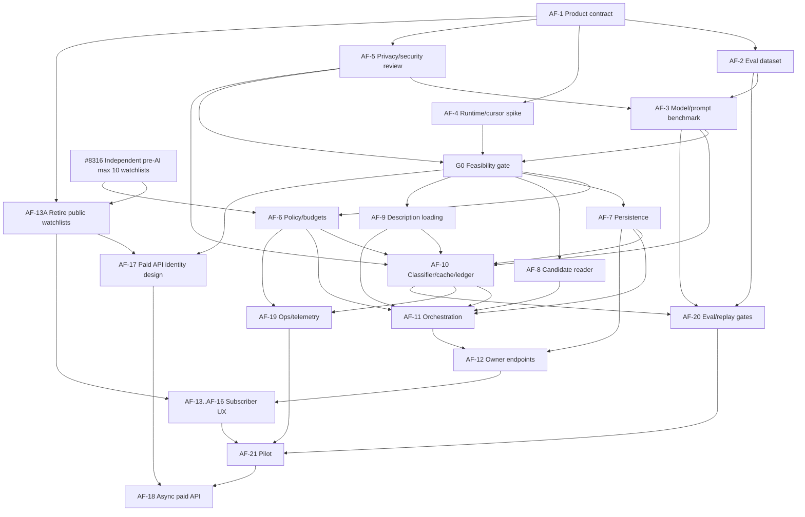

# Subscriber AI filter for watchlists

Status: proposed epic design, synchronized with the live planning issues and
`origin/main` on 2026-09-01. This document does not provision an AI provider or
runtime, and it does not claim that the proposed AI feature is implemented.

## Outcome

Give an actively subscribed user a persistent natural-language filter on an
owned, manually configured watchlist. The user sets every structured filter
through the existing controls; those filters select the exact candidate
stream. A small model receives only the soft query and job content and
classifies each candidate into accepted or rejected. The initial activation
reviews one bounded segment of currently active jobs first seen in the prior
30 days. Older recent history is reviewed only as the owner reaches the end of
the accepted feed; ongoing spend follows matching new-job arrivals rather than
time spent browsing.

This is not an Explore/search-page mode. Watchlists become private owner
resources, with no anonymous/public watchlist viewer or discovery surface.
Results persist across visits and structured-filter edits, survive refreshes
and disconnects, and can be corrected by the owner. User-facing AI credits are
unnecessary, but watchlist breadth, account watchlist count, concurrency, and
model spend are enforced server-side.

## Current delivery status

The live GitHub issues remain authoritative when this proposal and delivery
state differ:

- [#8323](https://github.com/colophon-group/jobseek/issues/8323) owns the
  dynamic AI-filter epic, feasibility gate, and downstream AI issue tree;
- [#8348](https://github.com/colophon-group/jobseek/issues/8348) owns the
  staged public-watchlist retirement and the preserved future copy/API seams;
  and
- [#8366](https://github.com/colophon-group/jobseek/issues/8366) tracks the
  pre-AI cleanup dependencies and their current gates.

As of `origin/main` at `3c20e13c3`, only these relevant foundations are merged:

- #8372 enforces the universal 10-watchlist backend cap while grandfathering
  existing over-limit accounts;
- #8374 gives anonymous `GET /api/v1/watchlists` its bounded `410 Gone`
  sunset and removes unauthenticated MCP watchlist discovery;
- #8376 makes mutations private by default and separates explicit copy-source
  authorization from destination-owner capacity;
- #8380 provides the canonical session-free structured watchlist matcher for
  interactive and future background consumers; it is a prerequisite seam,
  not completion of the AI candidate reader; and
- #8375 and #8386 provide providerless weekly-notification persistence and an
  `off`/`shadow` scheduler core. Notifications remain an independent track and
  do not consume AI accepted/rejected queues in their first release.

The rendered account-limit UI (#8377) and canonical private watchlist route UI
(#8385/#8368) are technically reviewed drafts but still lack the required
preview evidence and explicit human taste approval. The private-row migration
(#8381) is also an unmerged, unexecuted draft gated on that route cutover and
deployment verification. Public cache/index/SEO/OG/sitemap/IndexNow cleanup,
compatibility retirement, and removal of `is_public` remain open. No AI
feasibility issue is complete, gate G0 is closed, and no AI service, provider,
model route, queue, or UI described below is implemented.

This documentation-only planning update changes no rendered UI and creates no
provider or cost commitment, so neither the human UI gate nor a provider-cost
approval gate applies to this document itself.

## Product contract

### Watchlist-bound inputs and lifecycle

Only an owner with `canUseAiFilter` may enable AI filtering on a watchlist. The
persistent configuration contains:

- the watchlist ID and owner;
- a required natural-language query describing soft preferences;
- the current watchlist revision and its existing locations, occupations,
  seniorities, technologies, employment type, work mode, compensation,
  experience, company scope, and owner language preferences;
- a newest-first candidate cursor/high-water mark;
- versioned normalization, cache, model, prompt, schema, breadth, spend, and
  privacy policies.

Structured watchlist settings are hard constraints. They are compiled through
the same canonical Typesense filter code as the normal watchlist and are
applied before a job reaches the model. The model must not reinterpret or
broaden them; it only classifies the remaining job against the AI query.

The user authors and narrows all hard filters through the existing watchlist
controls before AI can be enabled. The service never asks a model to parse the
soft query into countries, occupations, seniorities, experience, technologies,
or any other structured setting; it never suggests or mutates those settings.
The classifier request contains only the normalized soft query and normalized
job payload. The backend still records the structured-filter revision and
candidate provenance for eligibility, cursoring, reconciliation, and audit,
but does not include the filter snapshot in the model prompt.

Enabling the feature freezes a newest-first candidate horizon containing
currently active matching jobs first seen in the prior 30 days and reviews one
50-classification segment. Further historical segments are requested only when the
owner reaches the accepted-feed boundary. There is no explicit **Review more**
or **Load more** button. Separately, scheduled and access catch-up move forward
from the high-water mark and classify each newly matching posting at most once
for that watchlist/query version.

The accepted and rejected product queues expose only postings from the rolling
prior 30 days. Watchlist decision/event rows and global exact-cache entries
expire no later than the posting's `first_seen_at + 30 days`; a shared cache
entry also has an independent maximum of `ready_at + 30 days`, whichever comes
first. Cache hits never extend either boundary. Expired product/cache rows are
deleted by a bounded retention job and never cause an unbounded catch-up after
a long pause or lapsed subscription. De-identified aggregate usage records and
explicit feedback may have separately approved retention because they are not
reusable decisions. Internal 50-job segments make work durable and
cancellable; the owner sees ordinary feed continuation rather than credits or
backend batches.

Changing only structured watchlist settings reconciles membership and reuses
decisions for the unchanged AI query. Newly included jobs within the rolling
30-day window use the exact decision cache where possible. Changing the AI
query creates a new query version and a new 30-day initialization workload;
it starts with one segment and continues through accepted-feed scroll. The
prior query's results are no longer the active accepted/rejected view.
Disabling AI filtering stops new work but preserves existing results only until
their rolling 30-day product expiry.

### Account and breadth eligibility

The account-wide watchlist ceiling is 10 for all plans. Backend enforcement of
that universal limit is merged in #8372; the rendered plan/product-truth change
that replaces the former Free-one/paid-"unlimited" promise remains gated in
#8377. The limit is a product safety boundary rather than a subscription
restriction. The AI feature remains subscriber-only. Existing accounts above
10 are not modified or deleted: they retain read/edit/delete access and may
AI-enable at most 10 existing watchlists, but cannot create or copy another
watchlist until below the limit.

Before enable, AI-query change, or structured-filter reconciliation, run
count-only Typesense queries using the exact watchlist filters:

```text
expected_new_jobs_per_day = max(
  matching postings first seen in last 7 days / 7,
  matching postings first seen in last 30 days / 30
)
```

AI filtering is eligible only when:

- `expected_new_jobs_per_day <= 25`; and
- currently active matching postings first seen in the prior 30 days are
  `<= 750`.

"Expected" is a trailing observed flow rate, not a forecast or guarantee. The
30-day initialization count is an explicit second guard even though it should
normally be no larger than the 30-day flow count. Refuse initial enablement or
an AI-query replacement while either gate fails. If an ordinary structured
edit makes an already-enabled watchlist ineligible, allow the watchlist edit
but pause AI work and prompt the owner to narrow company, occupation, location,
seniority, or other hard filters using the normal watchlist controls. The UI
may highlight which existing controls can narrow the measured candidate set,
but it does not generate filter selections. Re-evaluate enabled watchlists
daily. A hard burst guard pauses a watchlist rather than silently skipping
candidates if more than 100 unseen matching jobs arrive within 24 hours.

Initial configuration for the pilot:

| Lever | Initial value | Purpose |
|---|---:|---|
| Account watchlists | 10 | Universal creation/copy ceiling and AI fan-out bound |
| AI-enabled watchlists | 10 | Subscriber maximum, bounded by account watchlists |
| Initialization horizon | 30 days | Useful recent history on first enable/query change |
| Expected new-job breadth | 25/day/watchlist | Eligibility gate based on max of 7d and 30d rates |
| Initialization candidates | 750/watchlist | Maximum active recent jobs available across a fully scrolled history horizon |
| Initial history work | 1 segment | Bound activation latency and spend before engagement |
| Historical continuation | Accepted-feed boundary | One segment per distinct owner scroll intent; no button |
| Visible AI queue history | Rolling 30 days | Bound watchlist history and long-pause catch-up |
| Exact decision-cache retention | Earlier of job first-seen + 30d or cache ready + 30d | Align reuse with the product horizon; hits do not extend it |
| New-job burst guard | 100/day/watchlist | Pause anomalous surges without dropping cursor state |
| Catch-up policy | Owner access + daily sweep + before weekly alert build | Configurable service cadence, not a user choice |
| Internal segment | 50 classified jobs | Durable checkpoint and spend unit |
| Model batch | 5 jobs | Amortize prompt overhead while preserving low first-result latency |
| Concurrent model batches | 2 | Keep providers and presentation buffer bounded |
| Foreground reveal interval | 1 second | Smooth newly confirmed decisions without replaying persisted history |
| Per-user monthly model-spend budget | $10 | Internal cost circuit breaker; expected use is below the budget |
| Active segments per user | 1 | Prevent replay and parallel-spend abuse |
| Query length | 1,000 characters | Bound cost and prompt abuse |
| Normalized description | 12,000 characters | Covers the observed corpus while bounding input tokens |
| Provider timeout | 10 seconds | Keep a segment recoverable |
| Provider retry | 1 retry | Bound duplicate token spend |

These are configuration, not literals spread across handlers. Product can
change cadence and segment size later without changing stored contracts.

The breadth and spend ceilings are not presented as a credit balance. If AI is
paused because a watchlist is too broad, a burst guard fires, or the internal
monthly budget is exhausted, the UI states that processing is paused and what
the owner can do; it never simulates indefinite work.

### Owned watchlist selection and public-watchlist retirement

The AI entry surface is a direct selection from the signed-in user's manually
configured watchlists. With the universal maximum of 10, render the owned list
as cards or a radio/select control; do not build a public, popular, or general
watchlist search surface. If the user has none, link to ordinary watchlist
creation and manual filter setup.

Phase out public watchlists across the product:

- all watchlists become owner-only and every create/update path is private;
- anonymous and cross-user watchlist reads return the same not-found behavior;
- remove public/popular discovery UI, the Typesense `watchlist` discovery
  collection, public REST/MCP watchlist search, public metadata/OG/structured
  data, sitemap/IndexNow paths, sharing/visibility controls, and corresponding
  caches, public-mirror copy paths, localization, tests, and documentation;
- migrate existing public rows to private without deleting watchlists or their
  filters, companies, alerts, AI state, or owner access; and
- deploy owner-only reads before the data/index/cache cleanup so stale public
  caches cannot expose a newly private watchlist.

Do not remove the copy transaction or filter/company cloning behavior. Retire
cross-user public **mirror** semantics and mirror counts, but retain owned
duplication within the 10-watchlist limit. Keep copy-source authorization
separate from destination-owner capacity: `owned` is authorized now, while a
future explicit `grant`, `share`, or curated `template` source may authorize
cross-user copying later. That future permission would authorize one copy; it
would not restore cross-user list/read, ambient discovery, or public
visibility. No grant persistence, recipient workflow, sharing UI, or template
catalog is implemented by the pre-AI cleanup or this proposal.

Migration order is privacy-sensitive: first deploy code that forces private
writes and owner-only reads, removes discovery/tool declarations, and makes
anonymous owner/slug routes not-found; then transactionally set existing
`is_public` rows false; then purge Redis/CDN/OG/status caches, remove sitemap
entries and indexed Typesense documents, and notify removal where supported.
Only after the rollback window and all readers are gone should a later
migration drop the public index/column and delete compatibility code. Return a
documented `410 Gone` from anonymous `GET /api/v1/watchlists` for a bounded
deprecation window, while removing MCP `search_watchlists` from tool discovery
at cutover.

The current REST/MCP sunset is not a permanent deletion of watchlist
capability. Preserve owner-list/read domain seams for future API authentication.
After authenticated API identity exists, any restored REST or MCP watchlist
list/read capability may return only watchlists created by that authenticated
caller. Anonymous and cross-user discovery/read do not return.

### Canonical signed-in watchlist route and selection

Localized `/[lang]/watchlists` is the sole target canonical signed-in
watchlist experience. Selecting an owned watchlist does not create a public or
owner/slug detail URL. Selection is held in authenticated session state with
an opaque, versioned, user-bound cookie hint:

- identity always comes from the verified server session; neither a cookie nor
  a client-supplied watchlist ID is authorization;
- the server accepts a selection only after proving that the selected ID is
  owned by the session user, and authenticated data never enters a shared
  Redis/CDN/Cache Component entry;
- malformed, stale, deleted, or cross-account selections are cleared or
  replaced using one documented stable owner-only order without revealing
  whether another user's row exists;
- refresh revalidates a still-owned selection, while in-page selection leaves
  the URL unchanged and Back/Forward remains page navigation; and
- successful create, save-search, AI, or handoff flows may select only a
  server-validated newly owned destination before redirecting to
  `/[lang]/watchlists`; failed or cancelled handoffs do not change selection.

Historical owner/slug routes become privacy-safe not-found for anonymous and
cross-owner callers. A bounded signed-in compatibility redirect may set the
selection only after server-side ownership validation; after that window the
old route is removed or remains not-found. Future authorized cross-user copy
flows use explicit source authorization and never depend on a public detail
URL.

### Human approval gate for UI taste

Every change that affects a rendered user or operator interface, interaction,
motion, information hierarchy, or product copy requires explicit human taste
approval. Agents may implement a draft and complete functional, responsive,
localization, accessibility, privacy, and automated verification, but they may
not mark the UI issue complete, merge its UI changes, or expose them to users
until a human reviewer approves the rendered result in the issue or PR.

Approval is never inferred from silence, approval of this plan, passing tests,
design-system conformance, or an agent's judgment. The review package includes:

- a preview deployment or equivalent runnable artifact;
- before/after screenshots and, for motion or multi-step flows, a short video;
- representative desktop and mobile layouts, relevant themes/locales, and all
  material empty/loading/processing/paused/error/success states; and
- a link to the human's explicit approval comment and any requested changes.

Material UI changes after approval invalidate it and require another review.
Human taste approval is additional to, not a replacement for, accessibility,
functional, localization, privacy, security, and performance gates. Backend-
only issues do not carry this gate unless their scope grows to affect UI; if it
does, the agent must add the `gate:human-ui` label and approval checklist before
continuing toward completion.

### Decisions and queues

Every successfully classified posting gets:

- an immutable original model decision;
- a mutable current queue, `accepted` or `rejected`;
- a stable newest-first ordinal within the watchlist/query version;
- model, provider route, prompt/schema version, latency, token, and cost
  metadata;
- optional user move and explicit mistake-report events.

The MVP asks the classifier only for a binary accepted/rejected decision. It
does not generate, persist, or display rejection explanations, reason codes,
scores, confidence, or hidden reasoning traces. This deliberately trades some
explainability for a smaller output contract and a simpler rejected queue.
User moves and explicit mistake reports remain the feedback mechanism.

Accepted means "the AI put this in the accepted queue." It does not
automatically create a `saved_job`; the existing save action remains separate.
Likewise, an AI rejection is scoped to this watchlist/query version and does
not mutate the job or the application tracker.

Users may move a posting in either direction. The original model decision is
retained for evaluation. After a move, the card's former position becomes a
small inline action row such as:

> Moved to Accepted. Undo · Report AI mistake

Undo and report are inline; neither opens a dialog. Reporting is a one-step
inline action without a reason taxonomy in the MVP. A move is a weak
preference signal, while **Report AI mistake** is an explicit quality signal.
They are stored separately.

### Presentation and count contract

A lifetime "jobs processed" count is not a useful primary status for a
persistent watchlist. Use counts according to lifecycle:

- during initial enable, AI-query change, or filter reconciliation, show
  **Reviewed N of M recent jobs**, where `M` is the frozen eligible candidate
  count and `N` advances only on persisted decisions;
- after forward catch-up, show **AI filter up to date** and the last successful
  check; if historical candidates remain, add **Older recent jobs load as you
  scroll** rather than implying that all 30-day history is reviewed;
- on return, render persisted results immediately and show a dismissible
  **N new since your last visit** marker based on the owner's last AI-view
  timestamp;
- accepted/rejected tab totals remain available, but do not imply work is
  continuously running.

While the owner is watching active processing, the client consumes confirmed
decision events through a presentation buffer and reveals at most one new card
per configured interval. If the buffer empties, progress pauses truthfully.
Backend batches can finish out of order, so decisions carry ordinals and are
persisted/revealed newest-first. Work completed while the owner is away is not
slowly replayed on return and does not animate; only genuinely new foreground
arrivals use the 150-200 ms appearance animation. Reduced motion removes the
transform and reveal delay, and screen-reader announcements are throttled to
meaningful milestones.

The owned watchlist view gains accepted/rejected tabs and status. The accepted
feed has an intersection sentinel at its boundary. It first paginates any
already-persisted accepted rows without model work; only after those rows are
exhausted may a distinct downward scroll intent request exactly one additional
historical 50-classification segment. The sentinel re-arms only after it leaves
the viewport or after another actual downward scroll following completion. It
does not auto-chain when a segment yields only rejected decisions and no
accepted card appears. The rejected feed may paginate persisted rejected rows,
but it never initiates historical classification.

At the rolling cutoff, both tabs end with **Showing AI-filtered jobs from the
last 30 days**. There is no explicit continuation button. Keyboard scrolling
and Page Down/End must work, focus must remain stable, and a throttled live
region announces loading/completion without exposing batches. Rejected cards
do not include an AI explanation. Existing posting detail, outbound
application, and save controls are reused. Public/anonymous viewers continue
to receive not-found rather than an ordinary or AI watchlist view. Cross-user
callers never see the owner's filters, AI query, queues, counts, or feedback.

### Non-goals for the first release

- No AI filtering on Explore, ad-hoc searches, public/shared views, or a
  watchlist the subscriber does not own.
- No user-selectable AI scan cadence; the service uses one operator-controlled
  catch-up policy. Weekly email delivery remains a separate notification
  concern even if it later consumes accepted AI results.
- No learning or automatic prompt changes from one user's feedback.
- No global accepted/rejected state on a posting.
- No automatic save, application, or application-status change.
- No relevance score or model-generated ranking; source order stays newest
  first.
- No chain-of-thought display.
- No synchronous `ai=true` option on the current cacheable public search GET.
- No AI-assisted filter setup, query-to-filter parsing, suggested structured
  values, or model-authored watchlist mutations.
- No public-watchlist discovery, anonymous view, cross-user mirror flow, or
  pre-AI sharing product. A future explicit grant/share/template source may
  authorize cross-user copying without restoring discovery or cross-user
  list/read.
- No explicit button to classify more history; accepted-feed scroll is the
  only owner-initiated historical continuation trigger.
- No semantic/fuzzy cache reuse and no AI enablement for a watchlist above the
  breadth gate.

## Reconnaissance and feasibility

### Current system boundaries and cutover state

- AI filtering extends the owned-watchlist vertical. Explore remains
  browser-direct Typesense and has no AI state or control.
- The legacy public-watchlist concept spans `is_public`, owner/slug anonymous
  routes, discovery UI, a Typesense `watchlist` collection, SEO/OG/IndexNow,
  Redis/public-status caches, and cross-user mirror copy. These remaining
  surfaces retire as one staged privacy migration, not piecemeal UI hiding.
  The anonymous REST `410` contract and removal of unauthenticated MCP
  discovery are already merged, but the route cutover, row migration, purge,
  and compatibility/schema cleanup are not.
- The canonical structured filter types and Typesense compiler exist, and
  #8380 has merged a session-free matcher used by interactive reads and future
  background consumers. The AI candidate reader, stable AI cursor, 7d/30d
  eligibility counts, and AI-specific reconciliation remain proposed work.
- Typesense stores searchable job metadata but deliberately does not store the
  description. Description HTML is fetched from R2.
- The Python crawler enrichment stack already demonstrates useful principles:
  provider-neutral calls, versioned prompts, schema validation, token/cost
  ledgers, retry bounds, and spend caps. Its asynchronous batch runtime is not
  suitable for this interactive web path, so reuse the principles, not the
  process.
- The universal maximum of 10 is merged in the backend, independent of plan,
  with over-limit accounts grandfathered. Product-truth UI/localization remains
  gated in #8377. AI still needs a separate explicit `canUseAiFilter`
  entitlement and enforcement of at most 10 AI-enabled watchlists.
- Anonymous public watchlist discovery is retired at the REST/MCP boundary:
  REST currently returns the bounded non-cacheable `410`, and unauthenticated
  MCP discovery is absent. Future authenticated REST/MCP list/read is
  owner-only. Paid asynchronous AI work still needs API identity, entitlement,
  quota, and abuse-control design.
- `saved_job.status = rejected` belongs to the application tracker and cannot
  represent per-query AI decisions.

### Live corpus measurements

Read-only measurements against production on 2026-08-31 found:

| Slice | Active postings with content first seen in the last 7 days |
|---|---:|
| All structured filters empty | 412,396 |
| Switzerland | 4,555 |
| Software Engineer | 9,754 |
| Switzerland + Software Engineer | 49 |
| Switzerland + Software Engineer + Senior | 11 |

The watchlist-specific snapshot found 120 watchlists across 105 owners. Median
and p90 ownership were both one watchlist; one owner had 16 and was the only
account above the proposed limit of 10. There were 89 `anyCompany` watchlists,
31 company-scoped watchlists, and 15 nearly unfiltered watchlists. The two
active paid accounts owned 17 watchlists, four of them `anyCompany`.

Using each paid watchlist's actual company scope, structured filters, title
keywords, and owner language settings, recent candidate flow was:

| Maximum expected new candidates/day | Paid watchlists eligible |
|---:|---:|
| 5 | 4 of 17 |
| 10 | 5 of 17 |
| 25 | 9 of 17 |
| 50 | 12 of 17 |
| 100 | 14 of 17 |

The three broadest paid watchlists were above 500 expected candidates/day and
the maximum was approximately 1,056/day. Across the entire corpus, postings
with usable content arrived at approximately 49,714/day over 30 days and
62,455/day over seven days; 1,166,938 currently active postings had first been
seen in the prior 30 days. These figures make unrestricted `anyCompany` AI
watchlists economically invalid and support a measured breadth gate rather
than a filter-count heuristic.

The same production snapshot contained approximately 1.68 million active
postings with content and 127,000 first seen in the prior 24 hours. Broad
Typesense count queries took roughly 0.4-1.2 seconds inside Typesense;
representative filtered counts above returned in roughly 0.2-0.4 seconds.

A newest-100 R2 sample fetched 96 descriptions successfully. After HTML was
stripped, description lengths were:

| Percentile | Characters | Rough tokens at 4 characters/token |
|---|---:|---:|
| p50 | 3,838 | 960 |
| p90 | 7,173 | 1,793 |
| p95 | 8,826 | 2,207 |
| max | 37,799 | 9,450 |

Concurrent R2 fetch latency was about 153 ms p50 and 554 ms p95 in that sample.
The proposed 12,000-character input cap covers more than p95 while bounding
provider spend. Missing descriptions and fetch failures are skipped and
overfetched within a bounded allowance; they do not increment the visible
"processed" count.

The wide difference between broad and structured watchlists establishes three
requirements:

1. exact user-authored structured filtering must happen before any model call;
   and
2. users must manually narrow hard filters until measured recent candidate
   flow is eligible; filter count or model-generated setup is not a substitute;
   and
3. the 30-day initialization count, per-watchlist burst guard, and $10 account
   budget remain authoritative after enablement.

### Provider and model shortlist

Use AI SDK structured output through Vercel AI Gateway rather than a direct
provider SDK. AI Gateway provides one model interface, cost metadata, budgets,
fallback routing, and provider-level privacy controls at provider list price
with no token markup. It includes $5 in monthly credits until a team purchases
credits and moves to pay-as-you-go. See the [AI Gateway
overview](https://vercel.com/docs/ai-gateway) and [current pricing
rules](https://vercel.com/docs/ai-gateway/pricing).

No model is selected at planning time. Benchmark at least these roles on the
same gold set:

| Role | Candidate | Catalog p50 TTFT / throughput | Input / output per 1M tokens |
|---|---|---:|---:|
| Cost floor | [Qwen 3.7 Flash](https://vercel.com/ai-gateway/models/qwen3.7-flash) | 2.2 s / 145 tps | $0.03 / $0.13 |
| Balanced open model | [Qwen 3.8 27B](https://vercel.com/ai-gateway/models/qwen3.8-27b) | 2.4 s / 89 tps on the price-floor route | $0.10 / $0.40 |
| Small proprietary baseline | [GPT-5.4 Nano](https://vercel.com/ai-gateway/models/gpt-5.4-nano) | 0.7 s / 123 tps | $0.20 / $1.25 |
| Latency baseline | [Gemini 3.5 Flash Lite](https://vercel.com/ai-gateway/models/gemini-3.5-flash-lite) | 0.4 s / 459 tps | $0.30 / $2.50 |
| Quality ceiling | [Claude Haiku 4.5](https://vercel.com/ai-gateway/models/claude-haiku-4.5) | 0.8 s / 94 tps | $1.00 / $5.00 |

Catalog latency is live Gateway traffic, not a guarantee for our longer
multilingual batches. Catalog price floors can also correspond to different
provider routes. A route is eligible only after confirming zero-data-retention
and no-prompt-training behavior for that exact model/provider pair. Configure
both requirements on the request and team where supported; do not silently
fall back to an ineligible provider.

Hidden model thinking is disabled or set to the provider's minimum. This is a
simple classification task, and several candidates require non-thinking mode
for reliable structured output. This provider setting is separate from the
MVP decision to omit rejection explanations entirely.

### Token-cost model

The preliminary cost model assumes 1,500 input tokens and 40 output tokens per
job. This is a deliberately conservative envelope for field names, posting
IDs, and binary JSON decisions even though removing explanations should make
the actual output smaller. Actual Gateway cost metadata must replace estimates
in the pilot.

| Candidate price floor | 50 jobs | 250 jobs | 100 subscribers x 250 jobs/month |
|---|---:|---:|---:|
| Qwen 3.7 Flash | $0.0025 | $0.0126 | $1.26 |
| Qwen 3.8 27B | $0.0083 | $0.0415 | $4.15 |
| GPT-5.4 Nano | $0.0175 | $0.0875 | $8.75 |
| Gemini 3.5 Flash Lite | $0.0275 | $0.1375 | $13.75 |
| Claude Haiku 4.5 | $0.0850 | $0.4250 | $42.50 |

For an exact-cache hit rate `h`, steady-state token spend is approximately:

```text
effective_model_token_cost = (1 - h) * uncached_model_token_cost
```

Thus 25%, 50%, and 75% exact hit rates avoid roughly the same percentages of
provider token spend. They do not initially avoid Typesense, database, or R2
work, and the feasibility model must report same-user and cross-user hit rates
separately rather than assuming a favorable cache ratio.

At the current snapshot of two paid users, even a deliberately heavy pilot of
250 classifications per user every day for 30 days would cost approximately
$0.75, $2.49, $5.25, $8.25, or $25.50 respectively in model tokens. The $5
Gateway credit therefore covers initial usage for the cheaper candidates, but
the system must be safe at more than today's two subscribers.

These figures exclude Function CPU/memory, Workflow/Queue operations, R2
requests, database storage, privacy-option charges, retries, and failed
outputs. Queue operations are inexpensive relative to tokens, but the runtime
spike must measure the whole segment. The planned internal hard budget is $10
of model spend per user per month. This is a circuit breaker, not the expected
COGS assumption or a user-visible credit allowance. Forecasts must model the
observed distribution of activation, AI-enabled watchlists, arrival flow,
query/filter changes, cache hits, and classified jobs; most users are expected
to consume only a fraction of the budget. If that
assumption is not borne out in the pilot, pricing or limits must change before
broader rollout.

### Watchlist-flow spend model

Activation classifies one initial segment. After that, historical spend is
engagement-driven: reaching the accepted-feed boundary can request one more
segment within the 30-day horizon. Ordinary visits and pagination through
persisted rows do not spend model tokens. Steady-state work is caused by a
newly matching posting, an AI-query change, or a structured-filter broadening
that includes recent jobs not already cached for the same AI query.

For watchlist `w`:

```text
candidate_evaluations = initialization + new arrivals + reconciliation adds
model_candidates = candidate_evaluations - local_watchlist_decision_hits

effective_model_cost = (
  (1 - global_exact_cache_hit_rate)
  * model_candidates
  * cost_per_job
)
```

Do not assume global-cache hits in the base budget. Reopening and re-including
a previously classified same-query job already cost no model tokens because
the watchlist-specific result store persists. The global cache adds reuse when
a newly included job lacks a local decision but the same semantic query/job
pair was classified elsewhere. Cross-watchlist and cross-user exact hits are
upside, not a planning assumption.

At the proposed gate of 25 expected candidates/day, one fully utilized
watchlist has at most about 750 steady candidates/month and at most 750 initial
active candidates. Ten fully utilized watchlists therefore produce a
conservative first-month ceiling of 15,000 classifications only if the owner
scrolls far enough to exhaust every 30-day history segment; the later
steady-state ceiling is 7,500/month before cache hits:

| Model price floor | First month: 10 backfills + arrivals | Later steady month | Share of $10 budget, steady |
|---|---:|---:|---:|
| Qwen 3.7 Flash | $0.75 | $0.38 | 3.8% |
| Qwen 3.8 27B | $2.49 | $1.25 | 12.5% |
| GPT-5.4 Nano | $5.25 | $2.63 | 26.3% |
| Gemini 3.5 Flash Lite | $8.25 | $4.13 | 41.3% |
| Claude Haiku 4.5 | $25.50 | $12.75 | 127.5% |

This is why the initial breadth recommendation is 25 rather than 50. At 50
new candidates/day, the same conservative first month becomes 30,000 model
classifications: about $4.98 on Qwen 3.8, $10.50 on GPT-5.4 Nano, and $16.50
on Gemini Flash Lite before retries. A 25/day gate leaves multiple eligible
model options under the $10 safety budget and preserves the previous aggregate
250-jobs/day envelope when all 10 watchlists are maximally active.

The $10 per-user monthly model budget includes initialization, scheduled
catch-up, query changes, retries, and failed outputs. Cache hits do not debit
it. Repeated AI-query changes cannot bypass it. Full budget utilization is a
tail-risk ceiling rather than expected COGS; forecast cohort cost from measured
activation, number of AI-enabled watchlists, observed arrival flow, query
change frequency, accepted-feed history depth, and cache hits. The expected
first-month case must use measured scroll depth rather than assuming every
owner exhausts every backfill. For sensitivity reporting, 10%, 25%, 50%, and
100% average utilization correspond to $1, $2.50, $5, and $10 of model spend
per paid user-month before other infrastructure costs.

Never use Haiku as the default under this envelope. Keep the one-second reveal
interval configurable for foreground UX, but do not treat presentation delay
as an economic control.

### Responsiveness conclusion

With five jobs per model call, two calls in flight, and short structured
output, the current published model metrics imply a first persisted batch in
roughly 2-6 seconds. The Qwen 3.8 price-floor route currently projects to about
24 seconds for a complete 50-job backend segment, so it may miss the proposed
latency gates despite good token economics. A one-second presentation buffer
takes about 50 seconds to reveal 50 newly confirmed foreground decisions,
giving an eligible backend room to remain ahead of the UI. Background work and
persisted results are never delayed to maintain that cadence.

The feature is conditionally feasible if the corpus benchmark proves:

- first revealed decision p50 <= 2.5 seconds and p95 <= 5 seconds;
- a 50-job segment backend p95 <= 20 seconds;
- strict-schema validity >= 99.5%; and
- eligibility/count queries enforce 25 expected new candidates/day and 750
  initialization candidates using the canonical watchlist filter contract;
- atomic enforcement keeps per-user monthly model spend <= $10, while the
  pilot validates that mean utilization remains materially below the budget.

It is not feasible to enable AI on corpus-wide or similarly broad watchlists.
Product pacing and cache optimism cannot substitute for the breadth and spend
boundaries.

## Recommended architecture

```mermaid
flowchart LR
    U["Subscriber enables AI on owned watchlist"] --> E["Entitlement + account max 10"]
    E --> B["7d/30d breadth + 30d init counts"]
    B -->|"too broad"| PZ["Refuse enable or pause existing; prompt to narrow"]
    B -->|"eligible"| C["Persist watchlist AI query/version"]
    C --> I["Initial 50-classification history segment"]
    A["Accepted-feed boundary"] --> HS["One historical continuation segment"]
    S["Scheduled/access catch-up or filter edit"] --> N["New or newly included candidates"]
    I --> W["Bounded durable 50-job segments"]
    HS --> W
    N --> W
    W --> T["Canonical watchlist Typesense query"]
    T --> D["Fetch + normalize R2 descriptions"]
    D --> H["Exact decision-cache lookup"]
    H -->|"hit"| V["Persist watchlist decision"]
    H -->|"miss"| Q["Singleflight claim + miss-only budget reservation"]
    Q --> M["AI Gateway structured batch classification"]
    M --> K["Validate + populate decision cache"]
    K --> V
    V --> DE["Durable watchlist decision events"]
    DE --> PB["Foreground presentation buffer"]
    PB --> A["Accepted view"]
    PB --> J["Rejected view"]
    A --> F["Move / Undo / Report"]
    J --> F
    V --> X{"Workload complete?"}
    X -->|"historical segment"| Y["Wait for next accepted-feed scroll"]
    X -->|"forward caught up"| Z["Up to date; retain cursor"]
```



### Runtime choice

Use one logical watchlist/query version and one durable Workflow execution per
internal segment.
Vercel Workflows became generally available in April 2026 and provides durable
steps, retries, versioned executions, streams, and built-in observability. It
only charges active execution rather than idle workflow time. See the [GA
announcement](https://vercel.com/blog/a-new-programming-model-for-durable-execution),
[17 ms median orchestration update](https://vercel.com/changelog/vercel-workflow-is-now-twice-as-fast),
and [end-to-end payload encryption](https://vercel.com/changelog/workflow-encryption).

The database remains the product source of truth. Workflow durability is not
a substitute for queryable product state or retention/deletion semantics. Its
stream accelerates live presentation; reconnect first reads a database
snapshot and then resumes after an event cursor.

Use stable Workflow APIs for the pilot. Disable/pause/query-change cancellation
is cooperative: an endpoint updates the database, and each batch boundary
checks the current watchlist revision and state before more provider spend. Do
not require a beta in-flight cancellation API to launch.

The runtime spike must still compare a plain bounded Fluid Function segment
with Workflow. The simple Function is an acceptable fallback if Workflow
stream/reconnect, scheduled catch-up, or local testability fails the gate,
because a 50-job segment should complete well inside the Function limit. The
product data/state contracts stay the same either way.

### Segment algorithm

1. Authenticate and recheck `canUseAiFilter`.
2. Verify watchlist ownership, account quantity policy, current revision,
   breadth eligibility, state, and budget.
3. Atomically acquire the user's one-active-segment lease.
4. Read the AI query version, watchlist revision, historical/catch-up cursor,
   workload kind, rolling cutoff, and policy versions.
5. Fetch the next newest candidate page through the canonical watchlist query;
   initialization is bounded to active jobs in the frozen 30-day window, while
   catch-up starts strictly after the persisted high-water mark.
6. Remove decisions already present for this watchlist/query version.
7. Fetch descriptions from R2 concurrently with locale fallback.
8. Normalize HTML and truncate on a text boundary at the configured cap.
9. Compute exact classifier-input keys and bulk-read the decision cache.
10. Persist cache hits as watchlist decisions without reserving model budget.
11. Acquire expiring singleflight claims for misses. Wait a bounded interval
    for already-claimed keys and persist any entries that become ready.
12. Atomically reserve worst-case provider spend only for unresolved misses
    claimed by this worker, then pack them into batches of five with at most
    two calls in flight.
13. Validate output IDs, cardinality, and decision enums, then populate the
    cache and release each claim.
14. Persist watchlist decisions and exact usage/cost idempotently before emitting
    events. Cache hits have zero model-token usage but retain their origin
    classifier fingerprint for audit.
15. Repeat until 50 classifications, candidate exhaustion, revision/state
    change, burst guard, entitlement loss, provider failure, or a safety budget
    stops the segment. Historical initialization stops after one segment and
    waits for a distinct accepted-feed continuation request. Scheduled
    new-arrival catch-up may chain bounded segments automatically while
    eligible; a history-scroll request never does.
16. Reconcile unused reservation, persist the advanced cursor/high-water mark,
    release the lease, and record an explicit stop reason.

The history continuation request is idempotent for the client sentinel
generation. The client must not issue another merely because the sentinel
remains visible after a segment with zero accepted results. Candidate reads
and queue reads enforce `first_seen_at >= now - 30 days`; after the rolling
cutoff the history cursor is marked exhausted for product purposes.

At-least-once execution is assumed. Unique
`(watchlist_id, query_version, posting_id)` and segment idempotency keys make a
retry harmless. A provider timeout gets one retry; a schema-invalid multi-job
response can be retried once and then bisected so one bad item does not discard
the segment. Retry token spend is recorded.

The candidate cursor needs an explicit spike. Typesense supports at most 250
hits per page and up to three sort fields; string tiebreak sorting requires a
separate sort index. Offset pagination can shift when postings deactivate.
The spike must either prove bounded offset + dedupe cannot skip relevant jobs
for this workflow or add a compact stable tiebreak field and keyset contract.
See [Typesense search and sorting](https://typesense.org/docs/27.1/api/search.html).

### Component boundaries

Keep the feature in a dedicated owned-watchlist vertical slice rather than
adding AI state to the company-grouped Explore page.

Frontend responsibilities:

- `OwnedWatchlistSelector`: render the signed-in user's at-most-10 configured
  watchlists as direct options, with create/duplicate actions but no public or
  general watchlist search;
- `WatchlistAiControl`: enable/disable and AI-query editing for an owned
  watchlist, with breadth preview and subscriber gate; it never creates or
  changes structured filters;
- `WatchlistAiStatus`: initialization/reconciliation progress, up-to-date,
  paused, burst, budget, and last-check states;
- `WatchlistAiQueueTabs`: accepted/rejected selection, totals, new-since-visit
  marker, and ordered lists;
- `AcceptedHistorySentinel`: paginate persisted accepted rows, then request at
  most one historical segment per re-armed downward scroll intent, with a
  stable 30-day terminal state;
- `WatchlistAiJobCard`: AI queue metadata around reused posting
  detail/save/apply controls;
- `AiDecisionMoveReceipt`: inline Undo and Report action left at a moved card's
  former location;
- `WatchlistAiPauseNotice`: narrow-watchlist, disabled, failed, or
  safety-paused recovery actions;
- a pure presentation reducer/controller that consumes snapshot + ordered
  events, owns the reveal clock, and can be tested with fake timers.

Backend responsibilities:

- policy/entitlement service for the universal 10-watchlist limit, AI
  entitlement, breadth/burst policy, and budget checks;
- eligibility estimator and candidate reader over the canonical watchlist
  Typesense filter compiler and stable cursor;
- R2 description loader/normalizer with typed skips;
- provider-neutral classifier around AI SDK/Gateway and versioned prompts;
- privacy-safe exact decision cache with bulk lookup and singleflight claims;
- persistent watchlist/query repository and state machine for idempotent
  transitions, revisions, cursors, last-view markers, and counters;
- bounded segment orchestrator and ordered durable product-event writer;
- same-origin transport handlers that contain no classification business
  logic;
- metrics and usage ledger fed by persisted outcomes and Gateway receipts.

This separation lets the later authenticated developer API call the same
domain service without reusing browser handlers or inheriting artificial
presentation delays.

### State model

`watchlist_ai_filter`

- unique watchlist, owner, encrypted/private query, and query version;
- current watchlist revision/fingerprint and breadth-policy snapshot;
- 7-day/30-day flow estimates, frozen 30-day initialization count, rolling
  visibility cutoff, and burst state;
- independent historical candidate cursor/exhausted state and forward catch-up
  high-water mark/cursor;
- status, pause/stop reason, last successful check, and owner last-view time;
- examined/skipped/accepted/rejected/current-candidate counters;
- segment, prompt, schema, model-route, cache, spend, and privacy policy
  versions;
- timestamps and disable/cancellation metadata.

`watchlist_ai_segment`

- watchlist AI filter/query version and monotonically increasing segment;
- workload kind (`initialize`, `history_scroll`, `catch_up`, `reconcile`),
  requested limit, status, stop reason, and Workflow/run identifier;
- candidate cursor before/after;
- provider-call, token, cost, retry, and latency totals;
- idempotency key and timestamps.

`watchlist_ai_decision`

- watchlist, query version, originating segment, posting, and newest-first
  ordinal;
- immutable `model_bucket`, mutable `current_bucket`;
- decision source (`model` or `cache`) and nullable decision-cache key;
- current watchlist-match revision/state so narrowing can hide and broadening
  can restore an existing same-query decision without reclassification;
- provider/model/prompt/schema versions and per-item apportioned usage;
- evaluated, last-moved, and product-expiry timestamps;
- unique `(watchlist_id, query_version, posting_id)`.

`ai_filter_decision_cache`

- 32-byte HMAC decision key and cache-secret version;
- classifier fingerprint, binary decision, and `claimed`/`ready` state;
- origin model/provider/policy plus original usage and cost metadata;
- claim owner/expiry for singleflight recovery;
- created, ready, last-hit, hard expiry, and optional quarantine timestamps;
- bounded hit counter;
- no raw query, posting payload, description, or rendered prompt.

`watchlist_ai_feedback`

- decision and actor;
- event kind (`move`, `undo`, `report_mistake`);
- from/to buckets;
- timestamps and client idempotency key.

Watchlist AI states:

```text
disabled -> initializing -> active -> reconciling -> active
                    \-> paused_too_broad
                    \-> paused_burst
                    \-> paused_budget
                    \-> paused_entitlement
                    \-> failed
```

Stop reasons are machine-readable: `segment_limit`, `awaiting_scroll`,
`month_boundary`, `up_to_date`, `watchlist_revision_changed`, `ai_disabled`,
`too_broad`, `burst_guard`, `entitlement_lost`, `monthly_user_budget`,
`project_budget`, `provider_unavailable`, and `invalid_output`.

If a subscription lapses, existing results remain readable to the owner but no
new segment starts. The next batch boundary stops an already-running segment.

### Internal web API

The web UI uses authenticated, same-origin resource endpoints:

| Method and path | Contract |
|---|---|
| `GET /api/web/watchlists/{id}/ai-filter/eligibility` | Exact 7d/30d rate, init count, and narrowing eligibility |
| `PUT /api/web/watchlists/{id}/ai-filter` | Enable or replace AI query after entitlement/ownership/breadth checks |
| `DELETE /api/web/watchlists/{id}/ai-filter` | Disable cooperatively while retaining results |
| `GET /api/web/watchlists/{id}/ai-filter` | Owner-only snapshot, counts, status, metadata, and result cursors |
| `GET /api/web/watchlists/{id}/ai-filter/events?after=` | Owner-only resumable SSE or NDJSON of persisted product events |
| `POST /api/web/watchlists/{id}/ai-filter/reconcile` | Idempotent access/edit catch-up; scheduler uses the same service |
| `POST /api/web/watchlists/{id}/ai-filter/history/continue` | Accepted-feed sentinel requests one idempotent 50-classification historical segment |
| `PATCH /api/web/watchlists/{id}/ai-filter/decisions/{decisionId}` | Move accepted/rejected with idempotency key |
| `POST /api/web/watchlists/{id}/ai-filter/decisions/{decisionId}/reports` | Record explicit mistake feedback |

The history endpoint is not a user-visible button contract: it is called only
after persisted accepted pagination is exhausted and a re-armed scroll
sentinel enters. The rejected tab never calls it. The event contract exposes
decisions, initialization/reconciliation progress, and status, not model batch
boundaries. It never exposes provider credentials, raw model traces, or the
private AI query to anonymous or cross-user callers.

### Future authenticated developer API and MCP track

Do not add an AI flag to `GET /api/v1/search`. That route's anonymous,
rate-limited, cacheable semantics are incompatible with paid, asynchronous,
user-owned work.

Anonymous `GET /api/v1/watchlists` now has the bounded `410 Gone` compatibility
contract, and unauthenticated MCP `search_watchlists` is absent. Keep
`create_watchlist_link`/handoff because it creates a private, user-configured
watchlist and is not a discovery endpoint. These changes do not implement API
authentication.

Preserve the owner-list/read domain boundary so future authenticated REST and
MCP capabilities can list or read only watchlists created by the authenticated
caller. They must not restore global, anonymous, or cross-user discovery. MCP
exposure is a separately reviewed delivery choice after the shared API
identity and ownership contract exists, not an unauthenticated compatibility
shortcut.

The domain service is API-neutral so a later paid API can enable, inspect,
reconcile, disable, and read AI results for an authenticated caller's
watchlists. It does not expose generic AI search runs in the MVP contract.

Developer API work depends on a separate paid API identity, key, entitlement,
quota, idempotency, and abuse design. The web MVP does not wait for that
design. The paid API returns persisted results/events as soon as available;
foreground reveal cadence is a UI presentation concern, not API latency.
It accepts an owned watchlist ID selected/configured by the caller; it does not
search other users' watchlists or expose a public-watchlist catalog.

### Prompt and output contract

Use AI SDK structured output with a strict schema rather than parsing free
text. Current AI SDK structured-data guidance uses `generateText` with an
`Output` schema; pin the stable SDK version selected at implementation. See
[structured output](https://ai-sdk.dev/docs/ai-sdk-core/generating-structured-data).

Prompt invariants:

- job descriptions are untrusted data inside explicit delimiters;
- instructions found inside a job posting are ignored;
- no tools, URLs, browsing, or code execution are available to the model;
- hard structured filters have already passed, are not included in the prompt,
  and are not relitigated;
- reject only for a clear mismatch with the soft query; uncertainty favors
  acceptance during the pilot to reduce hidden false negatives;
- output contains every allowlisted posting ID exactly once and no other ID;
- output contains only the posting ID and binary accepted/rejected decision;
- prompt, JSON schema, and model policy are versioned.

The eval must test EN, DE, FR, and IT interface locales and multilingual job
descriptions.

### Exact decision cache

Use two reuse tiers:

1. `watchlist_ai_decision` is the primary per-watchlist result store. Reopening
   the watchlist reads it directly; a structured filter that excludes and later
   re-includes a job restores the same-query decision and the owner's move
   state without consulting a model or shared cache.
2. The global exact decision cache reuses a binary model decision across
   watchlists, query generations, and users only when the complete semantic
   classifier input is identical. It is useful when a newly included job is
   not yet in that watchlist's local store but was classified with the same AI
   query elsewhere.

The processing order is local watchlist decision, global exact cache, then
model. The global tier uses two distinct fingerprints:

```text
classifier_fingerprint = SHA-256(canonical JSON of {
  prompt template version,
  output schema version,
  input-normalization version,
  exact model/revision,
  inference and routing policy
})

decision_cache_key = HMAC-SHA-256(cache secret version, canonical JSON of {
  classifier_fingerprint,
  normalized soft query,
  exact normalized posting payload seen by the classifier
})
```

Call the lookup key `decision_cache_key`, not merely `prompt_hash`: the prompt
template hash alone omits the query and posting, while hashing a raw query with
plain SHA-256 permits dictionary attacks against common searches. The HMAC
secret is server-only and versioned so it can be rotated. The cache stores no
raw query, description, or rendered prompt.

The posting payload includes every semantic field sent to the model, such as
title, company, and normalized description, but excludes opaque posting/segment
identifiers used only to correlate output. Canonicalization may normalize
serialization, Unicode, and line endings only where the prompt builder does
the same; there is no lowercasing, stemming, embedding similarity, or fuzzy
reuse in the MVP. Hard watchlist filters are used only for candidate retrieval
and never enter the prompt or cache key. This permits reuse across
structured-filter edits and makes cache identity exactly match the simplified
classifier input.

The current `job_posting.description_r2_hash` is a signed, truncated SHA-256
and is not a dependable per-locale classifier-content identity. The safe first
implementation fetches R2, normalizes the selected fallback description, and
hashes the full classifier payload before lookup. A crawler/exporter follow-up
may publish a full per-locale normalized-content fingerprint to let the web
service detect hits before downloading R2; until then, cache model spend first
and treat R2 avoidance as a separate optimization.

Cache behavior:

- cache accepted and rejected decisions equally;
- set a hard, non-sliding expiry to
  `min(posting.first_seen_at + 30 days, cache.ready_at + 30 days)`; `last_hit`
  is observability only and never extends retention;
- give each watchlist-specific decision and its product events the same
  `posting.first_seen_at + 30 days` product expiry; do not keep a reusable
  decision merely because the owner moved it or revisited the watchlist;
- run bounded, idempotent cleanup that deletes expired decision/event and
  exact-cache rows. Claims retain their much shorter recovery lease and are
  cleaned independently;
- treat HMAC keys as sensitive pseudonymous data: restrict table access, never
  use full keys as metric labels, and include shared-cache retention/deletion
  semantics in privacy review;
- prompt, schema, normalization, model, settings, or posting-content changes
  produce a new key instead of requiring bulk invalidation;
- a cache hit still creates or restores an immutable watchlist/query-specific
  `watchlist_ai_decision`, preserving ordinal, mutable user queue, feedback,
  and presentation events;
- moves, Undo, and mistake reports never mutate a shared cache entry;
- user reports can be aggregated by cache key for evaluation or operator
  quarantine, but do not automatically poison or flip a global result;
- cache hits consume no model budget, while job/request safety limits still
  apply;
- expired or manually quarantined entries are misses.

Use a database-backed singleflight claim with a unique cache key and expiring
lease. One worker classifies a miss; concurrent workers wait for the ready
entry for a bounded interval or recover an expired claim. This prevents a
popular query/posting pair from producing duplicate provider calls without
holding a database transaction open across the model request. Batch only the
claimed misses, and record avoided calls, tokens, cost, and wait latency.

Per-item caching assumes the classifier treats each posting independently even
though five are sent in one request. The benchmark must permute batch order and
co-batched postings. If decisions are materially batch-dependent, the route is
not eligible for this cache design; do not hide the problem by keying on batch
composition.

### Privacy, fairness, and security

Natural-language queries can contain sensitive preferences or personal data.
Before pilot:

- update product/privacy copy to disclose third-party model processing;
- select only provider routes with approved retention/training terms;
- require zero-data-retention and no-prompt-training options where supported;
- disable prompt-content logging and avoid raw query/description data in
  application logs;
- tag Gateway requests with hashed user/watchlist/query-version identifiers,
  environment, and
  prompt version rather than email or raw query;
- define watchlist AI configuration, decision, event, cache, and feedback
  retention plus deletion/export behavior;
- keep the eval/feedback dataset private and redact or synthesize user text;
- ensure the prompt does not infer or act on protected characteristics and
  never turns this job-seeker assistant into employer-side candidate ranking;
- test prompt injection embedded in descriptions and output-ID substitution;
- enforce entitlement, ownership, limits, and cancellation at every mutating
  endpoint and at each provider-spend boundary.

User moves and reports are not automatically gold labels. They may reflect
preference changes or accidental clicks. Promotion into evaluation data
requires privacy review, redaction, sampling rules, and adjudication.

## Evaluation plan

The existing labelled-postings dataset is useful source material for diverse
job descriptions, but its labels describe posting structure rather than
query/job fit. Build a new, private, versioned pairwise dataset.

Initial target: 1,000 `(soft query, posting)` judgments:

- 600 curated/balanced examples spanning clear matches, clear mismatches,
  near misses, missing evidence, contradictory text, and adversarial content;
- 400 natural newest-first candidates preserving the real acceptance base
  rate after representative user-authored structured filters;
- approximately 40 reusable search profiles across software, operations,
  healthcare, finance, sales, design, skilled trades, and other major role
  families;
- EN/DE/FR/IT coverage plus descriptions in other observed languages;
- at least 25% double-labelled, with disagreements adjudicated;
- no real account identifiers or raw private user queries.

Add cache-conformance fixtures for identical replay, semantically relevant job
edits, locale fallback changes, query changes, prompt/schema/model/settings
bumps, HMAC-secret rotation, the job-age cap, ready-time cap, non-extending
hits, cleanup, quarantine, and concurrent claims. The model benchmark must also
repeat items across different batch positions and co-batched postings.

Gold fields:

- accept/reject;
- clear/ambiguous judgment;
- query locale and description language;
- user-authored structured-filter snapshot and candidate provenance as eval
  metadata only, never classifier input;
- annotator disagreement/adjudication state.

Annotators may keep free-form adjudication notes or evidence spans while
building the private corpus, but these are human QA artifacts rather than
classifier output or a production reason-code vocabulary.

Offline launch gates:

| Metric | Initial gate |
|---|---:|
| Strict output/schema validity after bounded retry | >= 99.5% |
| Accepted precision | >= 90% |
| Recall on clear relevant matches | >= 90% |
| Macro F1 | >= 0.85 |
| Per-locale quality regression vs overall | <= 5 percentage points |
| Prompt-injection / unknown-ID success | 0 |
| Breadth/count parity with canonical watchlist fixtures | 100% |
| False cache hits across key-conformance fixtures | 0 |
| Decision agreement across batch permutations | >= 99% |
| Per-user monthly model-token hard budget | <= $10 |
| Ten-watchlist first-month uncached envelope at 25/day | <= $10 |
| First reveal p95 on representative production descriptions | <= 5 s |
| 50-job backend segment p95 | <= 20 s |

Compare quality, latency, structured-output failures, retry cost, provider
privacy eligibility, and outage behavior. Use the expensive model only as a
quality ceiling. Select the cheapest eligible route that clears every gate,
not the highest-scoring model regardless of price.

After launch, watch acceptance rate, accepted-to-rejected moves,
rejected-to-accepted moves, explicit reports, AI enable/disable and query-change
rates, number of enabled watchlists, breadth rejection/narrowing rate,
initialization/catch-up volume, accepted-feed history depth and abandonment,
new-since-visit engagement, and downstream save/application actions. These are
product signals; they do not replace a stable gold set.

## Spend and operational controls

Discreet product pauses are useful but insufficient. Enforce:

- per-user active-segment and request-rate limits plus per-watchlist
  breadth/burst enforcement;
- a $10 per-user monthly model-spend budget, including retry and failed-output
  spend;
- per-watchlist/query-version and per-segment candidate/model-call/token
  ceilings;
- a project monthly spend budget and alert thresholds in both application
  policy and AI Gateway;
- atomic budget reservation before a segment and reconciliation from actual
  provider cost after calls;
- a feature kill switch, model-route allowlist, and per-model disable switch;
- retry, timeout, description-size, and output-size caps;
- no automatic failover to a more expensive or privacy-ineligible model unless
  the versioned route policy explicitly permits it.

Metrics and bounded labels:

- candidate query/R2/model/persistence/event/reveal latency;
- jobs examined, skipped, classified, accepted, rejected, moved, and reported;
- model/provider/prompt version, schema-invalid rate, retry and timeout rate;
- input/output tokens and exact cost per call, segment, watchlist/query version,
  and hashed user;
- exact-cache hit/miss/expiry/quarantine rates, same-user versus cross-user
  hits, age-at-hit, cleanup lag, singleflight waits/recoveries, and model
  tokens/cost avoided;
- active watchlist AI configurations/segments, catch-up/disable/pause/stop
  reasons;
- stream disconnect/reconnect lag and duplicate-event suppression;
- budget remaining, reservation drift, and kill-switch state.

Do not put queries, job description text, posting IDs, or raw user
IDs in high-cardinality metrics. Logs use safe operation/error classes and
sampled identifiers.

## Issue tree

The epic is deliberately gated. Foundation and UI implementation do not begin
until product semantics, corpus quality, runtime/cursor behavior, and privacy
are proven together.

The initial decomposition was one epic plus the 21 numbered children AF-1
through AF-21. AF-13A is the first evidence-driven addition, so the current
tree has 22 children. It is deliberately dynamic, not a fixed issue-count
contract. AF-13A has already split its staged privacy migration into #8364 and
#8367 through #8371, with implementation PRs tracked separately; #8366
coordinates those pre-AI dependencies without flattening them into the AI
epic:

- every issue owner validates upstream assumptions against current evidence;
- before closing discovery/design work, the owner updates this document, the
  epic dependency map, and every affected downstream issue;
- agents may split, supersede, or create additional issues when findings reveal
  a new independently verifiable risk or deliverable;
- superseded issues close with links to their replacements rather than silently
  rewriting completed history;
- active issues are not broadened beyond reviewable scope merely to preserve
  the original count; and
- any issue that gains rendered UI, interaction, motion, hierarchy, or product
  copy scope receives `gate:human-ui` and cannot complete/merge/roll out until
  explicit human taste approval is linked; and
- downstream work starts only when its latest gates and dependencies permit
  it, regardless of the issue's original number.

### Epic AF-0 - Subscriber AI filter

Own the product contract, dependency graph, launch scorecard, and final rollout.
The epic closes only after the measured production pilot clears every gate or
the project records a no-go decision and removes incomplete user-facing paths.

### Phase 0 - decision gate

#### AF-1 - Freeze AI-filter product semantics and domain contract

- Specify owned-watchlist-only scope, hard-filter versus soft-query behavior,
  one-segment initialization, accepted-scroll historical continuation, rolling
  30-day queue boundary, automatic forward catch-up, filter/query revision
  semantics, breadth pause behavior, queue meanings, disable/downgrade
  behavior, and non-goals.
- Freeze the manual-filter boundary: no model call parses, suggests, or mutates
  structured filters; only the soft query and job payload reach the classifier.
- Version the request, decision, progress-event, stop-reason, and feedback
  contracts independently of transport.
- Resolve "accepted is not saved," the explanation-free rejected queue, and
  lifecycle-specific progress/new-since-visit counts in product copy/tests.
- Obtain explicit human taste approval for the interaction/copy specification;
  later material UI changes require re-approval.

#### AF-2 - Build the private AI-filter gold dataset and annotation guide

- Produce the 1,000-pair balanced/natural corpus, label schema, annotation UI
  or workflow, double-label/adjudication process, and dataset versioning.
- Cover locales, role families, ambiguity, near misses, missing evidence, and
  prompt-injection cases.
- Document privacy, licensing, redaction, access, and retention; do not publish
  user queries to the existing Hugging Face dataset.
- If an annotation UI is built, gate its rendered workflow on explicit human
  taste approval in addition to annotator usability and accessibility.

#### AF-3 - Benchmark prompts, models, providers, latency, and cost

Depends on AF-1 and AF-2; final route selection also depends on AF-5 approval.

- Implement an offline provider-neutral benchmark using strict structured
  output and exact Gateway cost receipts.
- Benchmark exactly the production classifier input: soft query plus job
  payload, without a structured-filter snapshot.
- Compare the cost floor, balanced candidates, proprietary baseline, latency
  baseline, and quality ceiling with model thinking disabled/minimized.
- Report quality by slice, schema failures/retries, p50/p95 latency, exact
  token cost, route privacy eligibility, batch-order/co-batch decision
  stability, and outage/fallback behavior.
- Recommend a default and permitted fallback only if all launch gates pass.

#### AF-4 - Spike candidate cursors, batching, streaming, and durable runtime

Depends on AF-1.

- Prove deterministic newest-first cursoring under concurrent activation/
  deactivation, or add a stable sortable tiebreak field and exporter backfill.
- Prototype Typesense -> R2 -> five-job classifier batches -> persisted events
  on representative eligible watchlists, one-segment initialization,
  accepted-feed scroll continuation, scheduled/access catch-up, and
  structured-filter reconciliation.
- Compare one bounded Fluid Function with one Workflow per segment, including
  local tests, retry/idempotency, cancellation, refresh/reconnect, and cost.
- Prove that one sentinel entry causes at most one segment, including a
  zero-acceptance segment where the sentinel remains visible; require a new
  scroll intent/re-arm before additional historical spend.
- Benchmark the exact 7d/30d breadth estimator, 750-init guard, revision races,
  first-result, and 50-job p95 targets without fake progress.
- Treat any rendered spike as a draft: human taste approval is required before
  its interaction choices become downstream UI acceptance criteria.

#### AF-5 - Complete AI privacy, security, fairness, and provider review

Depends on AF-1 and informs AF-3.

- Approve exact provider routes, ZDR/no-training configuration, DPA/terms,
  prompt logging, region/data-residency posture, and incident response.
- Threat-model prompt injection, owner/public AI-state separation, cross-user
  watchlist access, ID substitution, duplicate catch-up, cost abuse, and
  downgrade/revision races.
- Define retention/deletion/export and acceptable feedback-to-eval promotion.
- Approve user disclosure and protected-characteristic policy.
- Require explicit human taste approval for the placement, hierarchy, and copy
  of any user-facing privacy/provider disclosure.

#### Gate G0 - Feasibility decision

AF-3, AF-4, and AF-5 must all close with evidence. Proceed only if quality,
latency, default cost, deterministic catch-up, privacy, and bounded failure
behavior meet the documented gates. A cheaper model does not compensate for a
quality/privacy miss, and a good model does not compensate for an unbounded
runtime.

### External prerequisite - universal watchlist limit

[#8316](https://github.com/colophon-group/jobseek/issues/8316) replaces plan
watchlist quantities with a universal limit of 10. It is related to the epic
but is not one of the 21 initially numbered AI-filter child issues. Its backend
kernel is merged in #8372; #8316 remains open because the rendered
count/product-truth work in #8377 still needs preview evidence and explicit
human taste approval before merge.

- Keep account-wide `maxWatchlists` at 10 independent of subscription and
  replace the remaining former Free=1/paid=unlimited pricing, FAQ,
  structured-data, upgrade-modal, and API copy after human UI approval.
- The merged backend keeps create/copy checks atomic under concurrency and
  grandfathers existing rows:
  never delete or hide them, but block create/copy above the cap until the
  owner is below 10.
- Permit an over-limit grandfathered subscriber to AI-enable at most 10 owned
  watchlists, and add migration/behavior tests for the observed 16-watchlist
  account shape.
- Gate all changed creation-limit, pricing, FAQ, upgrade, and copy UI on
  explicit human taste approval before merge or rollout.

### Phase 1 - service foundations

#### AF-6 - Add AI-filter entitlement, feature policy, budgets, and kill switch

- Add `canUseAiFilter` to the plan capability layer and enforce active
  subscription at enable, query change, catch-up, and each spend boundary.
- Centralize 25/day breadth, 750 initialization, 100/day burst, 10-watchlist,
  segment/batch/concurrency, 30-day horizon, query/description, retry, $10
  user/month, project-budget, and route policy.
- Implement per-user lease/rate limit, budget reservation/reconciliation, and
  fail-closed kill switches with tests.

#### AF-7 - Add watchlist AI configuration, segment, decision, and feedback persistence

- Add Drizzle schema/migration, constraints, indexes, ownership checks,
  query/watchlist revisions, separate historical/forward cursors, rolling
  30-day visibility state, last-view marker, idempotency keys, counters, state
  transitions, and stop reasons.
- Preserve immutable model decision separately from mutable current queue.
- Add `product_expires_at = posting.first_seen_at + 30 days` to decisions and
  product events, plus bounded idempotent deletion; define separate approved
  retention for aggregate usage and explicit feedback.
- Define deletion/export and migration rollback/forward safety.

#### AF-8 - Extract shared search-filter contract and build AI candidate reader

- Make the existing watchlist filter types and Typesense compilation reusable
  without changing owner watchlist candidate behavior; public discovery/index
  behavior retires only through AF-13A.
- Treat every hard filter as user-authored retrieval state; expose no
  query-to-filter model path.
- Implement exact 7d/30d flow and active-30d eligibility counts plus
  one-segment initialization, accepted-scroll historical continuation, forward
  catch-up, and filter-reconciliation candidate reads with stable newest-first
  cursors, dedupe, bounded overfetch, and a hard rolling 30-day cutoff.
- Add count/cursor/revision/deactivation regression tests and any required
  Typesense schema/exporter change from AF-4.

#### AF-9 - Build safe R2 description fetch and normalization

- Fetch server-side with locale fallback, bounded concurrency/timeouts/bytes,
  safe HTML-to-text normalization, and semantic truncation.
- Treat missing/deactivated/malformed content as typed skips and never count
  it as classified.
- Measure token-size and R2 latency distributions in tests/telemetry.

#### AF-10 - Build AI Gateway classifier, exact cache, and usage ledger

Depends on AF-3, AF-5, AF-6, AF-7, and AF-9.

- Add AI SDK/Gateway with strict output schema, route allowlist, privacy
  options, model thinking disabled/minimized, timeout/abort, and bounded retry.
- Validate exact input IDs/cardinality/decision enums and safely bisect an
  invalid batch.
- Version prompts/schema/model policy and persist exact Gateway usage/cost
  without logging prompt content.
- Define canonical classifier and decision-key fingerprints using a versioned
  server-side HMAC secret; add conformance fixtures proving every semantic
  input or policy change misses while identical replay hits.
- Build the prompt and decision cache only from classifier policy, normalized
  soft query, and normalized job payload; structured watchlist settings never
  enter the prompt or exact key.
- Add the cache/claim schema, bulk reads, operator quarantine, expiring
  singleflight leases, and safe claim recovery without holding transactions
  across provider calls.
- Enforce hard non-sliding cache expiry at the earlier of posting first-seen +
  30 days or cache ready + 30 days. Hits update telemetry only; they never
  extend expiry. Add bounded cleanup and separate the short claim lease from
  decision retention.
- Integrate hits into watchlist/query-specific decisions, structured-filter
  reconciliation, ordinals, events, and the usage ledger; cached decisions
  have zero new model cost and user feedback never mutates the shared entry.
- Measure same-user/cross-user hit rate, lookup/wait latency, duplicate calls,
  avoided tokens/cost, and privacy/retention behavior. Keep raw classifier
  inputs out of the store and telemetry.
- Treat a full per-locale crawler/exporter content fingerprint as an optional
  measured optimization for pre-R2 hits, not a prerequisite for model-call
  caching.

#### AF-11 - Implement durable bounded segment orchestration

Depends on AF-6 through AF-10.

- Implement the selected AF-4 runtime with idempotent steps, per-user lease,
  cooperative disable/revision cancel, entitlement/breadth/burst/budget
  rechecks, partial progress, and explicit terminal reasons.
- Persist before emitting durable ordered events; survive retry, deploy,
  refresh, and disconnect without duplicate decisions or double charging.
- Start one initialization segment, then require an idempotent accepted-scroll
  signal for each historical continuation segment; never auto-chain history
  when the sentinel remains visible or a segment yields zero accepted jobs.
- Schedule periodic forward catch-up independently, reuse the same service on
  owner access/edit and before a weekly alert build, and stop exactly on
  segment exhaustion, the rolling month boundary, an up-to-date cursor, or a
  pause boundary.

#### AF-12 - Expose owner-only watchlist AI and event endpoints

Depends on AF-7 and AF-11.

- Implement eligibility/enable/snapshot/events/reconcile/history-continue/
  disable/move/report endpoints with schemas, ownership, public-view isolation,
  CSRF/session, rate limits, idempotency, and safe errors.
- Make history continuation issue exactly one segment for a re-armed accepted
  sentinel generation; suppress duplicate requests and requests beyond the
  rolling 30-day boundary, while UI tests prove the rejected tab never calls
  it.
- Make reconnect snapshot + event cursor lossless and keep batch boundaries
  private.
- Add contract, concurrency, downgrade, replay, and cross-user access tests.

### Phase 2 - subscriber experience

#### AF-13A - Phase out public watchlists and preserve copy for templates

Depends on AF-1 and coordinates with external prerequisite #8316. Blocks AF-13,
AF-14, AF-17, and AF-18.

The backend/API slices #8374 and #8376 are merged. The canonical-route draft
#8385/#8368 still requires explicit human taste approval; migration draft
#8381 cannot merge or run until that route cutover and its prerequisite
deployments are verified. Purge and delayed schema cleanup remain open, so
AF-13A is not implemented or deployed as a complete cutover.

- Replace public/popular watchlist discovery with a direct selector containing
  only the signed-in user's at-most-10 configured watchlists on canonical
  `/[lang]/watchlists`.
- Store active selection in authenticated session state plus an opaque,
  versioned, user-bound cookie hint; derive identity from the verified session
  and server-validate ownership before accepting any selection or compatibility
  redirect.
- Force owner-only writes/reads before migrating every existing public row to
  private; anonymous and cross-user access becomes not-found.
- Retire `PublicWatchlistSearch`, Typesense watchlist discovery/indexing,
  visibility/share controls, public owner/slug pages and caches, SEO/OG/
  sitemap/IndexNow, anonymous REST watchlist search, MCP `search_watchlists`,
  mirror counts, public-copy authorization, localization, tests, and docs.
- Purge public caches and indexes in a staged, rollback-aware migration; remove
  `is_public` only after the compatibility window and all readers are gone.
- Preserve atomic owned duplication and the generic copy transaction behind
  explicit source authorization. A future authorized `grant`, `share`, or
  curated `template` source may permit cross-user copy without restoring
  public visibility or cross-user list/read. Do not implement those future
  source types or retain cross-user public mirroring now.
- Keep anonymous REST discovery disabled and unauthenticated MCP discovery
  absent. Preserve owner-list/read seams so future authenticated REST/MCP
  access is limited to the caller's own watchlists.
- Obtain explicit human taste approval for the owned selector, discovery
  removal/layout, copy action, empty state, migration/deprecation copy, and
  representative desktop/mobile states before UI merge or rollout.

#### AF-13 - Add AI controls and breadth guidance to owned watchlists

Depends on AF-6, AF-8, AF-12, and AF-13A.

- Add owner-only AI enable/query/disable controls to the existing watchlist
  experience; do not add an Explore or standalone AI-search entry point.
- Preview measured jobs/day and 30-day initialization count, explain the
  25/day and 750-job gates, and open/highlight the existing manual narrowing
  controls without generating suggested values.
- Do not add AI-assisted watchlist setup or query-to-filter mutation.
- Provide subscriber and too-broad/paused copy while keeping server
  entitlement/ownership/count enforcement authoritative.
- Require explicit human taste approval of the rendered owned selector,
  enable/query controls, hierarchy, copy, and every responsive lifecycle state.

#### AF-14 - Build accepted/rejected watchlist views and AI job cards

Depends on AF-12, AF-13A, and AF-13.

- Add owner-only accepted/rejected tabs, totals, new-since-visit marker,
  newest-first ordering, explanation-free rejected cards, initialization/
  up-to-date/paused/error states, and detail view.
- Infinite-scroll already-persisted rows in both tabs, but let only the
  accepted-feed boundary request unclassified history. End both feeds with
  **Showing AI-filtered jobs from the last 30 days** at the rolling cutoff;
  provide no explicit Review/Load-more button.
- Reuse job detail, save, and outbound application controls; accepted does not
  auto-save and rejected does not alter application status.
- Support read-only results after subscription loss, still bounded to the
  rolling 30-day product window.
- Require explicit human taste approval of accepted/rejected navigation, cards,
  totals, empty/terminal/paused/error states, and desktop/mobile hierarchy.

#### AF-15 - Add truthful presentation buffer, animation, and reconnect UX

Depends on AF-11, AF-12, and AF-14.

- Reveal only persisted decisions at uniform configured cadence, increment the
  frozen initialization/reconciliation `N of M` counter on reveal, and pause
  when the confirmed buffer is empty.
- Reorder by server ordinal, show persisted history immediately on return,
  animate only genuinely new foreground arrivals, and never expose model-batch
  boundaries or slowly replay background work.
- Implement the accepted-feed intersection sentinel with persisted-pagination
  precedence, one continuation per distinct scroll intent, and re-arm only
  after it leaves the viewport or a later downward scroll after completion.
  A zero-acceptance segment must not trigger another segment automatically.
- Implement reduced-motion, throttled screen-reader announcements, refresh/
  background-tab behavior, stable focus, keyboard Page Down/End behavior, and
  fake-timer/IntersectionObserver deterministic tests.
- Require explicit human taste approval of pacing, motion, perceived progress,
  scroll behavior, reconnect transitions, and reduced-motion presentation.

#### AF-16 - Add inline move, Undo, and Report AI mistake flows

Depends on AF-12 and AF-14.

- Optimistically move both directions while preserving original decision and
  newest-first destination order.
- Leave inline Undo and Report actions in the former card position; no dialog.
- Make retries/idempotency safe, roll back on failure, keep reporting one-step,
  and instrument moves separately from explicit reports.
- Require explicit human taste approval of card movement, inline receipt, Undo,
  Report, failure rollback, and touch/desktop interaction.

### Phase 3 - authenticated developer API and MCP track

This track can follow the web pilot and does not block it.

#### AF-17 - Design paid API identity, entitlement, quota, and abuse controls

Depends on AF-13A for the owner-only watchlist/public-discovery boundary.

- Specify API keys/service accounts, active subscription mapping, ownership,
  revocation, scopes, per-key/user/IP limits, idempotency, usage attribution,
  and billing evolution.
- Define a shared identity/ownership boundary for future REST and MCP
  watchlist list/read. Both surfaces are caller-owner-only after authentication;
  neither restores anonymous or cross-user discovery.
- Keep this independent from browser sessions and the anonymous public API.
- Decide whether quotas remain product-language limits or become explicit in
  the paid API contract.
- Exclude natural-language-to-structured-filter setup from the API design; API
  clients submit ordinary watchlist filters themselves.

#### AF-18 - Add asynchronous authenticated AI-filter API and OpenAPI documentation

Depends on AF-12, AF-13A, AF-17, and the web pilot gate.

- Expose eligibility/enable/status/results/reconcile/disable for caller-owned
  watchlists as paid asynchronous resources, reusing the domain service and
  persistence rather than UI handlers.
- Require structured filters to be configured through ordinary watchlist API
  fields; expose no model-assisted filter-generation endpoint.
- Return real persisted results without presentation delay; document polling/
  event and server-pagination semantics, idempotency, rolling 30-day limits,
  errors, privacy, and versioning. API clients do not inherit the browser's
  scroll gesture, but cannot request results outside the same service boundary.
- Add OpenAPI, auth/rate-limit/ownership tests, cost attribution, and examples.
  Authenticated owner-only MCP exposure is a later explicit delivery decision,
  not implicit scope and never an unauthenticated discovery surface.

### Phase 4 - operations and launch

#### AF-19 - Add AI-filter telemetry, dashboards, alerts, and operator controls

Begins with AF-6/AF-10 and must finish before the pilot.

- Record bounded latency/quality/usage/cost/product metrics and safe structured
  errors; add watchlist/query-version/provider/prompt inspection without raw
  private content.
- Dashboard SLOs, model/provider drift, budget reservation drift, move/report
  rates, AI-enabled watchlists per user, measured candidate flow, breadth/burst
  pauses, initialization backlog, accepted-feed scroll depth, history
  continuation signals/candidates, duplicate-signal suppression, cache
  hit/age/expiry/cleanup-lag/singleflight behavior, avoided model cost, and stop
  reasons.
- Alert on cost, invalid output, latency, provider failure, duplicate work, and
  budget thresholds; add cache quarantine/flush/secret-rotation controls and
  document disable/route-change/partial-segment response.
- If operator dashboards or controls add/change rendered UI, require explicit
  human taste approval before treating that interface as complete.

#### AF-20 - Add versioned eval regression, replay, and canary gates

Depends on AF-2, AF-3, and AF-10.

- Make the gold set replayable against prompt/model candidates with saved
  reports and per-slice thresholds.
- Require eval approval for prompt/schema/model/route changes and detect
  cost/latency/locale regressions.
- Run cache-key conformance, job-age/ready-age expiry, non-extending-hit,
  cleanup, claim-recovery, and batch-invariance suites on every
  classifier-policy change.
- Add offline/shadow/canary modes that never expose unapproved decisions or
  double-charge users.

#### AF-21 - Run subscriber pilot and graduate the feature

Depends on AF-13A, AF-13 through AF-16, AF-19, and AF-20.

- Launch behind a feature flag to internal accounts, then current subscribers,
  with frozen model/prompt/limit policy and a rollback rehearsal.
- Observe at least one defined pilot window covering enable/initial segment,
  accepted-scroll continuation and abandonment, zero-acceptance segments,
  30-day terminal behavior, scheduled/access catch-up, structured-filter and
  AI-query changes, too-broad/burst pauses, disable, disconnect, downgrade,
  provider failure, reports, and budget behavior, plus same-user/cross-user
  cache hits and singleflight recovery.
- Verify owned-watchlist selection and the AF-13A cutover: existing public rows
  are private, anonymous routes/API/MCP/search/index/cache surfaces are gone,
  and owner duplication remains within the universal limit.
- Compare production quality/latency/cost with gates, verify hard cache/product
  expiry and retention cleanup lag, review privacy copy, then record the
  expand/hold/rollback decision.
- Require linked human taste approval for every shipped UI issue and a final
  human review of the integrated desktop/mobile experience before cohort
  expansion.

### Dependency summary



#8316 is an independent pre-AI prerequisite, not a child of AF-1. AF-13A
coordinates with it, and its universal-limit policy also feeds the later
foundations. AF-19 begins from AF-6 and AF-10. AF-20 depends on AF-2, AF-3, and
AF-10. Neither AF-19 nor AF-20 waits for AF-11/AF-12 unless a live issue later
adds that dependency. AF-17 API identity design may start before the pilot,
but AF-18 should not ship until the domain service and web behavior have
production evidence.

## Pre-AI dependency snapshot

[#8366](https://github.com/colophon-group/jobseek/issues/8366) is the live
orchestrator for the prerequisite work. It does not open AI implementation and
does not turn weekly notifications into an AI dependency.

| Track | Merged/current state | Remaining gate |
|---|---|---|
| Universal limit #8316 | Backend cap and capacity kernel merged in #8372 | #8377 is an open draft; preview evidence and explicit human taste approval are required before merge and #8316 closure |
| Private mutations/copy #8348 | #8376 merged; public mutation authorization is gone and the future source-policy seam is preserved | Route/read cutover, migration, purge, and delayed cleanup still block #8348 |
| Anonymous REST/MCP sunset #8348 | #8374 merged; REST returns bounded `410`, unauthenticated MCP discovery is absent | Future API auth may restore owner-only REST/MCP list/read; it is not implemented here |
| Canonical route #8348 | #8385/#8368 is an open, technically reviewed draft | Preview/screenshots/video and explicit human taste approval, then deployment verification |
| Private-row migration #8348 | #8381/#8369 is an open, technically reviewed draft; no production migration has run | Canonical route approval, merge/deploy, and prerequisite service/API/web probes |
| Public artifact purge #8348 | #8370 remains open | Run only after owner-only readers and private-row migration are verified |
| Compatibility/schema cleanup #8348 | #8371 remains open | Wait for documented compatibility and rollback windows; retain future copy and owner-auth seams |
| Weekly notifications #8317 | #8375, #8380, and #8386 merged providerless foundations | Independent UI/email/provider/activation work remains; provider cost and rendered UI each have their own approval gates |
| AI feasibility #8323 | AF-1 through AF-5 remain open | AF-3, AF-4, and AF-5 must close with evidence and a written G0 go/no-go before downstream AI implementation opens |

## Live AI issue map and next move

All 22 current child issues exist. This table is a snapshot; the epic is the
live source of truth when agents add, split, or supersede work.

| Plan item | GitHub issue |
|---|---|
| AF-0 | [#8323 AI-filter epic](https://github.com/colophon-group/jobseek/issues/8323) |
| AF-1 | [#8324 Product semantics and domain contract](https://github.com/colophon-group/jobseek/issues/8324) |
| AF-2 | [#8325 Private query/job-fit evaluation dataset](https://github.com/colophon-group/jobseek/issues/8325) |
| AF-3 | [#8326 Model/provider/latency/cost benchmark](https://github.com/colophon-group/jobseek/issues/8326) |
| AF-4 | [#8327 Cursor, batching, scroll, and runtime spike](https://github.com/colophon-group/jobseek/issues/8327) |
| AF-5 | [#8328 Privacy, security, fairness, and provider review](https://github.com/colophon-group/jobseek/issues/8328) |
| AF-6 | [#8331 Entitlement, policy, budgets, and kill switches](https://github.com/colophon-group/jobseek/issues/8331) |
| AF-7 | [#8332 Configuration, segment, decision, and feedback persistence](https://github.com/colophon-group/jobseek/issues/8332) |
| AF-8 | [#8333 Canonical watchlist candidate reader](https://github.com/colophon-group/jobseek/issues/8333) |
| AF-9 | [#8334 Safe R2 description loading and normalization](https://github.com/colophon-group/jobseek/issues/8334) |
| AF-10 | [#8335 Gateway classifier, exact cache, and usage ledger](https://github.com/colophon-group/jobseek/issues/8335) |
| AF-11 | [#8336 Durable bounded segment orchestration](https://github.com/colophon-group/jobseek/issues/8336) |
| AF-12 | [#8337 Owner-only web resources and events](https://github.com/colophon-group/jobseek/issues/8337) |
| AF-13A | [#8348 Retire public watchlists; preserve copy/templates seam](https://github.com/colophon-group/jobseek/issues/8348) |
| AF-13 | [#8338 Owned-watchlist controls and breadth guidance](https://github.com/colophon-group/jobseek/issues/8338) |
| AF-14 | [#8339 Accepted/rejected watchlist views](https://github.com/colophon-group/jobseek/issues/8339) |
| AF-15 | [#8340 Truthful pacing, scroll continuation, and reconnect UX](https://github.com/colophon-group/jobseek/issues/8340) |
| AF-16 | [#8342 Inline move, Undo, and mistake-report flows](https://github.com/colophon-group/jobseek/issues/8342) |
| AF-17 | [#8343 Paid API identity, quota, and abuse-control design](https://github.com/colophon-group/jobseek/issues/8343) |
| AF-18 | [#8344 Asynchronous paid AI-filter API](https://github.com/colophon-group/jobseek/issues/8344) |
| AF-19 | [#8345 Telemetry, dashboards, alerts, and operator controls](https://github.com/colophon-group/jobseek/issues/8345) |
| AF-20 | [#8346 Eval regression, replay, shadow, and canary gates](https://github.com/colophon-group/jobseek/issues/8346) |
| AF-21 | [#8347 Subscriber pilot and graduation decision](https://github.com/colophon-group/jobseek/issues/8347) |

External prerequisite [#8316](https://github.com/colophon-group/jobseek/issues/8316)
may proceed independently. AF-1 through AF-5 now gather and reconcile evidence;
G0 produces a written go/no-go and updates the downstream tree before any
implementation issue is activated. A go decision opens only the issues still
valid under the revised dependency map.
