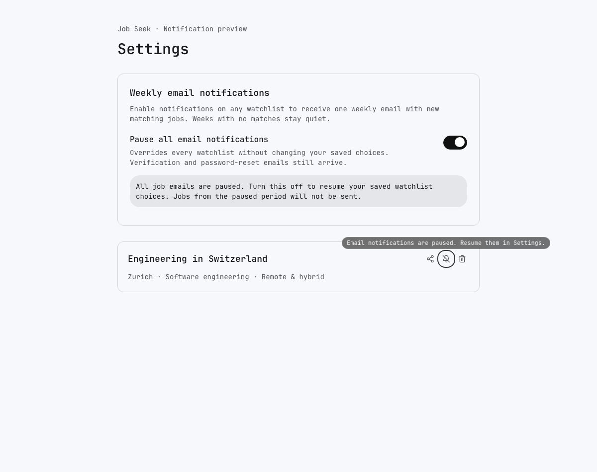

# Weekly notification review

Rendered from the implementation on 2026-09-27. These are local component
previews with fictional jobs/watchlists; no provider message was sent. The
preview-only route was removed after capture and is not part of the deployment.

Before this change, the watchlist bell saved an alert preference but no digest
could be sent, no global-pause Settings control existed, and a paused toggle
reported a generic save error. The proposed behavior is shown below.

## Settings


## Paused watchlist: keyboard-focus tooltip



## Mobile pause warning


The dialog fills a 390px viewport without horizontal overflow and restores
focus to the triggering control on dismissal. English/German mobile and French
desktop warnings were checked, in light and dark themes. Italian verification
copy and the save-error state were also rendered. Browser page-error capture
was empty. UI tests cover pause/resume persistence, save failures and focus.

## Consolidated email


Subject/body/manage/unsubscribe copy is available in English, German, French,
and Italian. Job/company/watchlist strings are escaped; unsafe source URL
schemes are rejected. The email also has a plain-text alternative.

Regenerate all four email previews without credentials or sending mail:

```sh
cd apps/web
pnpm exec tsx script/preview-notification-email.ts /tmp/notification-review
```

## Activation decision

The implementation defaults to `JOB_ALERTS_MODE=off`. No production environment,
schema, provider configuration, billing plan, or delivery mode has been changed.
The proposed notification envelope is at most 75 provider attempts per day and
2400 per month, with no tier change or overage enablement. The configuration
rejects larger caps and prevents preview deployments from sending.

Human approval of the rendered UI/email and the provider/cost envelope is
pending, as required by [#8317](https://github.com/colophon-group/jobseek/issues/8317).
The [runbook](../../../apps/web/docs/notifications.md) covers the migration,
webhook setup, staged activation, quota accounting, and recovery.
