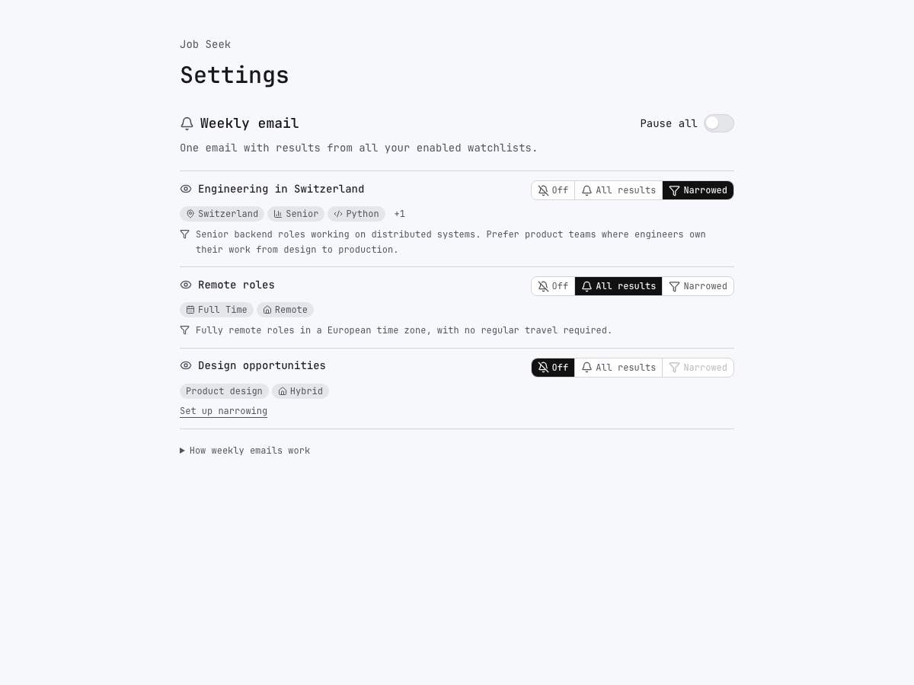
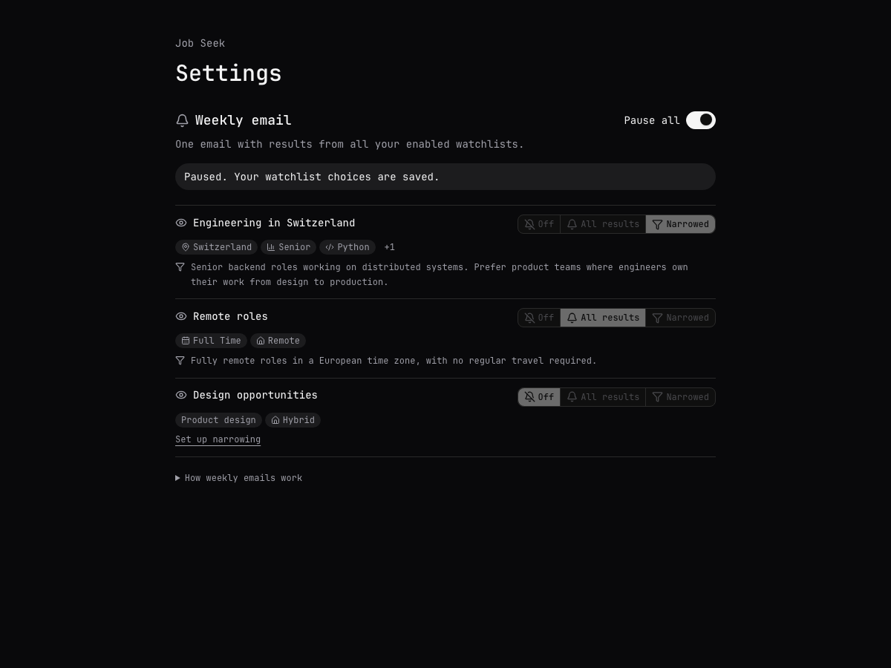
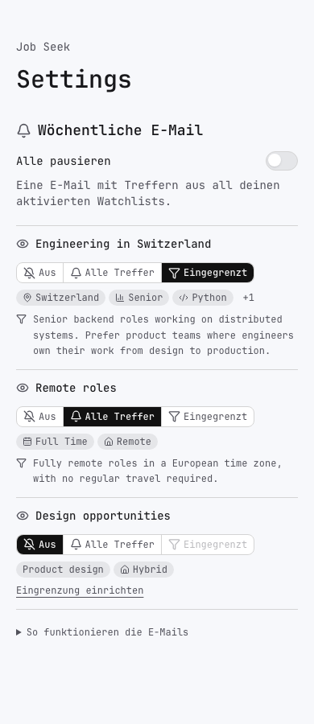
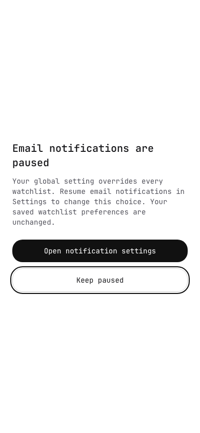
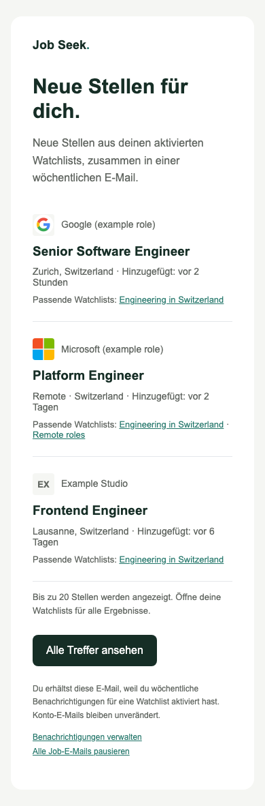

# Weekly notification review

Rendered from the implementation on 2026-09-27. These are local component
previews with fictional jobs/watchlists; no provider message was sent. The
preview-only route was removed after capture and is not part of the deployment.

Before this change, the watchlist bell saved an alert preference but no digest
could be sent, no global-pause Settings control existed, and a paused toggle
reported a generic save error. The proposed behavior is shown below.

## Settings

Each watchlist contributes all matching results, narrowed results only, or no
results. Every saved narrowing prompt stays fully visible, including when all
results or no emails are selected. The title and selector share one desktop
row, using the existing Settings control styles and familiar
watchlist/notification/narrowing icons. All three radio choices remain visible in one connected control with shared
borders, making the exclusive selection clear. Compact filter chips expand to show all filters;
explanations are under “How weekly emails work”. There are no share or
delete controls here. The email remains one consolidated message across all
enabled watchlists, with duplicate jobs shown once.



## Paused settings



## Mobile settings and saved prompt



## Mobile pause warning



The dialog fills a 390px viewport without horizontal overflow and restores
focus to the triggering control on dismissal. English/German mobile and French
desktop warnings were checked, in light and dark themes. Italian verification
copy and the save-error state were also rendered. Browser page-error capture
was empty. UI tests cover pause/resume persistence, save failures and focus.

## Consolidated email




Subject/body/manage/unsubscribe copy is available in English, German, French,
and Italian. Job/company/watchlist strings are escaped; unsafe source URL
schemes are rejected. Each role includes the company icon (initials when unavailable) and a localized
“Added … ago” label based on when Jobseek first found it, measured at email
render time. Company names remain readable when the mail client blocks images.
The email also has a plain-text alternative with the same age labels.
Preview roles are fictional; Google and Microsoft icons demonstrate image rendering.

Regenerate all four email previews without credentials or sending mail:

```sh
cd apps/web
pnpm exec tsx script/preview-notification-email.ts /tmp/notification-review
```

## Activation decision

The implementation defaults to `JOB_ALERTS_MODE=off`. No production environment,
schema, provider configuration, billing plan, or delivery mode has been changed.
The proposed notification envelope is at most 75 provider attempts per day and
2400 per month, with no tier change or overage enablement. The configuration
rejects larger caps and prevents preview deployments from sending.

Human approval of the rendered UI/email and the provider/cost envelope is
pending, as required by [#8317](https://github.com/colophon-group/jobseek/issues/8317).
The [runbook](../../../apps/web/docs/notifications.md) covers the migration,
webhook setup, staged activation, quota accounting, and recovery.
